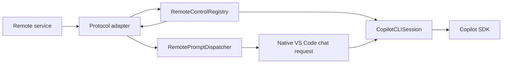
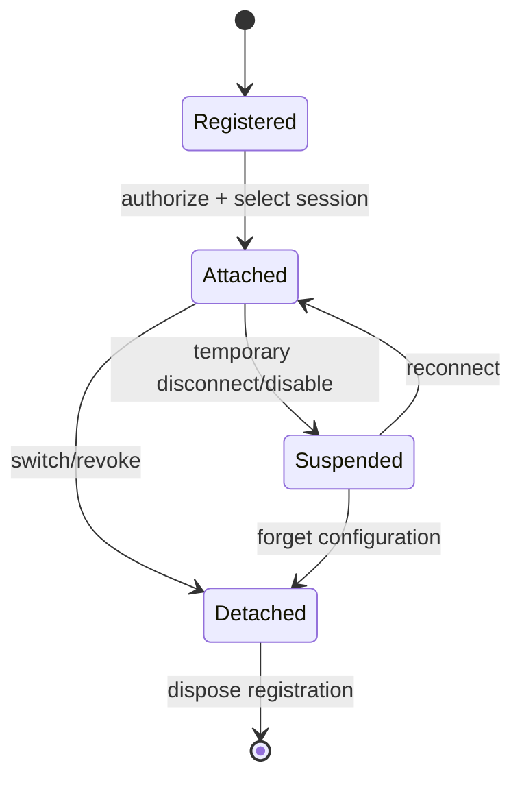
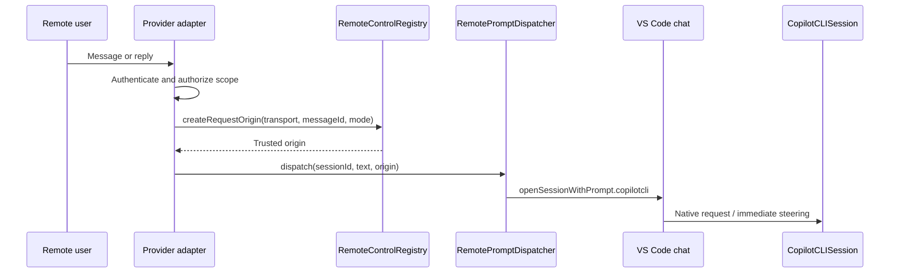
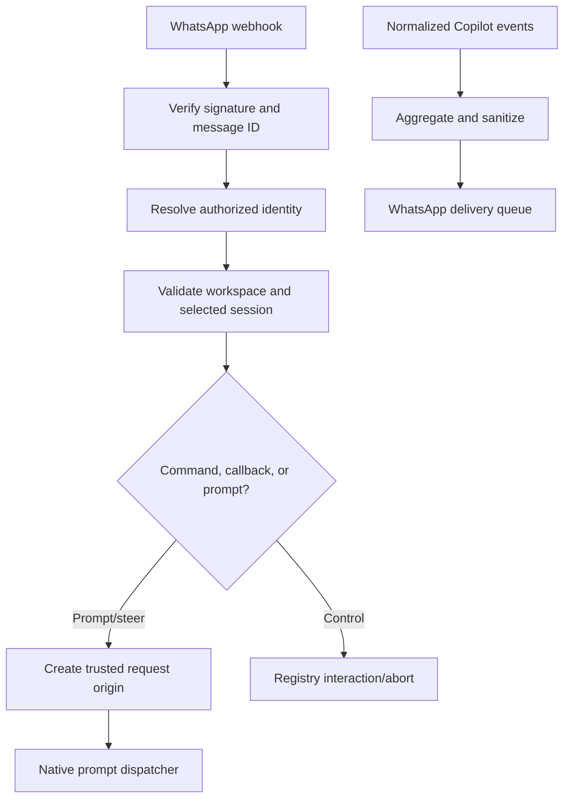

# Remote-Control Transport Integration Guide

Author: Sachith H. Liyanagama

This guide describes how to add a bundled remote-control transport, such as WhatsApp, Slack, or Discord, to the Copilot CLI integration.

> **Status:** `remoteControl/**` is an internal framework in this bundled VS Code fork. It is not a stable public VS Code API or a Marketplace extension point.

## Architecture



The framework owns session integration and safety. Each adapter owns its protocol and user experience.

| Framework | Transport adapter |
|---|---|
| Session binding and attachment | Provider authentication |
| Event normalization, replay, and ordering | Polling or webhooks |
| Trusted request provenance | User/chat authorization |
| Capability enforcement | Session-selection UX |
| Permission/question/plan response races | Provider-specific rendering |
| Native prompt dispatch and abort | Rate limits and delivery retries |

## Core contracts

The contracts are defined in [`remoteControlTypes.ts`](../src/extension/remoteControl/common/remoteControlTypes.ts):

- `IRemoteControlTransport` — transport identity, capabilities, event publishing, and optional responses.
- `IRemoteControlTransportCapabilities` — explicit permission to submit prompts, request modes, answer interactions, or abort.
- `IRemoteControlRegistry` — registration, attachment, trusted origins, event delivery, and response coordination.
- `IRemoteControlSessionEvent` — normalized event delivered to attached transports.
- `IRemotePromptDispatcher` — dispatches remote text through the native Copilot chat path.

Capabilities are grants. Declare only features the transport implements:

```ts
readonly capabilities = Object.freeze({
	submitPrompt: true,
	requestModes: ['interactive', 'plan'] as const,
	permissionResponses: true,
	userInputResponses: true,
	exitPlanResponses: true,
	abort: true,
});
```

Do not grant `elevatedModes` to an ordinary third-party transport. Telegram demonstrates the non-elevating policy in [`telegramTransport.ts`](../src/extension/telegramRemote/node/telegramTransport.ts).

## Implement a transport

Keep generic framework code and provider code separate:

```text
extension/
├── remoteControl/              # Shared framework
└── whatsAppRemote/             # Provider adapter
    ├── common/
    ├── node/
    │   ├── whatsAppTransport.ts
    │   ├── whatsAppService.ts
    │   ├── whatsAppCommandRouter.ts
    │   └── whatsAppSessionState.ts
    └── vscode-node/
        └── whatsAppRemoteContribution.ts
```

A minimal transport registers itself with the shared registry:

```ts
export class WhatsAppTransport extends Disposable implements IRemoteControlTransport {
	readonly id = 'whatsapp';
	readonly label = 'WhatsApp';
	readonly themeIcon = 'remote';
	readonly capabilities = Object.freeze({
		submitPrompt: true,
		requestModes: ['interactive', 'plan'] as const,
		abort: true,
	});

	constructor(@IRemoteControlRegistry registry: IRemoteControlRegistry) {
		super();
		this._register(registry.registerTransport(this));
	}

	publish(sessionId: string, event: IRemoteControlSessionEvent): Promise<void> {
		return this.sendProviderActivity(sessionId, event);
	}
}
```

The contribution creates the transport and owns connection/setup lifecycle. See [`chatSessions.ts`](../src/extension/chatSessions/vscode-node/chatSessions.ts) for service registration and [`telegramRemoteContribution.ts`](../src/extension/telegramRemote/vscode-node/telegramRemoteContribution.ts) for a concrete adapter contribution.

## Attach a session

Registering a transport does not attach it to every session. Attach only after local consent, provider authorization, and workspace/session validation:

```ts
const attachment = registry.attachTransport(sessionId, transport.id);
```

Dispose the returned handle when the user switches sessions, disconnects, revokes access, or the extension shuts down. Use `suspendTransport()` for a temporary routing pause and `detachTransport()` when all attachments must be removed. Telegram's selection lifecycle is implemented in [`telegramSessionState.ts`](../src/extension/telegramRemote/node/telegramSessionState.ts).



## Submit prompts and steering

Always use a registry-issued origin and the native dispatcher. Never call `sdkSession.send()` directly.

```ts
const origin = registry.createRequestOrigin(
	transport.id,
	providerMessageId,
	'interactive',
);

promptDispatcher.dispatch(sessionId, text, origin);
```

The dispatcher in [`remotePromptDispatcher.ts`](../src/extension/remoteControl/vscode-node/remotePromptDispatcher.ts) preserves chat history, steering, tool tokens, model selection, and the normal Copilot request lifecycle.



## Events and interactions

Attached transports receive normalized events through `publish()`. The registry serializes publication, suppresses duplicate event IDs, and replays supported history when a session is rebound. Provider adapters should aggregate noisy SDK events and redact sensitive content before rendering them.

Optional handlers allow a transport to answer:

- `requestPermission()`
- `requestUserInput()`
- `requestExitPlanMode()`

Advertise the corresponding capability only when the handler is implemented. The registry applies first-valid-response-wins semantics and cancels losing or detached responders. Abort must use:

```ts
await registry.abort(sessionId, transport.id);
```

## Security requirements

A transport must:

- authenticate the provider request before exposing session metadata;
- authorize an exact workspace and session scope locally;
- obtain request origins from the registry rather than constructing them;
- default to `interactive` or `plan`, never remote permission-policy elevation;
- bind callbacks to provider identity, session, request, and one-time state;
- bound message sizes, queues, retries, and retained event IDs;
- redact secrets before logging or rendering;
- deduplicate webhook deliveries or enforce a single poller;
- dispose attachments and pending interactions deterministically.

## WhatsApp adapter outline



WhatsApp-specific webhook verification, templates, formatting, identity storage, and API retry behavior belong in `whatsAppRemote/**`, not in the shared registry.

## Tests

At minimum, test:

- registration, duplicate IDs, capability validation, and disposal;
- attach, suspend, replay, live events, detach, and session replacement;
- native prompt dispatch and forged-origin rejection;
- permission, question, and plan response races;
- non-elevating mode enforcement and scoped abort;
- provider authorization, callback replay rejection, deduplication, and queue bounds.

Use the synthetic third-transport coverage in [`remoteControlRegistry.spec.ts`](../src/extension/remoteControl/node/test/remoteControlRegistry.spec.ts) as the framework contract test. Use [`remotePromptDispatcher.spec.ts`](../src/extension/remoteControl/vscode-node/test/remotePromptDispatcher.spec.ts) for native dispatch behavior.

## Integration checklist

- [ ] Provider adapter contains no Copilot SDK fork or direct SDK prompt path.
- [ ] Transport registers with minimum capabilities.
- [ ] Authorization happens before session discovery or attachment.
- [ ] Every attachment and registration has an owner and disposal path.
- [ ] Prompts use a registry-issued origin and `IRemotePromptDispatcher`.
- [ ] Events are bounded, sanitized, deduplicated, and rendered by the adapter.
- [ ] Interactive responses are correlated, one-shot, cancellable, and fail closed.
- [ ] Generic, provider, security, and lifecycle tests pass.
- [ ] Release notes identify the transport as part of the bundled fork, not a public extension API.
