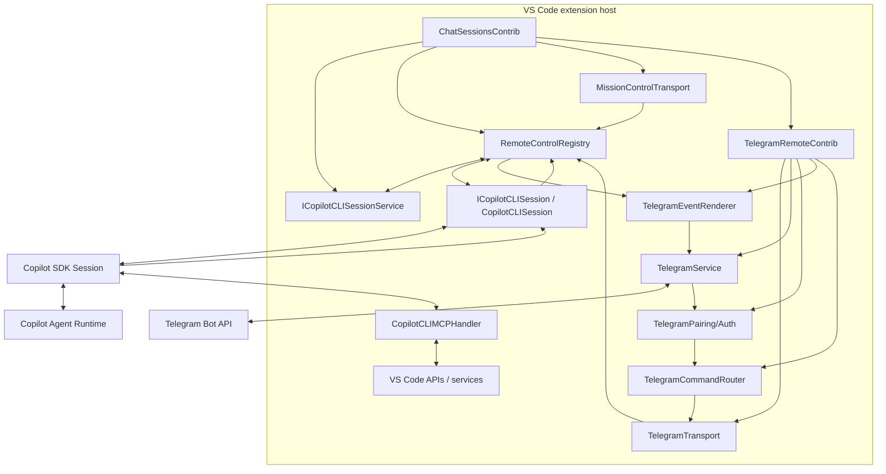
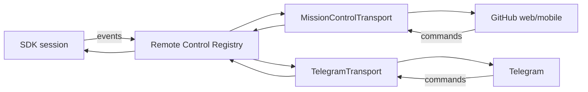
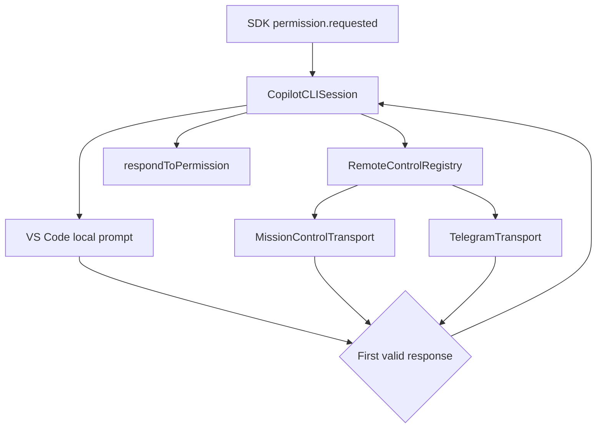
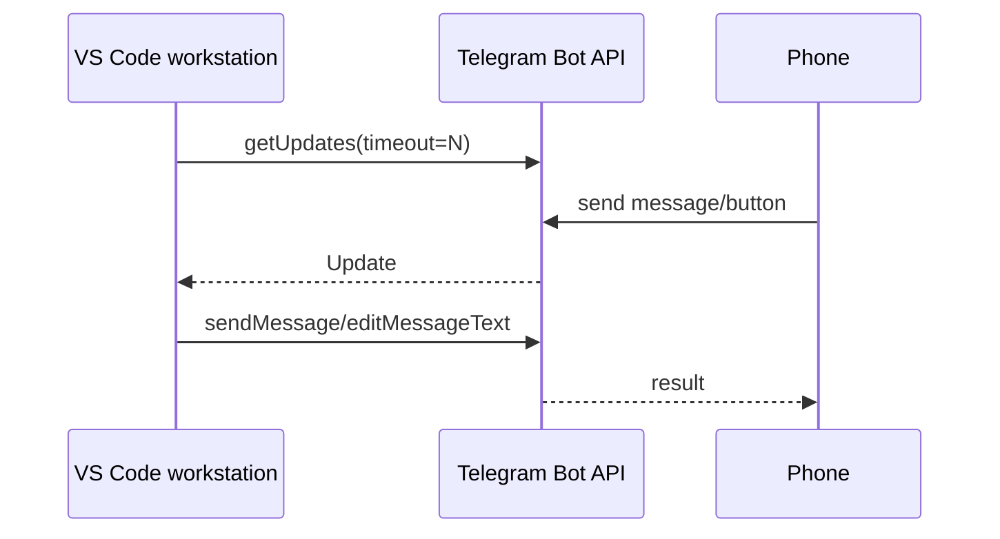
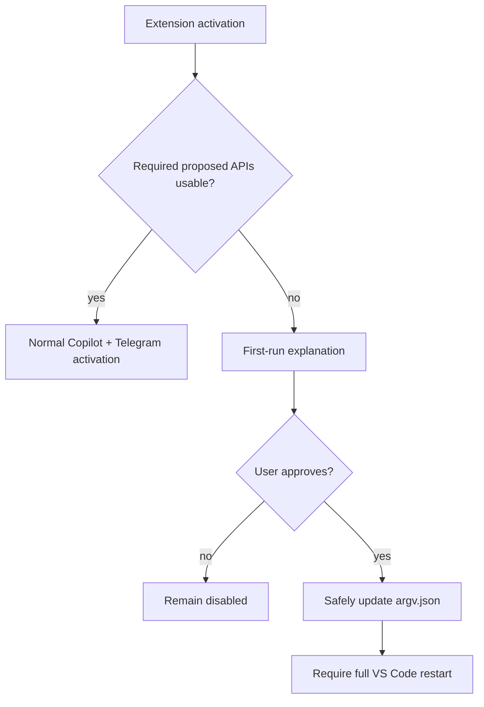

# Architecture

## 1. Architectural position

Telegram remote control is a downstream contribution to the existing Copilot CLI integration, not a replacement agent stack.

The upstream code already provides the major subsystems:

- Copilot SDK loading and runtime lifecycle,
- session creation/resume/history,
- model discovery and selection,
- agent modes,
- permissions and user-input requests,
- tools and MCP,
- worktrees and checkpoints,
- Git integration,
- native VS Code session/chat rendering,
- GitHub Mission Control remote control.

The project adds a new remote transport that observes and controls those same sessions.

## 2. Target component model



## 3. Proposed module layout

Shared remote-control code belongs with the Copilot CLI integration; Telegram code remains isolated in its own module:

```text
extensions/copilot/src/extension/chatSessions/copilotcli/
    common/
        remoteControlTypes.ts
    node/
        remoteControlRegistry.ts
        missionControlTransport.ts

extensions/copilot/src/extension/telegramRemote/
    common/
        telegramTypes.ts
    node/
        telegramRemoteContribution.ts
        telegramTransport.ts
        telegramService.ts
        telegramBotClient.ts
        telegramPairingService.ts
        telegramCommandRouter.ts
        telegramEventRenderer.ts
        telegramSettings.ts
        proposedApiSetup.ts
        test/
```

Telegram-specific classes MUST NOT be added to `copilotcliSession.ts` or imported by the shared registry. That upstream file receives only the narrow hooks required to publish session events, race interactive responses and expose safe session actions.

## 4. Composition root

Upstream `ChatSessionsContrib` already creates a child service collection containing Copilot CLI services and then instantiates Copilot contributions.

Relevant source:

- [`../../src/extension/chatSessions/vscode-node/chatSessions.ts`](../../src/extension/chatSessions/vscode-node/chatSessions.ts)

The current source has two registration paths: the session-controller path in `registerCopilotCLIServices()` and the older V1/non-controller path in `registerCopilotCLIServicesV1()`. Implement and validate the controller path first. Add V1 compatibility only after the registry contract is stable.

Preferred first downstream change:

```ts
this._register(
    copilotcliAgentInstaService.createInstance(TelegramRemoteContrib)
);
```

This is preferable to creating a second Copilot SDK client/session manager because the Telegram layer should target the same session objects used by VS Code.

## 5. Session ownership

The existing session service remains authoritative.

Relevant source:

- [`../../src/extension/chatSessions/copilotcli/node/copilotcliSessionService.ts`](../../src/extension/chatSessions/copilotcli/node/copilotcliSessionService.ts)

Important capabilities already exposed by the service include session lifecycle events and methods for session discovery, creation, loading, history and forking.

`getSession()` and `createSession()` return `IReference<ICopilotCLISession>`. Every caller MUST explicitly own and dispose that reference. A short operation uses `try/finally`; a long-lived remote attachment keeps one reference in its disposable session binding and releases it when the binding, session or extension ends. Leaking a reference can keep the SDK session and its resources alive; disposing it too early can invalidate remote control.

The Telegram layer stores only remote UI routing state such as:

```ts
interface TelegramRemoteSelection {
    telegramUserId: string;
    sessionId?: string;
    lastStatusMessageId?: number;
    activityDetail: 'compact' | 'detailed' | 'debug';
}
```

It MUST NOT maintain an independent copy of the conversation as the source of truth.

## 6. Active session bridge

`CopilotCLISession` already owns/wraps the SDK session used by VS Code.

Relevant source:

- [`../../src/extension/chatSessions/copilotcli/node/copilotcliSession.ts`](../../src/extension/chatSessions/copilotcli/node/copilotcliSession.ts)

Existing behavior that should be reused includes:

- active/busy session state,
- `mode: 'immediate'` steering,
- abort on the wrapped SDK session,
- model updates,
- permission response handling,
- user-input response handling,
- request-scoped SDK event subscriptions,
- Mission Control event forwarding.

### Current interface constraint

`ICopilotCLISession` currently exposes session metadata, status, `handleRequest()`, stream attachment, permission-level mutation and model inspection. It does **not** expose persistent SDK events, abort, permission responses, user-input responses or selected-model mutation. The concrete class exposes `sdkSession`, but Telegram must not depend on a concrete-class cast or receive the full SDK session.

`handleRequest()` is also not a general remote-send API: it requires a `ChatParticipantToolToken` from a real VS Code `ChatRequest`. Telegram cannot mint that token.

### Required bridge design

Phase 1 introduces a transport-neutral registry and a narrow session binding. Names are provisional and should reuse upstream SDK types:

```ts
type RemoteRequestOrigin =
    | { kind: 'missionControl'; transportId: 'missionControl'; commandId: string; mode?: MissionControlMode }
    | { kind: 'telegram'; transportId: 'telegram'; updateId: string };

interface IRemoteControlTransport {
    readonly id: string;
    readonly onDidReceiveCommand: Event<RemoteCommand>;
    publish(sessionId: string, event: RemoteAgentEvent): void;
    requestPermission?(request: RemotePermissionRequest, token: CancellationToken): Promise<PermissionRequestResult | undefined>;
    requestUserInput?(request: RemoteUserInputRequest, token: CancellationToken): Promise<UserInputResponse | undefined>;
}

interface IRemoteSessionControl {
    abort(): Promise<void>;
    setSelectedModel?(modelId: string, reasoningEffort?: string): Promise<void>;
}

interface IRemoteControlRegistry {
    registerTransport(transport: IRemoteControlTransport): IDisposable;
    attachSession(sessionId: string, control: IRemoteSessionControl): IDisposable;
    publish(sessionId: string, event: SessionEvent): void;
    waitForPermission(...): Promise<PermissionRequestResult | undefined>;
    waitForUserInput(...): Promise<UserInputResponse | undefined>;
}
```

The registry owns transport fan-out and correlation; `CopilotCLISession` remains the only owner of SDK response calls. Prompt injection is intentionally separate and goes through the native chat request path described in section 7.

### Typed request origin

The current source infers a Mission Control request from `SendOptions.source.startsWith('command-')` and then reads the shared `_mcState.mcMode`. This is unsafe for an N-transport design: a Telegram request accidentally or maliciously labelled `command-*` could inherit Mission Control's `autopilot` mode.

The registry MUST create a typed `RemoteRequestOrigin`; transport payloads cannot supply or override it. Carry this typed origin through pending request context and `CopilotCLISessionInput`. Derive effective remote mode/permission only from `origin.kind` and the originating transport's policy:

- only a registry-created `missionControl` origin may consume Mission Control mode,
- a `telegram` origin has no permission-elevating mode,
- Telegram remains limited to approve-once/deny even while Mission Control is active in `autopilot`,
- `SendOptions.source` remains a separately serialized SDK correlation/telemetry string and is never an authorization signal.

Telegram source strings SHOULD use a distinct `telegram-*` namespace and MUST NOT begin with `command-`, but the typed origin—not the prefix—is the security boundary.

## 7. Native prompt and steering path

Remote prompts MUST follow the same path currently used by Mission Control:

```text
TelegramTransport
  -> setPendingCopilotCLIRequestContext(sessionId, ...)
  -> workbench.action.chat.openSessionWithPrompt.copilotcli
  -> VS Code creates ChatRequest + ChatParticipantToolToken
  -> Copilot chat participant resolves the existing session
  -> CopilotCLISession.handleRequest(...)
  -> normal send, or mode: 'immediate' when already busy
```

This internal command is high-risk as an external extension contract, but it is a **required integration path inside the current fork** because it preserves native rendering and supplies the tool-invocation token. Feature-detect it, test it on every upstream rebase and fail visibly if it changes; do not fall back to direct SDK `send()` in V1.

The command implementation awaits the session's `responseCompletePromise`, so its returned promise may remain pending for the entire agent turn. Telegram MUST dispatch it fire-and-forget, attach rejection handling, acknowledge the Telegram update immediately and let SDK/registry events report progress/completion. Failure cleanup must clear only the matching pending request context; it must not erase a newer request for the same session.

## 8. Event projection

Most native rendering listeners are created inside `_handleRequestImplInner` and disposed at the end of the request. They are not a reusable session-level feed. Mission Control separately installs a persistent wildcard listener while remote control is active.

The remote-control seam therefore needs its own explicit session-lifetime subscription or equivalent publication hook. It may normalize the same SDK event types, but it must define ownership and disposal independently of the request-scoped renderer.

Current Mission Control can observe an SDK event twice while a request is active: once through the request-scoped wildcard listener and once through its persistent wildcard listener. Phase 1 MUST collapse remote forwarding to exactly one registry publication point per SDK event. Preserve upstream event IDs/timestamps where present, suppress duplicate IDs before transport fan-out, and reject/repair any event whose `parentId` equals its own ID. Semantic Mission Control compatibility does not require preserving duplicate delivery.

Events are normalized into a transport-neutral remote event model:

```ts
type RemoteAgentEvent =
    | { kind: 'assistantText'; text: string; final: boolean }
    | { kind: 'intent'; text: string }
    | { kind: 'reasoning'; text: string; final: boolean }
    | { kind: 'toolStart'; toolCallId: string; name: string; summary?: string }
    | { kind: 'toolProgress'; toolCallId: string; text: string }
    | { kind: 'toolComplete'; toolCallId: string; success: boolean; summary?: string }
    | { kind: 'permission'; requestId: string; data: unknown }
    | { kind: 'question'; requestId: string; data: unknown }
    | { kind: 'sessionState'; state: string }
    | { kind: 'subagent'; state: string; name?: string }
    | { kind: 'usage'; data: unknown }
    | { kind: 'error'; message: string };
```

Telegram rendering then becomes a pure adapter over these events.

### Existing-session replay

When a remote transport attaches to an existing session, the session bridge uses `sdkSession.getEvents()` as the replay source without exposing the SDK session to the transport. Replay only the explicitly supported persisted event types (initially user/assistant messages, assistant turn lifecycle and tool start/complete); do not assume ephemeral deltas are retained.

To avoid a replay/live-subscription gap, install the live listener into a temporary buffer, snapshot and replay persisted events in order, suppress duplicate event IDs, flush unseen buffered live events, then switch to direct live publication.

## 9. Mission Control relationship

Upstream Mission Control is the closest architectural reference.

The current Copilot session implementation:

- listens to all SDK session events,
- buffers selected events,
- submits them to GitHub Mission Control,
- polls for remote commands,
- handles abort,
- handles remote messages/steering,
- handles permission responses,
- handles user-input responses,
- keeps session state shared across wrapper instances.

Telegram should reuse the **control-plane pattern**, not call Mission Control itself.



The generalization is the first implementation milestone, not a later cleanup. Existing `_mcState`, `_waitForMcPermissionResponse()` and `_waitForMcUserInputResponse()` logic is hard-coded to one remote transport. Move that behavior behind the registry before adding Telegram branches. Preserve Mission Control's API client, buffering and poll cadence inside `MissionControlTransport`; the goal is a narrow transport seam, not a rewrite of the GitHub protocol.

The first registry test uses Mission Control plus an in-memory second transport. Telegram work starts only after Mission Control behavior remains semantically unchanged and each SDK event is published exactly once.

## 10. Permissions and interactive requests

The upstream session currently supports local UI responses and Mission Control responses. Telegram should follow the same semantics.

Conceptually:



Rules:

- responses are correlated by session ID + request ID + optional tool-call ID,
- stale callbacks are rejected,
- one resolution wins,
- pending Telegram buttons are invalidated after resolution,
- cancellation resolves safely to deny where appropriate.
- Telegram exposes only approve-once and deny in V1.
- Telegram may never set or raise the session permission level to `autoApprove` or `autopilot`, directly or through a mode change.

## 11. Telegram networking

Telegram transport uses long polling:



The workstation initiates all network connections. No inbound service is required.

Only one active `getUpdates` consumer may exist for a bot token. The contribution owns a singleton poller/lease and releases it on disable/deactivation. If multiple VS Code extension hosts can load the same configuration, V1 must either coordinate the lease across them or explicitly reject the second consumer; two pollers must never silently compete.

## 12. Telegram UI state

Telegram UI should use a small state machine rather than parse arbitrary text as control commands.

```text
UNPAIRED
  -> PAIRING
  -> READY
      -> SESSION_SELECTED
          -> IDLE
          -> RUNNING
          -> NEEDS_PERMISSION
          -> NEEDS_INPUT
          -> ERROR
```

Normal text behavior:

- no session selected -> ask/select session,
- selected idle session -> normal prompt,
- selected busy session -> steering by default,
- explicit queue command -> enqueue where implemented.

Destructive/permission operations use callback tokens, never free-text inference.

## 13. Model source of truth

For Copilot CLI-backed sessions the Copilot SDK/upstream `ICopilotCLIModels` layer is authoritative.

Relevant source:

- [`../../src/extension/chatSessions/copilotcli/node/copilotCli.ts`](../../src/extension/chatSessions/copilotcli/node/copilotCli.ts)

The VS Code `vscode.lm` model registry may contain additional models contributed by other extensions. These can be displayed as supplementary information later, but the Telegram UI must distinguish:

```text
Agent-capable Copilot CLI models
vs.
Other VS Code language models
```

## 14. IDE context

Do not rebuild IDE tooling in Telegram. The agent continues to use the existing VS Code MCP integration.

Relevant source:

- [`../../src/extension/chatSessions/copilotcli/node/mcpHandler.ts`](../../src/extension/chatSessions/copilotcli/node/mcpHandler.ts)

This preserves upstream behavior for diagnostics, selection, diff/open-diff flows and other IDE-aware capabilities.

## 15. Packaging modes and proposed APIs

The current implementation target is a VS Code source fork with the modified Copilot extension bundled into the product. It should use the fork's product configuration and existing Copilot activation path. Do not make `argv.json` mutation a prerequisite for this path.

A future independently installed extension/renamed VSIX has a different constraint: VS Code normally strips proposed API access unless its ID is enabled through product configuration, extension-development mode or `--enable-proposed-api`. The preflight flow below applies to that future path only:

Any such independent-extension experiment needs a preflight activation path that uses only stable/basic functionality before touching proposed APIs:



See [SETUP_RELEASE_AND_LICENSING.md](./SETUP_RELEASE_AND_LICENSING.md). Hosted Copilot authentication/entitlement for a self-built fork requires a separate source-level validation; these documents do not assume that Microsoft signing either permits or prevents it.

## 16. Source ownership boundary

### Upstream-owned

- agent implementation,
- SDK session internals,
- native Copilot UI,
- tool definitions,
- MCP integration,
- worktrees/checkpoints,
- GitHub authentication implementation,
- model provider implementation,
- Mission Control.

### Downstream-owned

- Telegram Bot API client/wrapper,
- long-poll lifecycle,
- pairing and Telegram authorization,
- Telegram UI renderer,
- remote routing/selection state,
- event projection/coalescing,
- callback/request correlation,
- proposed-API onboarding helper,
- downstream build/release metadata.

### Shared seam

The registry contract and Mission Control adapter are shared integration code. Only the narrow glue required to publish existing session events, race interactive responses and expose safe actions should touch `copilotcliSession.ts`.

## 17. Architecture quality gate

A proposed implementation change should be rejected if it:

- duplicates session state already maintained upstream,
- creates a second Copilot SDK session for the same VS Code session merely for Telegram,
- parses VS Code UI text or screen state,
- relies on terminal/PTY scraping when an SDK event exists,
- introduces Telegram types into core Copilot model/tool/worktree services,
- modifies large upstream files when a small service/interface seam would work,
- adds Telegram-specific branches to Mission Control permission/question logic,
- sends a remote prompt directly to the SDK instead of through the native chat request path,
- loses or leaks an `IReference<ICopilotCLISession>`,
- starts a second long poller for the same bot token,
- lets Telegram raise permission level to `autoApprove` or `autopilot`,
- requires inbound networking for the default Telegram transport.
