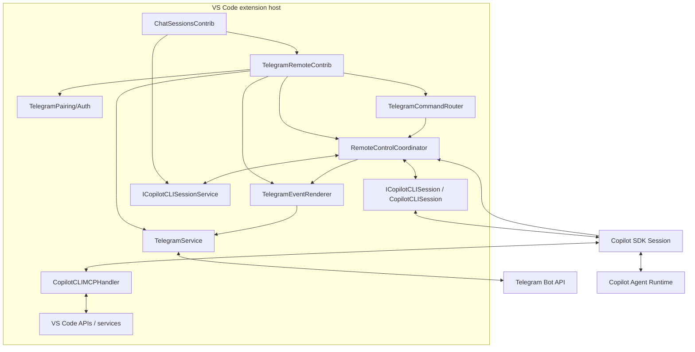
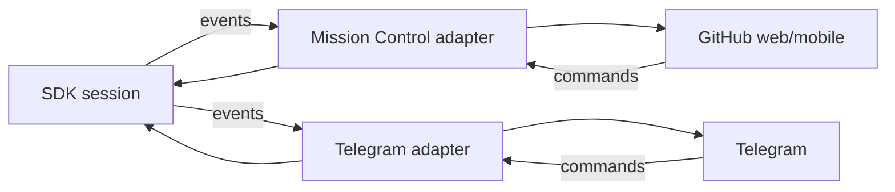
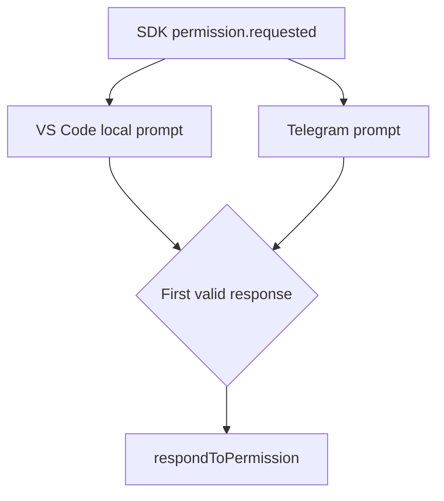
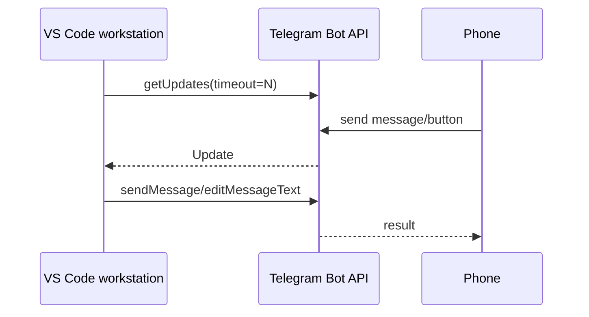
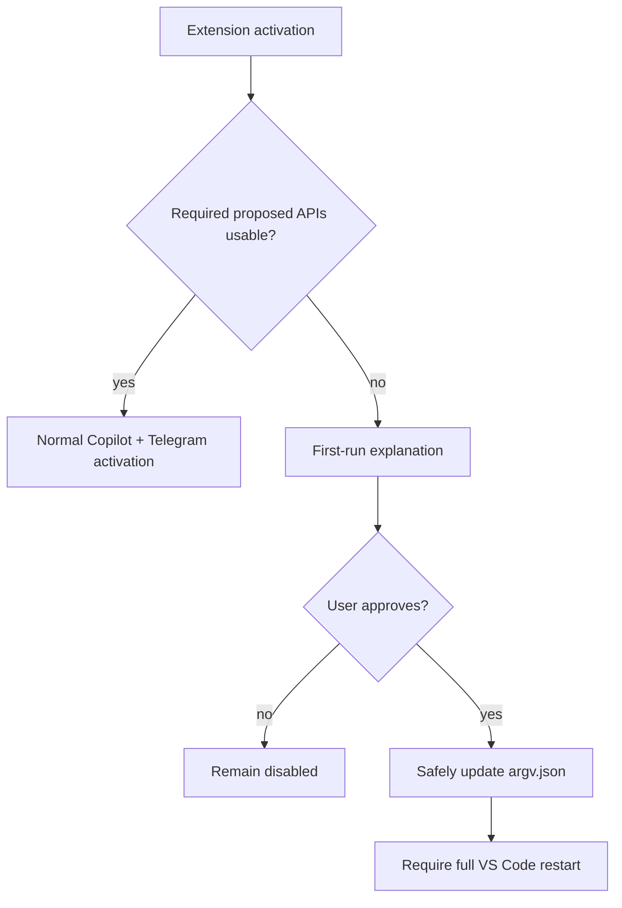

# Architecture

## 1. Architectural position

Telegram remote control is a downstream contribution to the existing Copilot CLI integration, not a replacement agent stack.

The upstream code already provides the major subsystems:

- Copilot SDK loading and runtime lifecycle,
- session creation/resume/history,
- model discovery and selection,
- agent modes,
- permissions and user-input requests,
- tools and MCP,
- worktrees and checkpoints,
- Git integration,
- native VS Code session/chat rendering,
- GitHub Mission Control remote control.

The project adds a new remote transport that observes and controls those same sessions.

## 2. Target component model



## 3. Proposed new module

Preferred directory:

```text
extensions/copilot/src/extension/telegramRemote/
    common/
        telegramTypes.ts
        remoteControlTypes.ts
    node/
        telegramRemoteContribution.ts
        remoteControlCoordinator.ts
        telegramService.ts
        telegramBotClient.ts
        telegramPairingService.ts
        telegramCommandRouter.ts
        telegramEventRenderer.ts
        telegramSettings.ts
        proposedApiSetup.ts
        test/
```

Do not place Telegram-specific classes inside `copilotcliSession.ts` unless the integration cannot be achieved through a narrow hook/interface.

## 4. Composition root

Upstream `ChatSessionsContrib` already creates a child service collection containing Copilot CLI services and then instantiates Copilot contributions.

Relevant source:

- [`../../src/extension/chatSessions/vscode-node/chatSessions.ts`](../../src/extension/chatSessions/vscode-node/chatSessions.ts)

Preferred downstream change:

```ts
this._register(
    copilotcliAgentInstaService.createInstance(TelegramRemoteContrib)
);
```

This is preferable to creating a second Copilot SDK client/session manager because the Telegram layer should target the same session objects used by VS Code.

## 5. Session ownership

The existing session service remains authoritative.

Relevant source:

- [`../../src/extension/chatSessions/copilotcli/node/copilotcliSessionService.ts`](../../src/extension/chatSessions/copilotcli/node/copilotcliSessionService.ts)

Important capabilities already exposed by the service include session lifecycle events and methods for session discovery, creation, loading, history and forking.

The Telegram layer stores only remote UI routing state such as:

```ts
interface TelegramRemoteSelection {
    telegramUserId: string;
    sessionId?: string;
    lastStatusMessageId?: number;
    activityDetail: 'compact' | 'detailed' | 'debug';
}
```

It MUST NOT maintain an independent copy of the conversation as the source of truth.

## 6. Active session bridge

`CopilotCLISession` already owns/wraps the SDK session used by VS Code.

Relevant source:

- [`../../src/extension/chatSessions/copilotcli/node/copilotcliSession.ts`](../../src/extension/chatSessions/copilotcli/node/copilotcliSession.ts)

Existing behavior that should be reused includes:

- active/busy session state,
- `mode: 'immediate'` steering,
- abort,
- model updates,
- permission response handling,
- user-input response handling,
- SDK event subscriptions,
- Mission Control event forwarding.

### Preferred bridge design

Introduce or expose a narrow session-remote interface rather than handing Telegram the entire concrete class:

```ts
interface IRemoteControllableSession {
    readonly sessionId: string;
    readonly status: vscode.ChatSessionStatus | undefined;

    onEvent(listener: (event: SessionEvent) => void): IDisposable;
    sendPrompt(prompt: string): Promise<void>;
    steer(prompt: string): Promise<void>;
    abort(): void;
    respondToPermission(requestId: string, response: PermissionResponse): void;
    respondToUserInput(requestId: string, response: UserInputResponse): void;
    getSelectedModelId(): Promise<string | undefined>;
    setSelectedModel?(...): Promise<void>;
}
```

The exact final interface should reuse existing types and avoid wrapping methods that are already directly available through a stable internal service.

## 7. Event projection

The Telegram layer subscribes to the same SDK event stream used by native VS Code rendering and Mission Control.

Events are normalized into a transport-neutral remote event model:

```ts
type RemoteAgentEvent =
    | { kind: 'assistantText'; text: string; final: boolean }
    | { kind: 'intent'; text: string }
    | { kind: 'reasoning'; text: string; final: boolean }
    | { kind: 'toolStart'; toolCallId: string; name: string; summary?: string }
    | { kind: 'toolProgress'; toolCallId: string; text: string }
    | { kind: 'toolComplete'; toolCallId: string; success: boolean; summary?: string }
    | { kind: 'permission'; requestId: string; data: unknown }
    | { kind: 'question'; requestId: string; data: unknown }
    | { kind: 'sessionState'; state: string }
    | { kind: 'subagent'; state: string; name?: string }
    | { kind: 'usage'; data: unknown }
    | { kind: 'error'; message: string };
```

Telegram rendering then becomes a pure adapter over these events.

## 8. Mission Control relationship

Upstream Mission Control is the closest architectural reference.

The current Copilot session implementation:

- listens to all SDK session events,
- buffers selected events,
- submits them to GitHub Mission Control,
- polls for remote commands,
- handles abort,
- handles remote messages/steering,
- handles permission responses,
- handles user-input responses,
- keeps session state shared across wrapper instances.

Telegram should mimic the **control-plane pattern**, not call Mission Control itself.



A later refactor may generalize common remote behavior behind an `IRemoteControlTransport`, but V1 should avoid unnecessarily rewriting upstream Mission Control code before Telegram behavior is proven.

## 9. Permissions and interactive requests

The upstream session currently supports local UI responses and Mission Control responses. Telegram should follow the same semantics.

Conceptually:



Rules:

- responses are correlated by session ID + request ID + optional tool-call ID,
- stale callbacks are rejected,
- one resolution wins,
- pending Telegram buttons are invalidated after resolution,
- cancellation resolves safely to deny where appropriate.

## 10. Telegram networking

Telegram transport uses long polling:



The workstation initiates all network connections. No inbound service is required.

## 11. Telegram UI state

Telegram UI should use a small state machine rather than parse arbitrary text as control commands.

```text
UNPAIRED
  -> PAIRING
  -> READY
      -> SESSION_SELECTED
          -> IDLE
          -> RUNNING
          -> NEEDS_PERMISSION
          -> NEEDS_INPUT
          -> ERROR
```

Normal text behavior:

- no session selected -> ask/select session,
- selected idle session -> normal prompt,
- selected busy session -> steering by default,
- explicit queue command -> enqueue where implemented.

Destructive/permission operations use callback tokens, never free-text inference.

## 12. Model source of truth

For Copilot CLI-backed sessions the Copilot SDK/upstream `ICopilotCLIModels` layer is authoritative.

Relevant source:

- [`../../src/extension/chatSessions/copilotcli/node/copilotCli.ts`](../../src/extension/chatSessions/copilotcli/node/copilotCli.ts)

The VS Code `vscode.lm` model registry may contain additional models contributed by other extensions. These can be displayed as supplementary information later, but the Telegram UI must distinguish:

```text
Agent-capable Copilot CLI models
vs.
Other VS Code language models
```

## 13. IDE context

Do not rebuild IDE tooling in Telegram. The agent continues to use the existing VS Code MCP integration.

Relevant source:

- [`../../src/extension/chatSessions/copilotcli/node/mcpHandler.ts`](../../src/extension/chatSessions/copilotcli/node/mcpHandler.ts)

This preserves upstream behavior for diagnostics, selection, diff/open-diff flows and other IDE-aware capabilities.

## 14. Proposed API bootstrapping

If the downstream build uses its own extension ID, VS Code normally strips proposed API access unless the ID is enabled through product configuration, extension-development mode or `--enable-proposed-api`.

V1 setup therefore needs a preflight activation path that uses only stable/basic functionality before touching proposed APIs:



See [SETUP_RELEASE_AND_LICENSING.md](./SETUP_RELEASE_AND_LICENSING.md).

## 15. Source ownership boundary

### Upstream-owned

- agent implementation,
- SDK session internals,
- native Copilot UI,
- tool definitions,
- MCP integration,
- worktrees/checkpoints,
- GitHub authentication implementation,
- model provider implementation,
- Mission Control.

### Downstream-owned

- Telegram Bot API client/wrapper,
- long-poll lifecycle,
- pairing and Telegram authorization,
- Telegram UI renderer,
- remote routing/selection state,
- event projection/coalescing,
- callback/request correlation,
- proposed-API onboarding helper,
- downstream build/release metadata.

### Shared seam

Only the narrow glue required to expose existing session events/actions to `TelegramRemoteContrib` should touch upstream files.

## 16. Architecture quality gate

A proposed implementation change should be rejected if it:

- duplicates session state already maintained upstream,
- creates a second Copilot SDK session for the same VS Code session merely for Telegram,
- parses VS Code UI text or screen state,
- relies on terminal/PTY scraping when an SDK event exists,
- introduces Telegram types into core Copilot model/tool/worktree services,
- modifies large upstream files when a small service/interface seam would work,
- requires inbound networking for the default Telegram transport.
