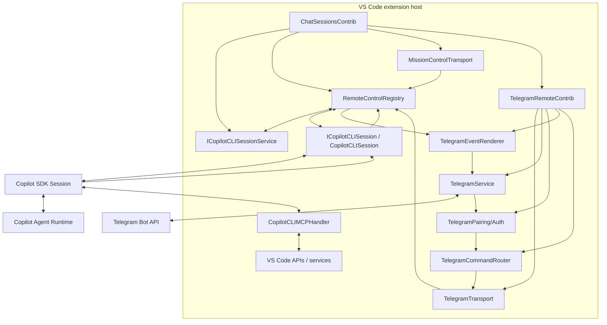
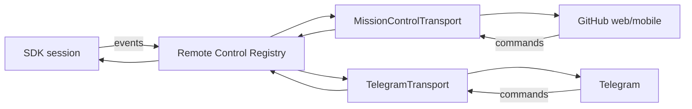
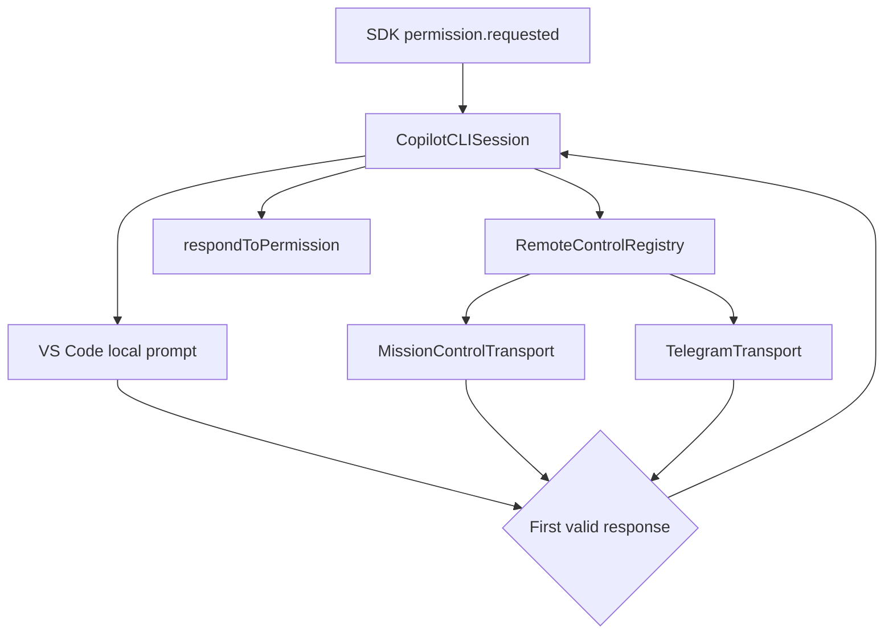
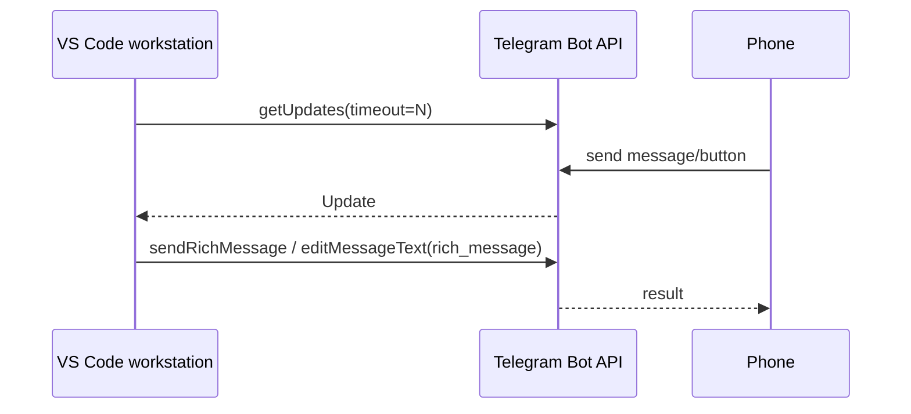
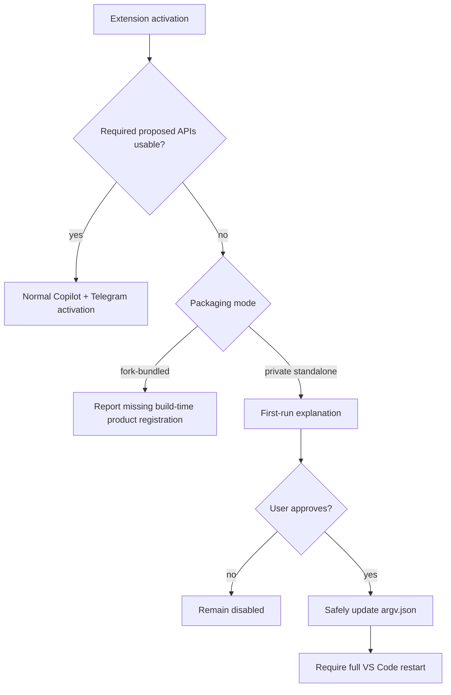

# Architecture

## 1. Architectural position

Telegram remote control is a downstream contribution to the existing Copilot CLI integration, not a replacement agent stack.

The upstream code already provides the major subsystems:

- Copilot SDK loading and runtime lifecycle,
- session creation/resume/history,
- model discovery and selection,
- agent modes,
- permissions and user-input requests,
- tools and MCP,
- worktrees and checkpoints,
- Git integration,
- native VS Code session/chat rendering,
- GitHub Mission Control remote control.

The project adds a new remote transport that observes and controls those same sessions.

## 2. Target component model



## 3. Proposed module layout

All downstream-authored remote-control and Telegram code remains isolated in the fork-owned module. Upstream Copilot CLI files contain only the narrow integration hooks required by that module:

```text
extensions/copilot/src/extension/telegramRemote/
    common/
        remoteControlTypes.ts
        remoteAgentEvent.ts
        activityRound.ts
        telegramTypes.ts
    node/
        remoteControlRegistry.ts
        telegramTransport.ts
        telegramService.ts
        telegramBotClient.ts
        telegramPairingService.ts
        telegramCallbackRegistry.ts
        telegramCommandRouter.ts
        activityAggregator.ts
        telegramActivityTimeline.ts
        telegramRichRenderer.ts
        telegramSessionState.ts
        test/
    vscode-node/
        remotePromptDispatcher.ts
        missionControlTransport.ts
        missionControlQr.ts
        telegramRemoteContribution.ts
        test/
```

The older `telegramEventRenderer.ts` / `telegramActivityCoalescer.ts` remain only as a tested compatibility implementation and are no longer selected by the composition root. New activity work targets the Rich Message timeline above.

Telegram-specific classes MUST NOT be added to `copilotcliSession.ts` or imported by the shared registry. That upstream file receives only the narrow hooks required to publish session events, race interactive responses and expose safe session actions.

## 4. Composition root

Upstream `ChatSessionsContrib` already creates a child service collection containing Copilot CLI services and then instantiates Copilot contributions.

Relevant source:

- [`../../src/extension/chatSessions/vscode-node/chatSessions.ts`](../../src/extension/chatSessions/vscode-node/chatSessions.ts)

The current source has two registration paths: the session-controller path in `registerCopilotCLIServices()` and the older V1/non-controller path in `registerCopilotCLIServicesV1()`. Implement and validate the controller path first. Add V1 compatibility only after the registry contract is stable.

Preferred first downstream change:

```ts
this._register(
    copilotcliAgentInstaService.createInstance(TelegramRemoteContrib)
);
```

This is preferable to creating a second Copilot SDK client/session manager because the Telegram layer should target the same session objects used by VS Code.

## 5. Session ownership

The existing session service remains authoritative.

Relevant source:

- [`../../src/extension/chatSessions/copilotcli/node/copilotcliSessionService.ts`](../../src/extension/chatSessions/copilotcli/node/copilotcliSessionService.ts)

Important capabilities already exposed by the service include session lifecycle events and methods for session discovery, creation, loading, history and forking.

`getSession()` and `createSession()` return `IReference<ICopilotCLISession>`. Every caller MUST explicitly own and dispose that reference. The implemented Telegram selection, status, activity timeline and correlation paths deliberately use metadata methods only and never call either reference-returning method. `/new` stages provisional controller metadata and lets the first native request materialize the wrapper. The registry binding is installed and disposed by the normally owned `CopilotCLISession` wrapper; Telegram does not pin that wrapper. Any future feature that does acquire a reference must use deterministic `try/finally` or an explicit disposable lifetime.

The Telegram layer stores only remote UI routing state such as:

```ts
interface TelegramRemoteSelection {
    pairingId: string;
    telegramUserId: number;
    chatId: number;
    sessionId: string;
    sessionScopeFingerprint: string;
    selectedAt: number;
}
```

It MUST NOT maintain an independent copy of the conversation as the source of truth.

### 5.1 Current-workspace authorization boundary

Consent to the current VS Code window is not authorization for every session returned by `getAllSessions()`. Before Telegram receives session metadata or performs selection, status, prompt, steering, stop, restoration, event publication, or final-answer publication, the session's `workingDirectory` is authorized by `CurrentWorkspaceTelegramSessionScopePolicy`.

The current conservative policy permits a session only when all of the following are true:

- the current window has at least one consented workspace root,
- the session has a valid file-URI working directory,
- VS Code resource identity reports that directory equal to or below one of those roots,
- the pairing and consent scope are still current.

URI identity uses `extUriBiasedIgnorePathCase.isEqualOrParent`; string-prefix path checks are forbidden because they mishandle sibling paths, casing and URI authorities. Empty windows, missing working directories, foreign authorities, sibling repositories, and changed roots fail closed. The durable selection schema is versioned and stores a fingerprint that combines the consent scope with the normalized session URI, so older or cross-scope selections cannot restore silently.

## 6. Active session bridge

`CopilotCLISession` already owns/wraps the SDK session used by VS Code.

Relevant source:

- [`../../src/extension/chatSessions/copilotcli/node/copilotcliSession.ts`](../../src/extension/chatSessions/copilotcli/node/copilotcliSession.ts)

Existing behavior that should be reused includes:

- active/busy session state,
- `mode: 'immediate'` steering,
- abort on the wrapped SDK session,
- model updates,
- permission response handling,
- user-input response handling,
- request-scoped SDK event subscriptions,
- Mission Control event forwarding.

### Current interface constraint

`ICopilotCLISession` currently exposes session metadata, status, `handleRequest()`, stream attachment, permission-level mutation and model inspection. It does **not** expose persistent SDK events, abort, permission responses, user-input responses or selected-model mutation. The concrete class exposes `sdkSession`, but Telegram must not depend on a concrete-class cast or receive the full SDK session.

`handleRequest()` is also not a general remote-send API: it requires a `ChatParticipantToolToken` from a real VS Code `ChatRequest`. Telegram cannot mint that token.

### Required bridge design

Phase 1 introduces a transport-neutral registry and a narrow session binding. Names are provisional and should reuse upstream SDK types:

```ts
type RemoteRequestOrigin =
    | { kind: 'missionControl'; transportId: 'missionControl'; commandId: string; mode?: MissionControlMode }
    | { kind: 'telegram'; transportId: 'telegram'; updateId: string; mode: 'interactive' | 'plan' };

interface IRemoteControlTransport {
    readonly id: string;
    readonly onDidReceiveCommand: Event<RemoteCommand>;
    publish(sessionId: string, event: RemoteAgentEvent): void;
    requestPermission?(sessionId: string, request: RemotePermissionRequest, token: CancellationToken): Promise<PermissionRequestResult | undefined>;
    requestUserInput?(sessionId: string, request: RemoteUserInputRequest, token: CancellationToken): Promise<UserInputResponse | undefined>;
    requestExitPlanMode?(sessionId: string, request: RemoteExitPlanModeRequest, token: CancellationToken): Promise<RemoteExitPlanModeResponse | undefined>;
}

interface IRemoteSessionControl {
    abort(): Promise<void>;
    getCurrentMode(): string | undefined;
}

interface IRemoteControlRegistry {
    registerTransport(transport: IRemoteControlTransport): IDisposable;
    attachSession(sessionId: string, control: IRemoteSessionControl): IDisposable;
    publish(sessionId: string, event: SessionEvent): void;
    waitForPermission(...): Promise<PermissionRequestResult | undefined>;
    waitForUserInput(...): Promise<UserInputResponse | undefined>;
    waitForExitPlanMode(...): Promise<RemoteExitPlanModeResponse | undefined>;
}
```

The registry owns transport fan-out and correlation; `CopilotCLISession` remains the only owner of SDK response calls. Prompt injection is intentionally separate and goes through the native chat request path described in section 7.

### Typed request origin

The registry-created typed origin replaces the former `SendOptions.source.startsWith('command-')` mode inference. That older inference was unsafe for an N-transport design because a Telegram request accidentally or maliciously labelled `command-*` could inherit Mission Control's `autopilot` mode.

The registry MUST create a typed `RemoteRequestOrigin`; transport payloads cannot supply or override it. Carry this typed origin through pending request context and `CopilotCLISessionInput`. Derive effective remote mode/permission only from `origin.kind` and the originating transport's policy:

- only a registry-created `missionControl` origin may carry Mission Control's `autopilot` mode,
- a registry-created `telegram` origin is always `interactive` or `plan` and defaults to `interactive`,
- Telegram remains limited to approve-once/deny even while Mission Control is active in `autopilot`,
- `SendOptions.source` remains a separately serialized SDK correlation/telemetry string and is never an authorization signal.

Telegram source strings SHOULD use a distinct `telegram-*` namespace and MUST NOT begin with `command-`, but the typed origin—not the prefix—is the security boundary.

## 7. Native prompt and steering path

Remote prompts MUST follow the same path currently used by Mission Control:

```text
TelegramTransport
  -> setPendingCopilotCLIRequestContext(sessionId, ...)
  -> workbench.action.chat.openSessionWithPrompt.copilotcli
     (optional userSelectedModelId + userSelectedModelConfiguration)
  -> VS Code creates ChatRequest + ChatParticipantToolToken + selected model configuration
  -> Copilot chat participant resolves the existing session
  -> CopilotCLISession.handleRequest(...)
  -> normal send, or mode: 'immediate' when already busy
```

This internal command is high-risk as an external extension contract, but it is a **required integration path inside the current fork** because it preserves native rendering and supplies the tool-invocation token. Feature-detect it, test it on every upstream rebase and fail visibly if it changes; do not fall back to direct SDK `send()` in V1.

The command implementation awaits the session's `responseCompletePromise`, so its returned promise may remain pending for the entire agent turn. Telegram dispatches it fire-and-forget, creates an initial request-progress round immediately, and lets SDK/registry events report later rounds and completion. Failure cleanup clears only the matching pending request context; it must not erase a newer request for the same session.

## 8. Event projection

Most native rendering listeners are created inside `_handleRequestImplInner` and disposed at the end of the request. They are not a reusable session-level feed. Mission Control separately installs a persistent wildcard listener while remote control is active.

The remote-control seam therefore needs its own explicit session-lifetime subscription or equivalent publication hook. It may normalize the same SDK event types, but it must define ownership and disposal independently of the request-scoped renderer.

Current Mission Control can observe an SDK event twice while a request is active: once through the request-scoped wildcard listener and once through its persistent wildcard listener. Phase 1 MUST collapse remote forwarding to exactly one registry publication point per SDK event. Preserve upstream event IDs/timestamps where present, suppress duplicate IDs before transport fan-out, and reject/repair any event whose `parentId` equals its own ID. Semantic Mission Control compatibility does not require preserving duplicate delivery.

Events are first projected into the verified transport-neutral `RemoteAgentEvent` subset. Tool arguments/results are bounded at this boundary; malformed and unknown events are dropped. A second transport-neutral layer performs semantic aggregation:

```ts
interface ActivityRound {
    id: string;
    sessionId: string;
    requestId?: string;
    toolCallId?: string;
    type: 'reasoning' | 'progress' | 'answer' | 'search' | 'read' | 'edit' | 'command' | 'permission' | 'question' | 'subagent' | 'other';
    summary: string;
    status: 'running' | 'completed' | 'failed' | 'waiting';
    details?: ActivityRoundDetail[];
    steerable: boolean;
    startedAt?: number;
    completedAt?: number;
}
```

The implemented data path is:

```text
SDK SessionEvent
  -> projectRemoteAgentEvent
  -> ActivityAggregator
  -> ActivityRound
  -> TelegramRichRenderer
  -> Telegram Rich Message
```

`ActivityAggregator` groups a consecutive read/search burst until a semantic boundary. Consecutive SDK-visible intent/reasoning updates similarly append to one expandable **Thinking…** round until a tool, answer, interaction, subagent or terminal event changes direction. Commands, edits, permissions, questions, subagents, compact lifecycle updates and final answers remain distinct. `toolCallId` updates a running tool round rather than opening separate start/progress/complete messages.

### Granular Activity Timeline

`TelegramActivityTimeline` owns delivery and correlation, not Copilot execution. Each meaningful round becomes one persistent `sendRichMessage` bubble. Tool and interaction rounds with useful detail use a collapsed `InputRichBlockDetails`; short lifecycle/progress updates use a compact paragraph, and final assistant answers use sanitized rich HTML so Markdown is formatted and visible without expansion. Later mutations use `editMessageText` with the `rich_message` parameter. Edits are coalesced to a 750 ms minimum interval; new, failed, waiting and terminal rounds flush immediately. If editing fails because the message was deleted, expired or otherwise unavailable, the timeline sends a replacement Rich Message with `ReplyParameters` pointing to the former message when possible. A successful assistant answer suppresses the otherwise redundant terminal-completion bubble.

For every sent bubble, the timeline stores `(chatId, messageId) -> (sessionId, requestId, activityRoundId, generation)`. A Telegram reply to a live steerable bubble is resolved against that bounded, expiring map and then submitted through the same native prompt path described in section 7. The normal busy-session path produces SDK `mode: 'immediate'`; no second Copilot session is created. Completed, replaced-generation, wrong-identity, wrong-session and expired correlations return a stale response.

The renderer sanitizes each round before presentation. It exposes only event data the SDK deliberately supplies: intent, progress, assistant-visible messages, reasoning summaries, tool activity, subagent state and terminal results. It does not inspect logs or reconstruct hidden model chain-of-thought. The local `activityDetail` setting remains effective: compact omits successful raw tool progress/output, detailed adds those bounded/redacted details, and debug additionally shows bounded correlation identifiers. Correlation stores metadata only and never acquires `IReference<ICopilotCLISession>`; listing/selection/timeline delivery therefore cannot pin a wrapper, worktree or MCP host.

`sendRichMessageDraft` is available in the narrow Bot API adapter but is intentionally not used by the V1 activity timeline. Telegram drafts are ephemeral 30-second previews and return no persistent message ID, so a running draft cannot provide the stable reply target required for bubble-specific steering. Persistent send/edit is chosen independently for activity and assistant output.

### Existing-session replay

When a remote transport attaches to an existing session, the session bridge uses `sdkSession.getEvents()` as the replay source without exposing the SDK session to the transport. Replay only explicitly supported persisted event types; do not assume ephemeral deltas are retained. Telegram uses replay to seed correlation and bounded internal state only. It never sends replay as new current activity or as a new final answer, and a newly dispatched request starts with clean request-local state.

To avoid a replay/live-subscription gap, install the live listener into a temporary buffer, snapshot and replay persisted events in order, suppress duplicate event IDs, flush unseen buffered live events, then switch to direct live publication.

## 9. Mission Control relationship

Upstream Mission Control is the closest architectural reference.

The current Copilot session implementation:

- listens to all SDK session events,
- buffers selected events,
- submits them to GitHub Mission Control,
- polls for remote commands,
- handles abort,
- handles remote messages/steering,
- handles permission responses,
- handles user-input responses,
- handles plan-exit responses,
- keeps session state shared across wrapper instances.

Telegram should reuse the **control-plane pattern**, not call Mission Control itself.



The generalization is the first implementation milestone, not a later cleanup. Existing `_mcState`, `_waitForMcPermissionResponse()` and `_waitForMcUserInputResponse()` logic is hard-coded to one remote transport. Move that behavior behind the registry before adding Telegram branches. Preserve Mission Control's API client, buffering and poll cadence inside `MissionControlTransport`; the goal is a narrow transport seam, not a rewrite of the GitHub protocol.

The first registry test uses Mission Control plus an in-memory second transport. Telegram work starts only after Mission Control behavior remains semantically unchanged and each SDK event is published exactly once.

## 10. Permissions and interactive requests

The registry races the existing local UI, Mission Control and Telegram responders. Telegram publishes permission and question requests as individual waiting Rich Message rounds. Permission controls are approve-once/deny callbacks; question controls are bounded choice callbacks, with a reply to that question bubble used for freeform input when allowed. Plan requests use the separate `TelegramPlanBridge`, which shows only `interactive`, `exit_only`, denial and correlated reply feedback.

Conceptually:



Rules:

- responses are correlated by session ID + request ID + optional tool-call ID,
- stale callbacks are rejected,
- one resolution wins,
- pending Telegram buttons are invalidated after resolution,
- cancellation resolves safely to deny where appropriate.
- Telegram exposes only approve-once and deny in V1.
- Telegram may never set or raise the session permission level to `autoApprove` or `autopilot`, directly or through a mode change.
- a callback registration is one-shot; replay cannot resolve the request twice,
- local or Mission Control resolution cancels Telegram's pending responder and removes its active controls.
- plan response types cannot represent `autopilot`, `autopilot_fleet` or `autoApproveEdits`; registry runtime validation also rejects forged elevating values before they can win.

## 11. Telegram networking

Telegram transport uses long polling:



The workstation initiates all network connections. No inbound service is required.

Only one active `getUpdates` consumer may exist for a bot token. The contribution owns a singleton poller/lease and releases it on disable/deactivation. Automatic startup rejects a healthy competing owner. An explicit user **Reconnect** may transfer the lease: it atomically replaces ownership, the former owner detects the nonce change and aborts, and the new owner waits through the heartbeat handoff before polling. This provides recovery from a reload/orphaned window without silently letting two pollers compete.

## 12. Telegram UI state

Telegram UI should use a small state machine rather than parse arbitrary text as control commands.

```text
UNPAIRED
  -> PAIRING
  -> READY
      -> SESSION_SELECTED
          -> IDLE
          -> RUNNING
          -> NEEDS_PERMISSION
          -> NEEDS_INPUT
          -> ERROR
```

Normal text behavior:

- no session selected -> ask/select session,
- selected idle session -> normal prompt,
- selected busy session -> steering by default,
- explicit queue command -> enqueue where implemented.

Destructive/permission operations use callback tokens, never free-text inference.

## 13. Model source of truth

The Telegram catalogue has two provider-qualified sources:

- native Copilot CLI models from `ICopilotCLIModels`, and
- models visible to the built-in extension through `vscode.lm.selectChatModels()`, including configured models from `chatLanguageModels.json`.

Relevant source:

- [`../../src/extension/chatSessions/copilotcli/node/copilotCli.ts`](../../src/extension/chatSessions/copilotcli/node/copilotCli.ts)

`TelegramLanguageModelBridge` merges both sources, assigns provider-qualified Telegram IDs, removes native and recursive proxy duplicates, and retains the exact `LanguageModelChat` object returned by VS Code. `TelegramRequestPreferences` stores only an identity/session-bound preference for the next Telegram prompt and revalidates it immediately before dispatch.

Native models continue through `userSelectedModelId`. A VS Code-backed selection travels as private `ChatRequest.modelConfiguration`, where `CopilotCLIChatSessionInitializer` resolves it to an additive Copilot SDK provider/model registry. `CopilotCLISession` registers that registry idempotently before `updateModel()` selects it. The SDK's OpenAI Responses request is serviced by a nonce-authenticated loopback adapter bound only to `127.0.0.1`; the adapter calls the retained VS Code LM object, so configured provider secrets stay inside the provider implementation and are never copied into Telegram configuration, logs, or SDK provider credentials.

Current selected-model visibility reads an active wrapper through `getSelectedModelId()`. For an inactive session, `ICopilotCLISessionService.getSelectedModelId()` transiently opens the SDK session, reads the model, and closes it without creating a wrapper. Current mode is displayed only from a live registry binding and is omitted when unknown.

The execution paths remain deliberately distinct:

```text
Native Copilot CLI model
vs.
VS Code LM model adapted into the Copilot SDK agent harness
```

Visibility is not a provider-compatibility claim. A configured backend must still pass prompt, tool, permission, steering, image and abort tests before the documentation marks that backend compatible.

## 14. IDE context

Do not rebuild IDE tooling in Telegram. The agent continues to use the existing VS Code MCP integration.

Relevant source:

- [`../../src/extension/chatSessions/copilotcli/node/mcpHandler.ts`](../../src/extension/chatSessions/copilotcli/node/mcpHandler.ts)

This preserves upstream behavior for diagnostics, selection, diff/open-diff flows and other IDE-aware capabilities.

## 15. Packaging modes and proposed APIs

The current implementation target is a VS Code source fork with the modified Copilot extension bundled into the product. V1 runs inside that built-in extension, whose manifest already declares its proposed APIs, and uses the existing Copilot activation path. Validate proposal availability in the built product, but do not add a separate Telegram extension ID or make `argv.json` mutation a prerequisite for V1.

A future V2 own-ID companion has two possible authorization paths:

- **Fork-bundled companion:** add its exact extension ID and proposal list to `product.json#extensionEnabledApiProposals` at build time. Keep that list synchronized with the companion's `package.json#enabledApiProposals`. Activation verifies the result but never edits `product.json`.
- **Private standalone VSIX experiment:** enable its ID through extension-development mode or `--enable-proposed-api`/`argv.json`, with explicit consent and a full application restart.

Product registration or runtime proposal enablement grants only VS Code API proposals. It does not provide the missing public Copilot session-control seam, so V2 remains blocked on an upstream-supported API or a separately designed fork bridge.

Any such V2 experiment needs a preflight activation path that uses only stable/basic functionality before touching proposed APIs:



The fork-bundled branch fails closed with an actionable build diagnostic; it cannot repair product registration at runtime because proposed-API authorization is resolved before extension activation.

See [SETUP_RELEASE_AND_LICENSING.md](./SETUP_RELEASE_AND_LICENSING.md). Hosted Copilot authentication/entitlement for a self-built fork requires a separate source-level validation; these documents do not assume that Microsoft signing either permits or prevents it.

## 16. VS Code UI surfaces

Remote control was invisible in the original native UI: Mission Control only printed a one-time markdown banner into the chat stream when `/remote` ran. A session could therefore be remotely steerable with nothing on screen to say so. The implemented local UI makes remote attachment continuously visible and locally revocable; its wording is derived from the attached transport's actual permission-response capability.

### 16.1 Design constraint

All native indicators are rendered from **transport-neutral** state. Upstream files ask the registry "which transports are attached to this session?" and render the returned label/icon. Telegram strings, emoji and bot identities never appear in `copilotCLIChatSessions.ts` or `copilotcliSession.ts`.

```ts
interface IRemoteAttachmentInfo {
    readonly transportId: string;
    readonly label: string;     // localized, e.g. "Telegram"
    readonly themeIcon: string; // codicon id, e.g. 'radio-tower'
    readonly remotePermissionResponses: boolean;
}

// on IRemoteControlRegistry
getAttachments(sessionId: string): readonly IRemoteAttachmentInfo[];
readonly onDidChangeAttachments: Event<string /* sessionId */>;
```

### 16.2 Session list indicator (primary)

`ChatSessionItem` (proposed `chatSessionsProvider`) exposes `label`, `description`, `badge`, `status`, `tooltip` and `metadata`. Upstream already consumes `badge` (repo/folder), `status` (session state) and `metadata`; **`description` and `tooltip` are unused and are the correct slots.**

Rendered in `CopilotCLIChatSessionContentProvider` where `badge`/`metadata` are already assigned:

```ts
const attachments = this._remoteControlRegistry.getAttachments(session.id);
if (attachments.length) {
    const description = new vscode.MarkdownString(
        attachments.map(a => `$(${a.themeIcon}) ${a.label}`).join(' '));
    description.supportThemeIcons = true;
    item.description = description;
    item.tooltip = buildRemoteTooltip(attachments); // transport + who is paired + how to revoke
}
```

Live updates reuse the existing refresh contract rather than a new mechanism:

```ts
refreshSession({ reason: 'update', sessionId });
```

subscribed from `onDidChangeAttachments`. No new provider, no new API proposal.

### 16.3 Global status bar item

A single window-level item, following the precedent of `copilot.networkStatus` in `extension/log/vscode-node/loggingActions.ts`:

| State | Text | Background |
| --- | --- | --- |
| never configured / disabled | hidden | — |
| previously configured / disabled | `$(circle-slash) Telegram: Off` | none |
| current workspace consent required | `$(shield) Telegram: Workspace authorization required` | `statusBarItem.warningBackground` |
| connecting/retrying | `$(sync~spin) Telegram` | none |
| connected, no session attached | `$(radio-tower) Telegram` | none |
| session attached | `$(radio-tower) Telegram: <session title>` | `statusBarItem.warningBackground` |
| unauthorized/error | `$(alert) Telegram` | `statusBarItem.errorBackground` |

The QuickPick is state-aware:

- disabled: **Enable Remote Access** only;
- current workspace consent required: **Authorize Current Workspace**, **Keep Disabled**, *Forget Configuration*, and *Open Log*;
- recoverable failure or unexpected stop: **Reconnect**, *Show Status*, *Open Log*, **Disable Remote Access**, and *Forget Configuration* when applicable;
- authentication/configuration failure: *Set Up Again* instead of Reconnect;
- connected: *Show Status*, *Unpair User* only when paired (otherwise *Pair User*), *Open Log*, and **Disable Remote Access**.

The kill switch remains one click away whenever access is enabled. A configured disabled instance stays discoverable through the muted Off item when the visibility setting is on; `Telegram Remote: Enable Remote Access` remains in the Command Palette even when that item is hidden.

### 16.3.1 Lifecycle ownership and recovery

Setup, Enable and Reconnect share one generation-bound connection operation. Concurrent invocations reuse that operation rather than starting another poller. Disable increments the generation and blocks incoming dispatch/callback registration synchronously, then hides the attachment from routing/UI and awaits poller cleanup. A late validation/start result cannot re-enable the cancelled generation. If a local turn is still active, the hidden attachment remains event-delivery-only until its correlated terminal event; this does not permit commands or permission responses.

Readiness is distinct from connection state: `missing-token` performs complete setup, `missing-pairing` reuses the stored token and starts pairing, `needs-workspace-consent` shows only the local consent dialog and reuses both token and paired identity, and `ready` reconnects directly. Runtime admission is separately `disabled`, `needs-consent`, `pairing-only`, or `authorized`. Pairing-only admits only the matching challenge command. `onDidAuthorizeConnection` fires only after bot validation, token-bound identity, and current exact-scope consent all pass, so persisted session restoration still revalidates session scope. Recovery cancellation preserves configuration; only explicit *Forget Configuration* removes token, consent, pairing, and the durable marker.

### 16.4 In-chat notice

When a transport attaches while a request stream is live, emit one capability-accurate notice through the existing routed stream:

```ts
stream.warning(remotePermissionResponses
    ? l10n.t('This session is now remotely controllable from {0}. Supported permission prompts may be answered remotely.', label)
    : l10n.t('This session is now remotely controllable from {0}. Permission prompts must be answered locally.', label));
```

`stream.warning()` already exists on `CopilotCLIResponseStreamRouter` and no-ops safely when no UI stream is attached, so this needs no null-guarding and no new plumbing. Do **not** use `addUserAssistantMessage()` for notices — it emits a synthetic `assistant.message` into the SDK session and would pollute both the transcript and the model's context. Attach/detach events go to the extension log for the audit trail instead.

### 16.5 Configuration and setup

V1 uses commands and settings only. No webview, no custom editor — the setup surface is small and a webview would add proposed-API-independent maintenance cost for no benefit.

- `Telegram Remote: Set Up` — a `QuickPick`/`InputBox` wizard: consent (16.6) → bot token (`password: true`) → validate via `getMe` → show pairing challenge → wait for `/pair` → confirm.
- Settings under `github.copilot.chat.cli.telegram.*` registered with `defineSetting()` in `platform/configuration/common/configurationService.ts` plus matching `contributes.configuration` entries. The bot token is **never** a setting; it lives in `IVSCodeExtensionContext.secrets`.
- Every command is `enablement`-gated so the palette does not advertise pairing actions when the feature is disabled.

### 16.6 Consent gate

The first enable is blocked on an explicit modal. This is the single point where the risk is stated in full; see [SECURITY.md](./SECURITY.md) section 20 for the required content and wording rules.

```ts
const choice = await vscode.window.showWarningMessage(
    l10n.t('Enable Telegram remote control of Copilot?'),
    { modal: true, detail: /* risk disclosure */ },
    l10n.t('Enable'), l10n.t('Learn More'));
```

Default is cancel. Declining leaves the feature disabled and does not persist a token.

## 17. Source ownership boundary

### Upstream-owned

- agent implementation,
- SDK session internals,
- native Copilot UI,
- tool definitions,
- MCP integration,
- worktrees/checkpoints,
- GitHub authentication implementation,
- model provider implementation,
- Mission Control.

### Downstream-owned

- Telegram Bot API client/wrapper,
- long-poll lifecycle,
- pairing and Telegram authorization,
- Telegram UI renderer,
- remote routing/selection state,
- transport-neutral event projection and semantic activity aggregation,
- Telegram Rich Message rendering and message-to-activity correlation,
- callback/request correlation,
- proposed-API onboarding helper,
- downstream build/release metadata.

### Shared seam

The registry contract and Mission Control adapter are shared integration code. Only the narrow glue required to publish existing session events, race interactive responses and expose safe actions should touch `copilotcliSession.ts`.

## 18. Architecture quality gate

A proposed implementation change should be rejected if it:

- duplicates session state already maintained upstream,
- creates a second Copilot SDK session for the same VS Code session merely for Telegram,
- parses VS Code UI text or screen state,
- relies on terminal/PTY scraping when an SDK event exists,
- introduces Telegram types into core Copilot model/tool/worktree services,
- modifies large upstream files when a small service/interface seam would work,
- adds Telegram-specific branches to Mission Control permission/question logic,
- sends a remote prompt directly to the SDK instead of through the native chat request path,
- loses or leaks an `IReference<ICopilotCLISession>`,
- starts a second long poller for the same bot token,
- lets Telegram raise permission level to `autoApprove` or `autopilot`,
- renders a transport-specific string or icon inside an upstream file,
- leaves a session remotely attached with no persistent local indicator,
- enables remote access without an explicit modal consent gate,
- requires inbound networking for the default Telegram transport.
