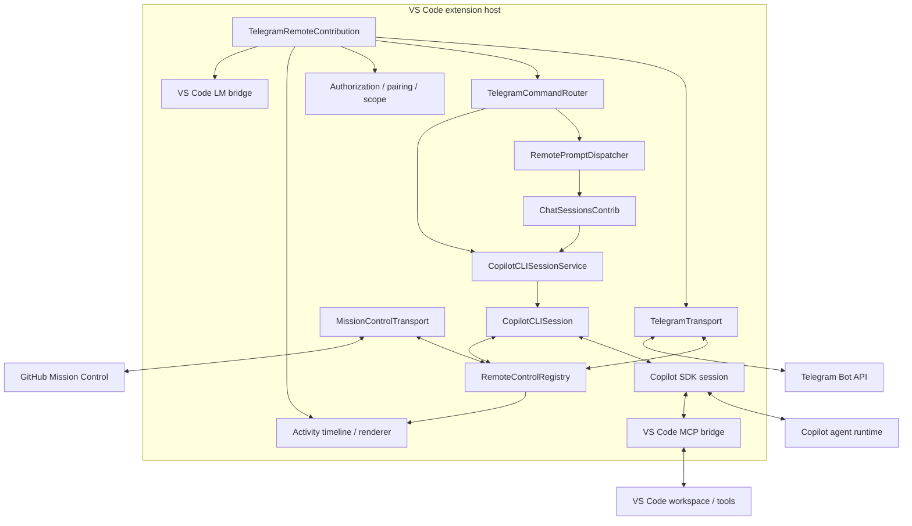
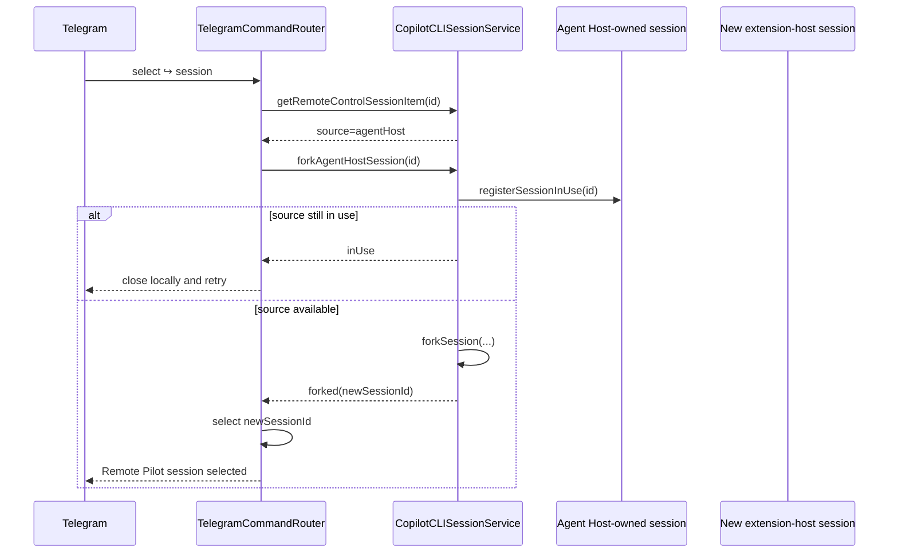
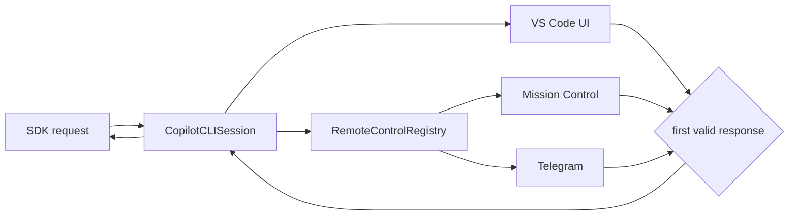

# Architecture

> **Status:** Current architecture reference
> **Scope:** `copilot-telegram` downstream branch
> **Last reviewed:** 2026-09-01
>
> This document describes the architecture implemented in the branch today. Historical implementation sequencing belongs in [IMPLEMENTATION_PLAN.md](./IMPLEMENTATION_PLAN.md); major design decisions are recorded in [adr/](./adr/README.md).

## 1. Architectural position

The project is a downstream extension of the existing VS Code Copilot implementation, not a replacement agent stack.

The upstream Copilot code remains authoritative for:

- Copilot SDK/runtime lifecycle,
- session creation, resume and persistence,
- agent execution,
- tools and MCP,
- permissions and user-input requests,
- worktrees/checkpoints,
- model/runtime behavior,
- native VS Code chat/session rendering,
- GitHub Mission Control.

The downstream project adds two layers:

1. a **transport-neutral remote-control framework** under `src/extension/remoteControl/**`, and
2. a **Telegram transport/presentation implementation** under `src/extension/telegramRemote/**`.

The core rule is:

> Remote clients control existing Copilot behavior; they do not become a second Copilot implementation.

## 2. Current component model



Telegram is a transport and remote presentation layer. It does not own the conversation, model context or agent loop.

## 3. Source ownership boundary

### 3.1 Generic remote-control framework

```text
extensions/copilot/src/extension/remoteControl/
    common/
        remoteControlTypes.ts
        remoteAgentEvent.ts
        remoteLanguageModelBridgeTypes.ts
    node/
        remoteControlRegistry.ts
        test/
    vscode-node/
        remotePromptDispatcher.ts
        missionControlTransport.ts
        missionControlQr.ts
        test/
```

This layer defines:

- transport registration and capabilities,
- typed remote request provenance,
- live session binding,
- attachment state,
- remote event publication,
- permission/question/plan response fan-in,
- abort,
- native prompt dispatch support,
- shared Mission Control integration.

It contains no Telegram Bot API, bot token, chat ID, polling, Telegram rendering or Telegram authorization types.

### 3.2 Telegram adapter

```text
extensions/copilot/src/extension/telegramRemote/
    common/
    node/
    vscode-node/
```

The Telegram layer owns:

- Bot API client and long polling,
- token validation and SecretStorage integration,
- private-chat pairing and numeric user authorization,
- workspace/session scope authorization,
- command/callback routing,
- session/model/mode/file pickers,
- live activity presentation,
- message/activity correlation,
- Telegram-specific rate limits and lifecycle,
- local Telegram status/setup UI.

Small compatibility re-export files may remain under `telegramRemote/**`, but new generic consumers should depend on `remoteControl/**` directly.

## 4. Remote-control registry

`IRemoteControlRegistry` is the main downstream architecture seam.

Current responsibilities include:

```ts
bindSession(session)
registerTransport(transport)
attachTransport(sessionId, transportId)
getAttachments(sessionId)
createRequestOrigin(transportId, requestId, mode)
requestPermission(...)
requestUserInput(...)
requestExitPlanMode(...)
abort(sessionId, transportId)
```

Transport registrations declare explicit capabilities. Operations not granted by those capabilities fail closed.

The registry also makes request provenance an identity-trusted internal object. A remote payload cannot gain authority by constructing a structurally similar object or by choosing an SDK `source` string.

See [ADR-0001](./adr/0001-transport-neutral-remote-control-registry.md).

## 5. Session ownership

The existing `CopilotCLISessionService` remains authoritative for CLI-backed session metadata and lifecycle.

`getSession()` and `createSession()` return `IReference<ICopilotCLISession>`. Remote UI code must not retain these references merely to list, select or display a session. The current Telegram selection/status paths intentionally use metadata and let the normally owned `CopilotCLISession` wrapper bind itself to the remote registry.

Telegram persists only routing metadata such as the selected session ID and an authorization fingerprint. It does not persist a parallel conversation transcript as the source of truth.

## 6. Two session ownership domains

Current VS Code/Copilot can expose sessions owned by different local runtimes.

### 6.1 Extension-host sessions

These are controllable through the downstream `CopilotCLISession`/registry integration. Telegram can select them directly after workspace authorization.

### 6.2 Agent Host-owned sessions

The current branch can **discover** Agent Host-owned sessions for remote selection. `CopilotCLISessionService.getRemoteControlSessions()` combines extension-host session metadata with Agent Host-owned metadata.

Ownership is detected using current session metadata and the Agent Host session-data directory derived from VS Code's user-data layout.

An Agent Host session is not directly attached to `IRemoteControlRegistry` and Telegram is not an AHP client.

When the user selects an Agent Host-owned session:



The Telegram picker marks these sessions with `↪` and explains that they continue as a **new Remote Pilot session**.

This preserves ownership boundaries rather than attempting to mutate a live Agent Host session from the extension host.

See [ADR-0003](./adr/0003-agent-host-session-handover.md).

## 7. Workspace authorization boundary

Consent to a VS Code window is not blanket authorization to every session returned by the SDK/session manager.

Every externally visible session is authorized against the currently consented workspace roots before Telegram can:

- list it,
- select it,
- restore it,
- show status,
- send/steer,
- stop it,
- publish activity/final output.

The current policy requires a valid file-URI working directory equal to or below an authorized root according to VS Code resource identity. String-prefix path checks are not accepted.

Empty windows, missing working directories, foreign URI authorities, sibling repositories and stale authorization fingerprints fail closed.

## 8. Native prompt and steering lifecycle

Telegram does not call Copilot SDK `session.send()` directly.

The current path is:

```text
TelegramCommandRouter
    -> RemoteControlRegistry.createRequestOrigin(...)
    -> RemotePromptDispatcher
    -> setPendingCopilotCLIRequestContext(...)
    -> workbench.action.chat.openSessionWithPrompt.copilotcli
    -> VS Code creates real ChatRequest/tool token/model config
    -> CopilotCLISession.handleRequest(...)
    -> normal request or immediate steering
```

This preserves the native VS Code request lifecycle, tool token, selected-model configuration and native chat rendering.

`RemotePromptDispatcher` deliberately treats the command as asynchronous turn execution: Telegram acknowledges dispatch without awaiting the entire agent turn, while registry/SDK events drive subsequent remote presentation.

See [ADR-0002](./adr/0002-use-native-vscode-request-lifecycle.md).

## 9. Typed request provenance and permission ceiling

Remote origin is created by the registry and carries the registered transport identity and requested mode.

SDK `SendOptions.source` is correlation/telemetry metadata only. In particular, a string prefix such as `command-` is not trusted as evidence that a request originated from Mission Control.

Telegram is deliberately limited to non-elevating modes:

- `interactive`
- `plan`

Telegram cannot request:

- `autoApprove`
- `autopilot`
- `autopilot_fleet`

and cannot convert a one-time permission response into a persistent permission-policy change.

## 10. Event projection

The native VS Code renderer installs request-scoped listeners and is not suitable as a reusable remote session feed.

The downstream session bridge therefore exposes session-lifetime SDK events to the registry. Events are normalized and bounded before they reach transports.

The main path is:

```text
SDK SessionEvent
    -> session bridge
    -> RemoteControlRegistry
    -> remoteAgentEvent projection
    -> ActivityAggregator
    -> TelegramActivityTimeline / rich renderer
    -> Telegram
```

The Telegram timeline groups semantically related activity rather than mirroring every SDK event one-for-one.

Examples:

- consecutive read/search work may aggregate,
- tool start/progress/complete updates one correlated tool round,
- permission/question/plan interactions remain distinct,
- final assistant output remains distinct,
- nested agent activity is summarized without mixing its assistant stream into the root response.

Only runtime-visible summaries and events are presented. The system does not reconstruct hidden chain-of-thought.

## 11. Existing-session replay

When an extension-host session becomes remotely attached, persisted events may be read through the session bridge to seed correlation/state.

Replay is not displayed as fresh activity.

The safe ordering is:

1. establish live buffering,
2. read persisted events,
3. process replay in order,
4. deduplicate by event ID,
5. flush unseen buffered live events,
6. continue direct live publication.

This avoids both replay gaps and duplicated remote output.

## 12. Permissions, questions and plan responses

The session remains the only component that responds to the SDK.

The registry allows multiple UIs/transports to race for the same pending interaction:



Rules:

- exact session/request/tool correlation,
- first valid response wins,
- stale/replayed callbacks fail,
- losing controls are cancelled/invalidated,
- Telegram permission responses are approve-once or deny only,
- Telegram plan actions are `interactive`, `exit_only`, denial or bounded feedback only.

## 13. Telegram connectivity and lifecycle

V1 uses Telegram Bot API long polling.

The workstation initiates outbound HTTPS requests. The default deployment needs no:

- inbound port,
- webhook server,
- static public IP,
- port forwarding,
- Tailscale dependency.

Only one healthy poller may consume a bot token. Automatic competing consumers fail visibly. Explicit reconnect can perform a nonce-checked lease handoff so a stale/reloaded owner exits before the replacement poller becomes authoritative.

Lifecycle generations prevent a late async start/validation result from reviving a disabled transport.

## 14. Telegram presentation model

Telegram has several distinct UI surfaces:

- native bot command menu,
- optional quick-control reply keyboard,
- inline pickers/callbacks,
- live activity draft,
- persistent rich activity/final messages,
- reply-to-message steering.

Persistent correlation is bounded and identity/session scoped. A visible Telegram button or reply target is never treated as authorization by itself.

The session picker behaves differently by source:

- extension-host session: select directly,
- Agent Host session: show `↪`, fork when available, then select the resulting Remote Pilot session.

## 15. Model integration

The Telegram model catalogue can combine:

- native Copilot CLI models from `ICopilotCLIModels`, and
- models exposed through `vscode.lm.selectChatModels()`.

Native models continue through the ordinary Copilot model-selection path.

Configured VS Code LM selections use the downstream authenticated loopback Responses adapter to make the selected `LanguageModelChat` object available to the existing Copilot SDK agent harness without copying provider credentials into Telegram state.

Model visibility is not a compatibility claim. A backend is compatible only after its tool/permission/steering/abort behavior is validated.

## 16. Native VS Code surfaces

The local UI exposes Telegram lifecycle and remote attachment through transport-neutral state wherever possible.

The main principles are:

- remote access is locally visible,
- a kill switch remains locally discoverable,
- native session indicators consume generic attachment metadata rather than Telegram-specific branches,
- setup/enable/reconnect state is explicit,
- diagnostics omit prompts, answers, tokens and private paths.

## 17. Packaging architecture

The current implementation runs as a modified bundled Copilot implementation in the downstream VS Code source fork.

Why:

- the required Copilot session-control seam is internal,
- proposed APIs are extension-ID sensitive,
- a separately identified extension does not automatically gain the official provider/session ownership,
- public Copilot extension exports do not provide equivalent control.

Custom-ID/private experiments remain useful for compatibility research, but they are not the current production architecture of this branch.

See [ADR-0004](./adr/0004-bundled-fork-before-standalone-extension.md) and [SETUP_RELEASE_AND_LICENSING.md](./SETUP_RELEASE_AND_LICENSING.md).

## 18. Agent Host/AHP direction

The branch now interoperates with Agent Host-owned session history through **discovery and fork handover**.

It does not currently implement:

```text
Agent Host
    └── AHP
        ├── VS Code client
        └── Telegram/Emagin8 client
```

Direct AHP multi-client control remains an architectural research direction because it could eventually remove the need to fork an Agent Host-owned session into the extension-host control domain.

Until that is implemented and validated, documentation and promotion must describe the current handover behavior accurately.

## 19. Architecture quality gate

Reject a proposed change if it:

- duplicates conversation/session state already owned upstream,
- creates a second SDK session merely to mirror an already controllable extension-host session,
- bypasses the native VS Code request lifecycle for Telegram prompts without a deliberate architecture decision,
- treats string prefixes or Telegram payload fields as trusted provenance,
- leaks or pins session references for UI-only work,
- lets Telegram raise persistent permission policy,
- mixes Telegram Bot API/auth types into the generic remote-control layer,
- exposes a session outside the current authorized workspace,
- starts a competing long poller silently,
- claims direct Agent Host/AHP control when only fork handover is implemented,
- claims hidden chain-of-thought access,
- requires inbound networking for the default Telegram transport.