# Call Flows

This document captures the intended runtime call paths. Names are architectural and may be adjusted to match final implementation types.

## 1. Extension activation

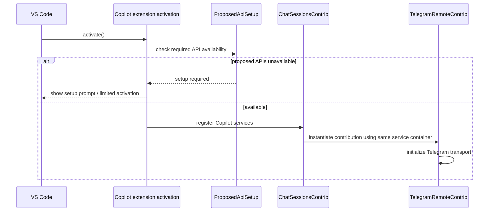

## 2. Telegram long-poll lifecycle

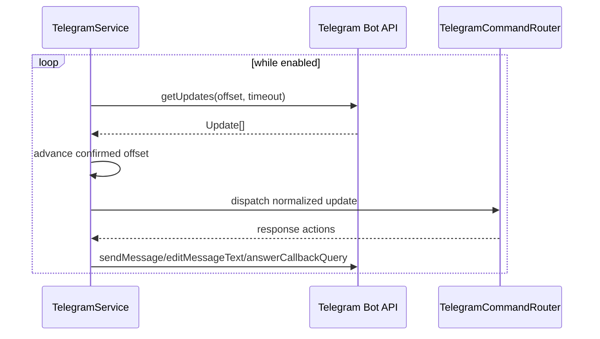

Requirements:

- offset advances only after an update is safely accepted for processing,
- duplicate update IDs are ignored,
- retry uses bounded backoff,
- only one poller may consume a configured bot token in a given extension process.

## 3. Pairing

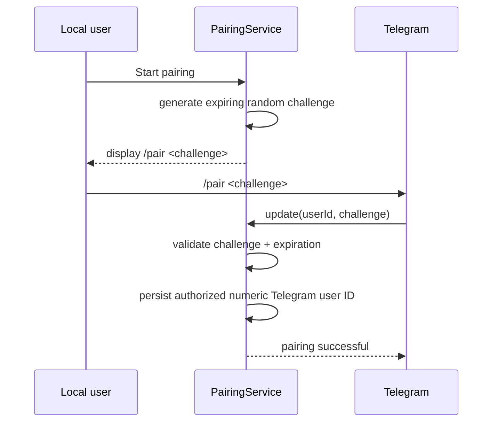

Security properties:

- pairing code is single-use,
- code expires quickly,
- authorization is bound to Telegram numeric user ID, not username,
- bot token alone does not authorize a Telegram user.

## 4. Session list and selection

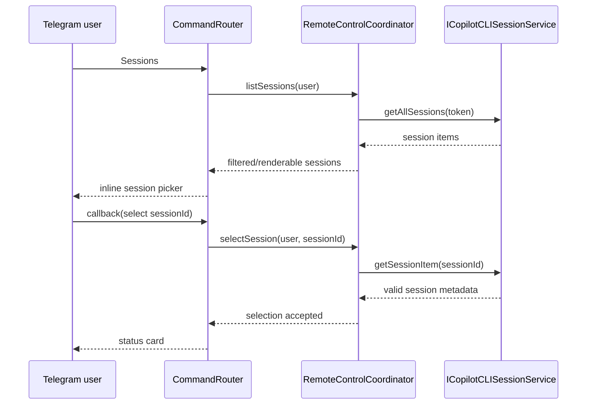

## 5. Normal prompt to idle session

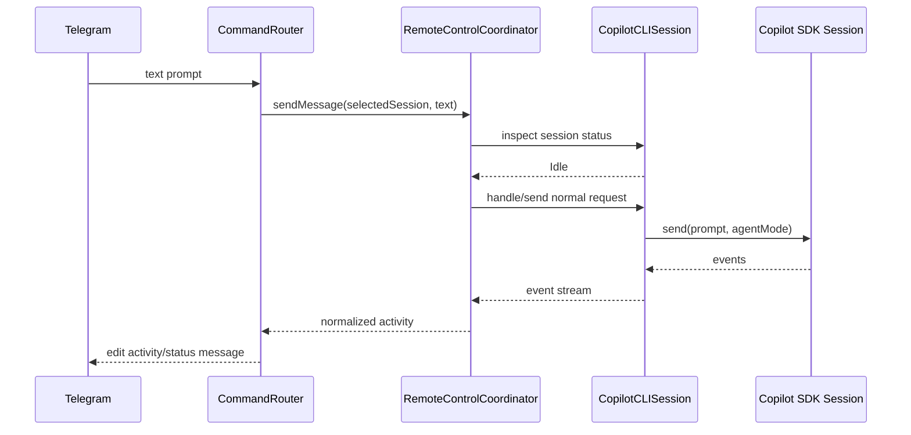

## 6. Mid-turn steering

Upstream Copilot already treats a request received while the session is busy as steering and sends the SDK request with `mode: 'immediate'`.

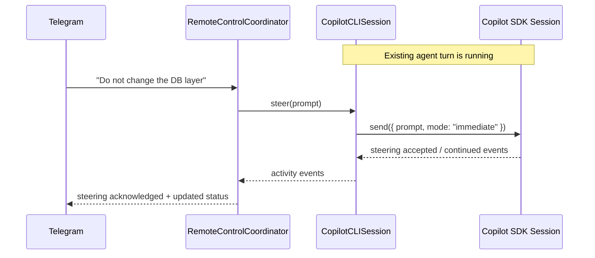

Reference: https://docs.github.com/en/copilot/how-tos/copilot-sdk/features/steering-and-queueing

## 7. Tool execution activity

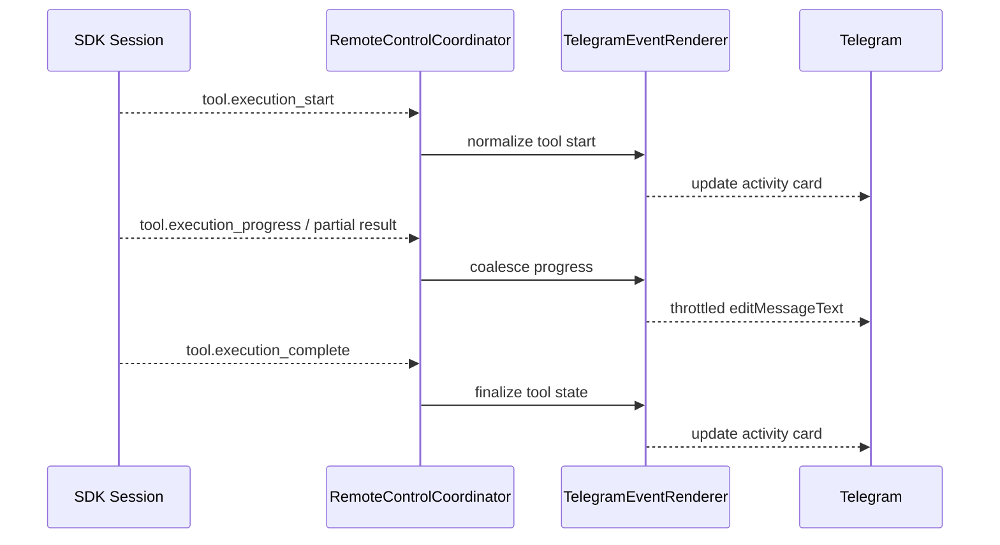

The renderer should rate-limit message edits and preserve only useful recent actions in compact mode.

## 8. Permission request — local and Telegram race

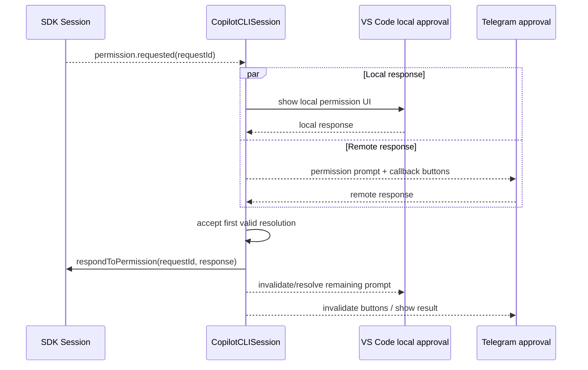

Stale Telegram callbacks MUST NOT be allowed to resolve a later permission request.

## 9. Agent user question

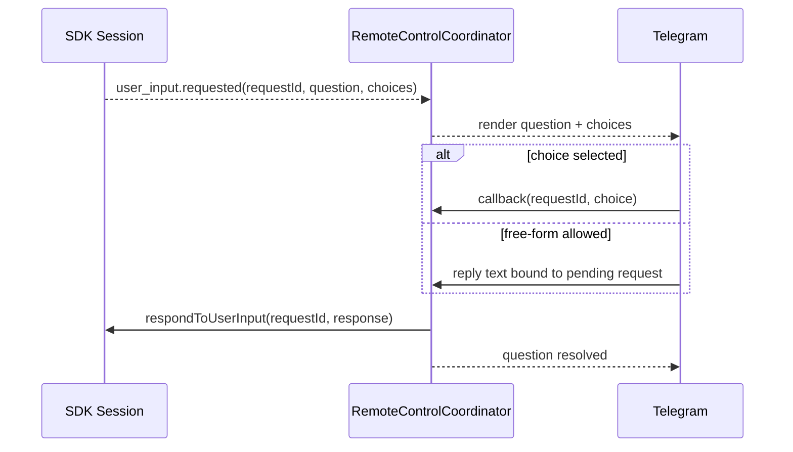

## 10. Abort

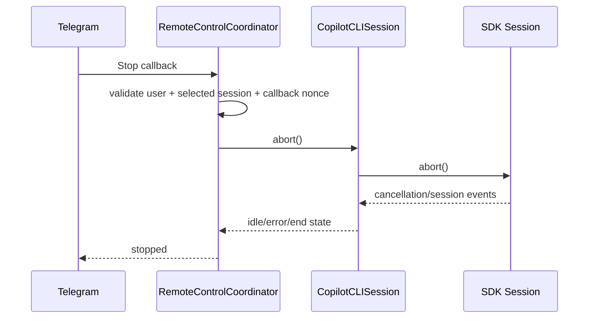

## 11. Model selection

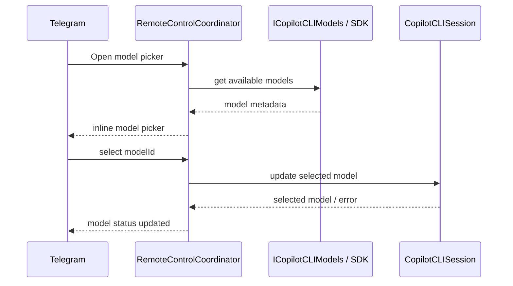

Cross-provider/BYOK changes may have stronger constraints than same-provider model changes. The implementation must follow the current upstream API rather than assuming all provider changes are hot-swappable.

## 12. Session event projection

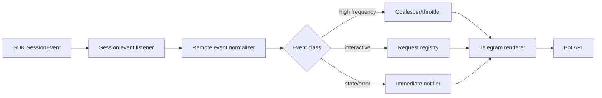

Persisted SDK events may be replayed when attaching Telegram to an existing session. Ephemeral deltas should not be expected to exist after the fact.

Reference: https://docs.github.com/en/copilot/how-tos/copilot-sdk/features/streaming-events

## 13. First-run proposed API enablement

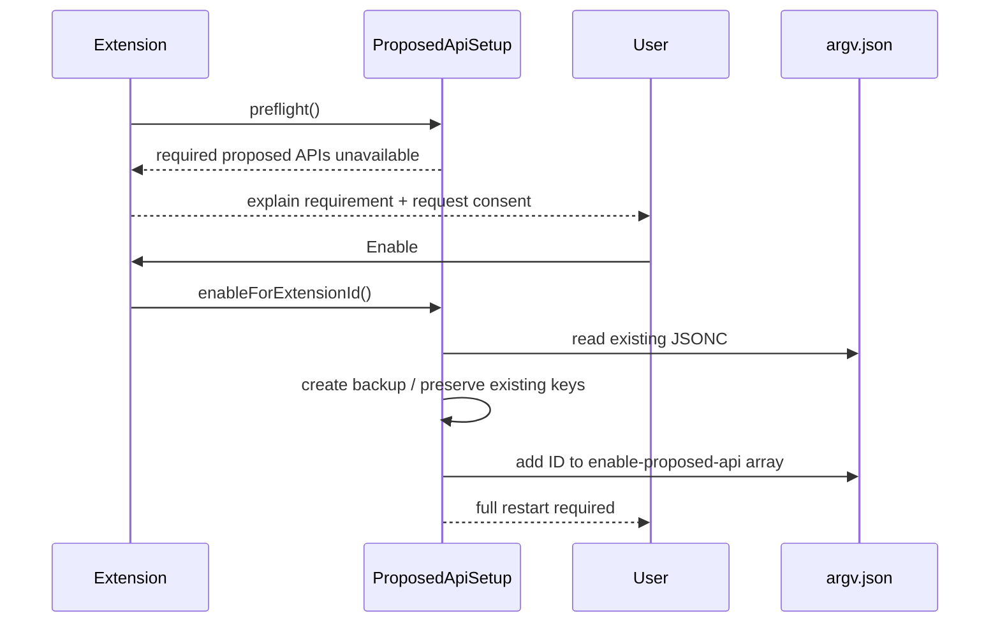

A simple window reload is not considered sufficient because startup arguments are read by the VS Code main process.

Reference: https://code.visualstudio.com/api/advanced-topics/using-proposed-api

## 14. Error handling flow

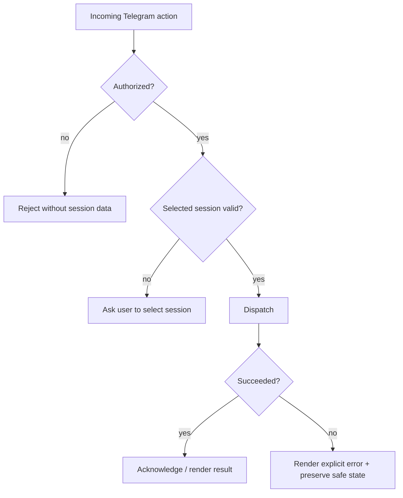

No accepted Telegram action should disappear silently.
