# Call Flows

> **Status:** Current runtime reference
> **Scope:** `copilot-telegram` downstream branch
> **Last reviewed:** 2026-09-01
>
> These diagrams describe the implemented control paths. Historical phase sequencing is intentionally omitted.

## 1. Activation and transport registration

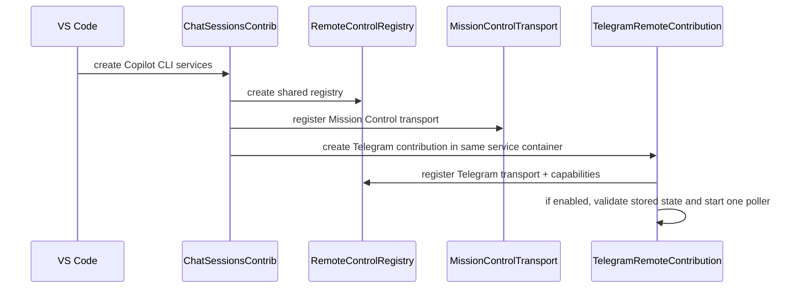

The generic registry is shared. Telegram does not create an independent Copilot SDK/session manager.

## 2. Telegram connection lifecycle

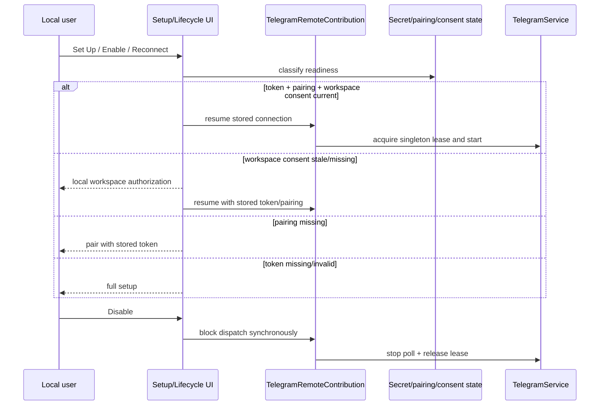

Only one healthy `getUpdates` consumer is allowed per bot token. Automatic competing owners fail visibly; explicit reconnect may perform the implemented ownership handoff.

## 3. Pairing

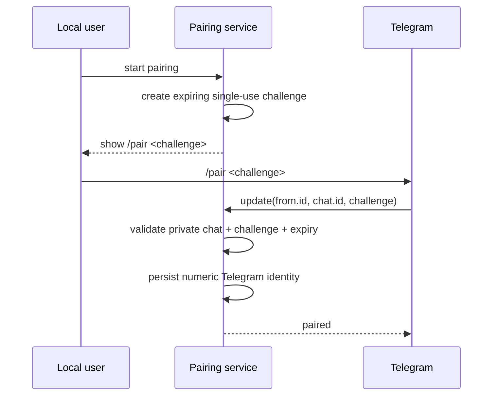

Authorization uses numeric identity, not username/display name.

## 4. Session list

Telegram now lists two local ownership domains.

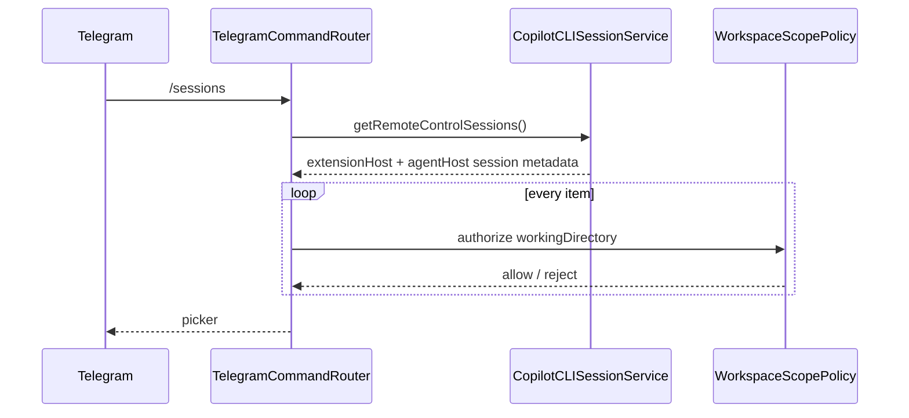

Extension-host sessions are directly selectable. Agent Host-owned sessions are marked `↪` and require handover.

## 5. Select an extension-host session

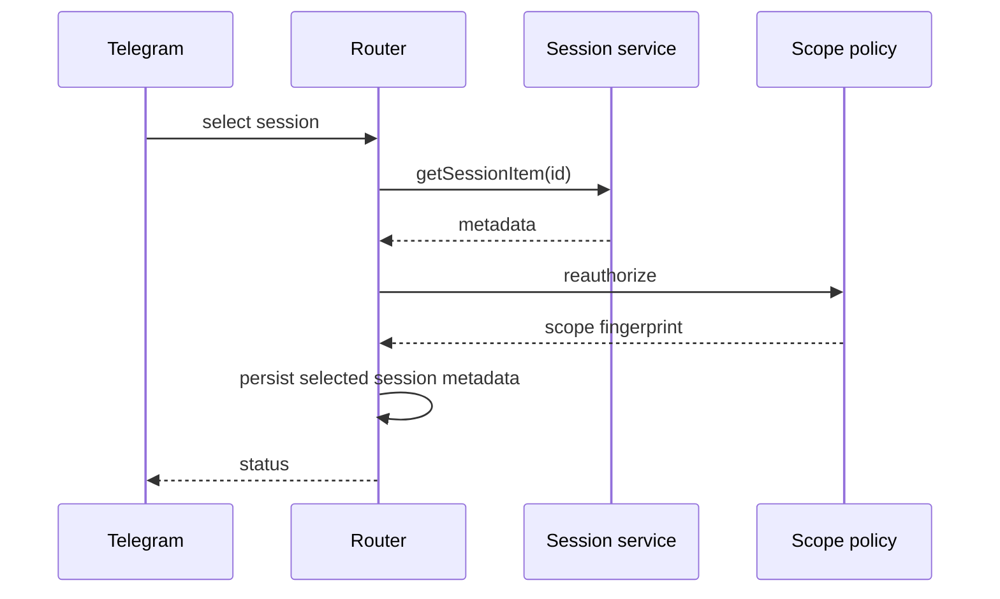

Selection does not acquire and retain an `IReference<ICopilotCLISession>`.

## 6. Agent Host session handover

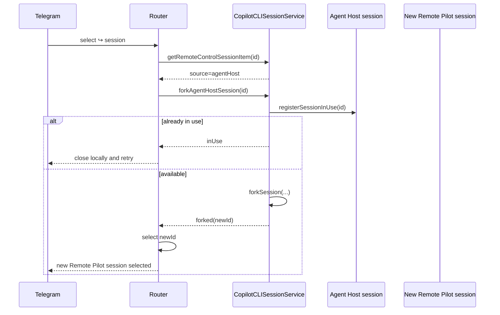

This is a controlled **fork/handover**, not direct control of the live Agent Host session and not an AHP client connection.

## 7. Prompt to selected session

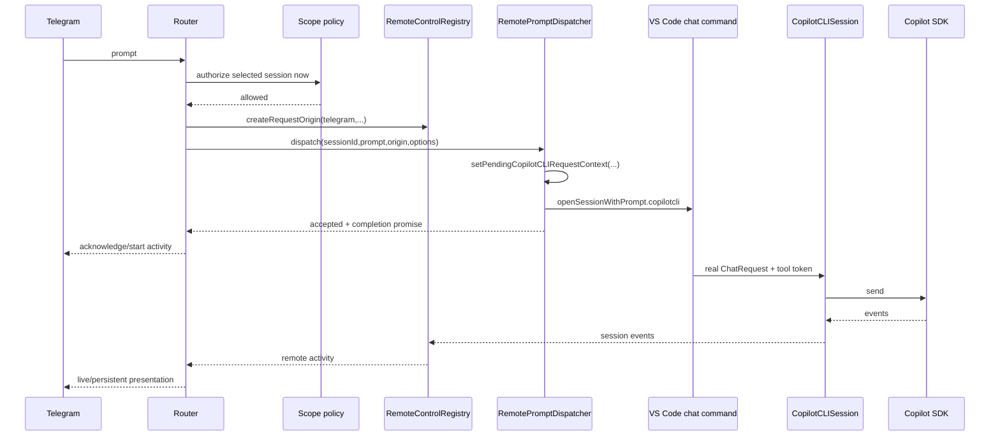

Telegram does not await the whole VS Code command before acknowledging the user. The command may remain pending for the full agent turn.

## 8. Mid-turn steering

The same native path is used while a session is busy.

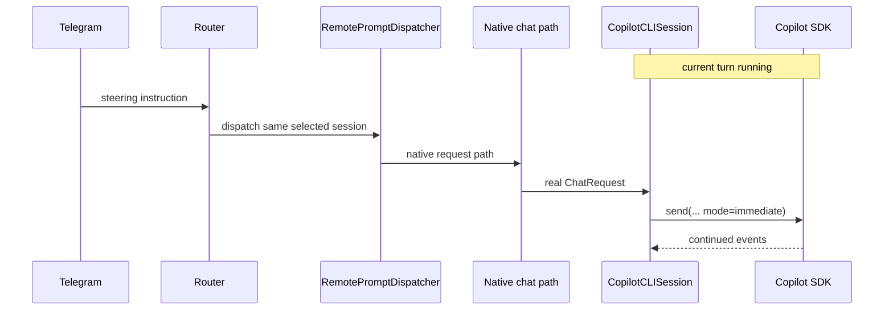

Reply-to-activity steering first resolves bounded message correlation and revalidates identity, selected session and workspace scope.

## 9. Event projection

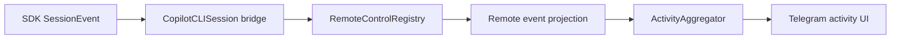

The remote feed is session-lifetime state, not a reuse of request-scoped native rendering listeners.

Replay of persisted events seeds internal state only. It is not presented as new activity.

## 10. Tool activity

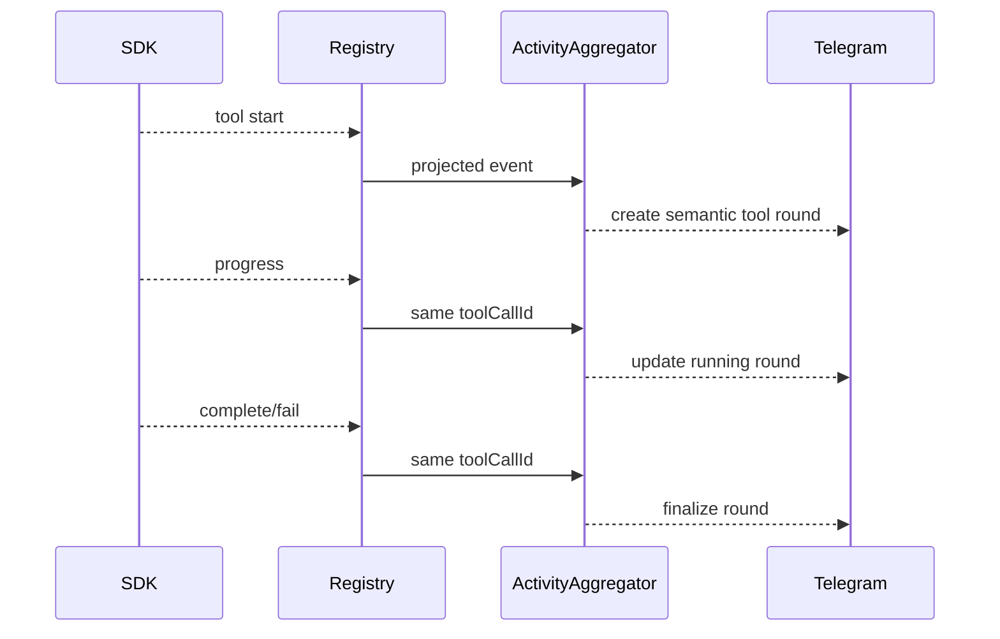

Read/search bursts may aggregate. Commands, edits and interactive requests remain distinct where that improves steerability and reviewability.

## 11. Permission request

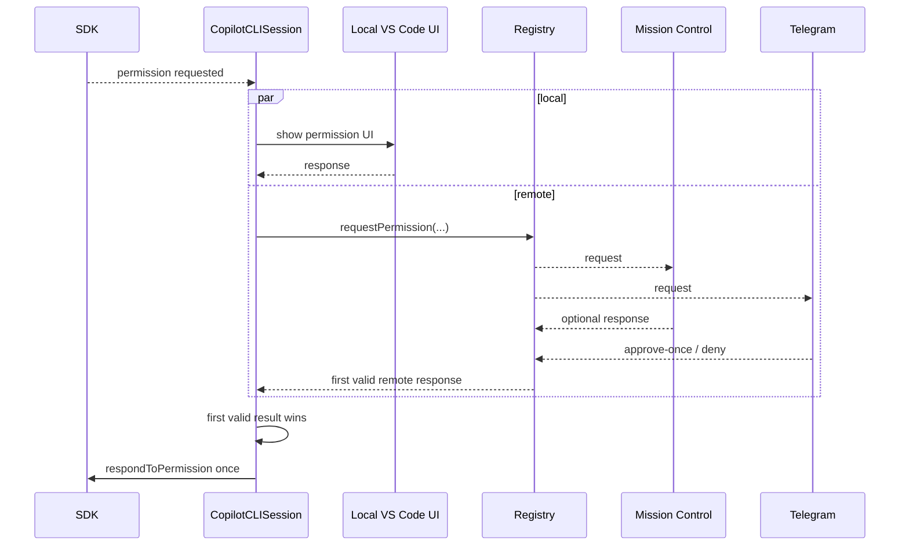

Telegram cannot change the session-wide permission policy.

## 12. User question

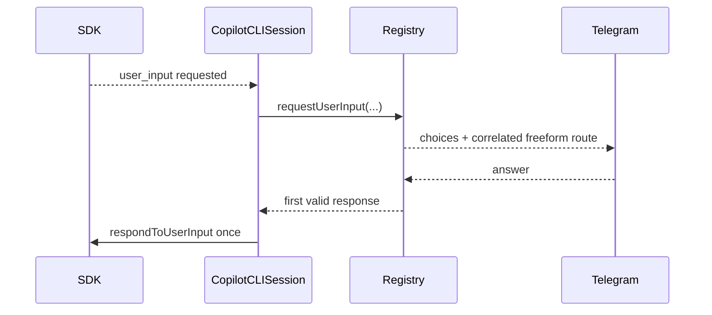

## 13. Plan exit/approval

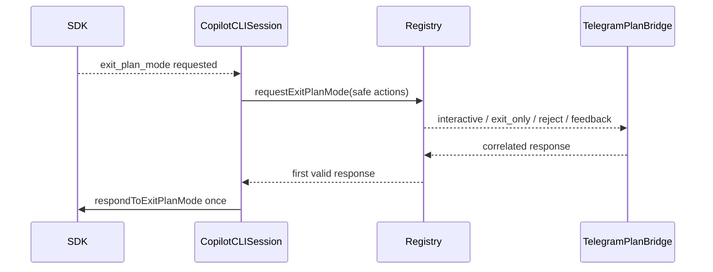

Remote types cannot represent autopilot/autopilot-fleet/autoApproveEdits.

## 14. Stop/abort

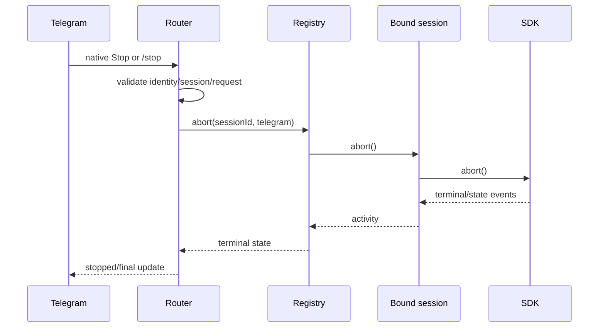

## 15. Model selection

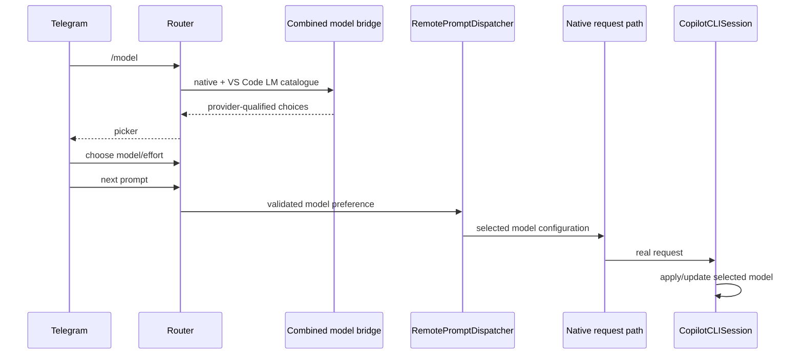

Catalogue visibility does not by itself prove backend compatibility.

## 16. Workspace file browsing

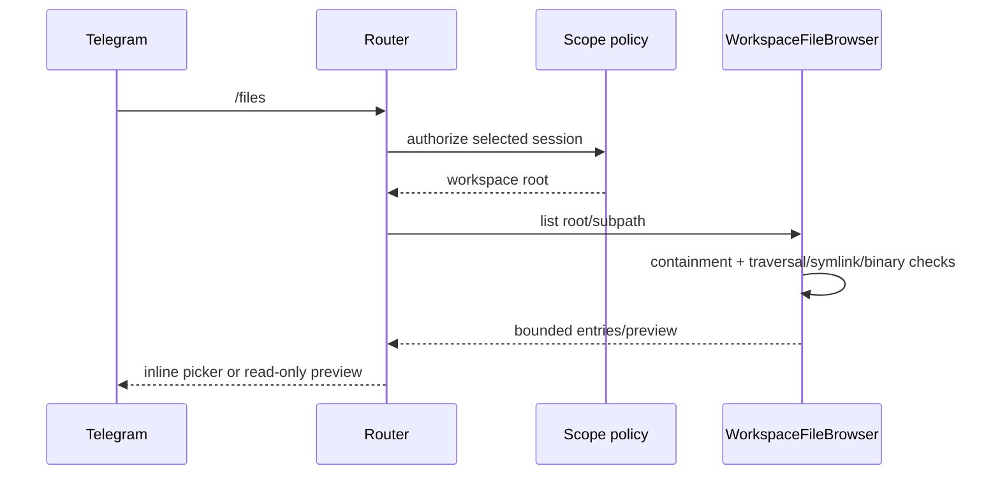

File browsing is presentation-only in the current implementation; editing from Telegram is not implied.

## 17. Error handling

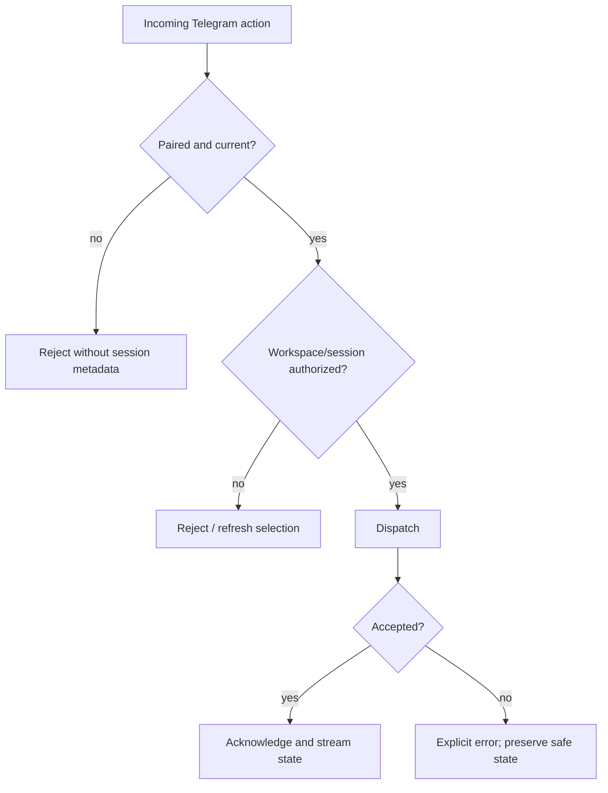

No accepted remote action should disappear silently.