# Call Flows

This document captures the intended runtime call paths. Names are architectural and may be adjusted to match final implementation types.

## 1. Extension activation

```mermaid
sequenceDiagram
    participant VS as VS Code
    participant EXT as Copilot extension activation
    participant PRE as ProposedApiSetup
    participant CSC as ChatSessionsContrib
    participant REG as RemoteControlRegistry
    participant MC as MissionControlTransport
    participant TR as TelegramRemoteContrib

    VS->>EXT: activate()
    EXT->>CSC: register controller-path Copilot services
    CSC->>REG: create shared remote-control registry
    CSC->>MC: register Mission Control transport
    CSC->>TR: instantiate contribution using same service container
    TR->>REG: register Telegram transport
    TR->>TR: when enabled, verify stored readiness then acquire singleton poller lease

    Note over PRE,VS: ProposedApiSetup is V2-only; V1 adds no third-party extension ID
```

## 2. Telegram long-poll lifecycle

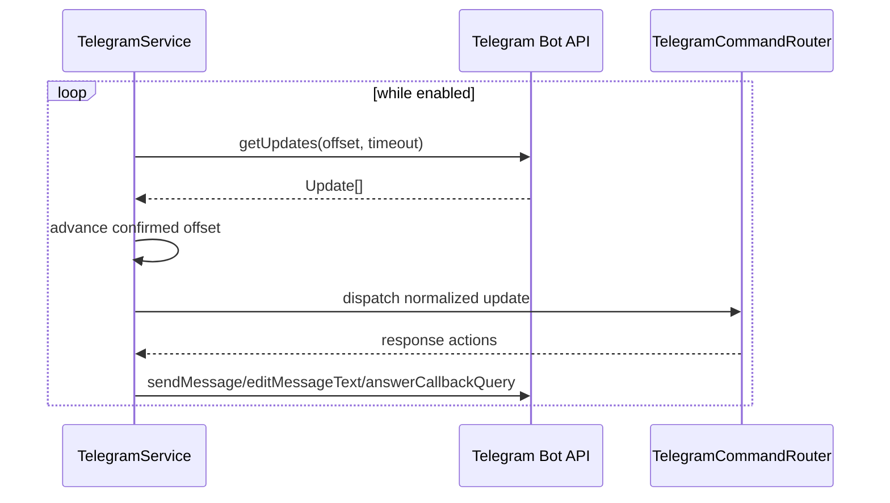

Requirements:

- offset advances only after an update is safely accepted for processing,
- duplicate update IDs are ignored,
- retry uses bounded backoff,
- only one poller may consume a configured bot token,
- a second extension host/process must acquire a cross-process lease or fail explicitly rather than compete for updates.

### 2.1 Enable, reconnect and synchronous disable

```mermaid
sequenceDiagram
    participant U as Local user
    participant W as TelegramSetupWizard
    participant C as TelegramRemoteContribution
    participant S as Secret/consent/pairing state
    participant T as TelegramService

    U->>W: Enable Remote Access
    W->>S: classify token + token-bound pairing + exact-scope consent
    alt all current
        W->>C: resumeStoredConnection(scope)
        C->>T: start(token) / acquire singleton lease
        T-->>C: validated bot
        C-->>W: authorized connection
        Note over C,W: router restores selection only after identity + session-scope checks
    else workspace consent required
        W-->>U: local consent dialog only
        W->>S: save current scope; reuse token + paired user
        W->>C: resumeStoredConnection(scope)
    else pairing missing
        W-->>U: local consent + saved-token pairing flow
    else token missing
        W-->>U: full consent/token/pairing setup flow
    end

    opt retryable failed or unexpectedly stopped
        U->>W: Reconnect
        W->>C: deduplicated resume using same stored readiness checks
    end

    U->>W: Disable Remote Access
    W->>C: cancel lifecycle generation
    C->>C: synchronously block updates/callbacks and suspend routing
    C->>T: abort poll and release lease
    opt correlated local turn remains active
        C->>T: retain outbound-only client
        Note over C,T: SDK terminal event updates activity/final answer, then detaches
    end
    W->>W: persist enabled=false; keep configured marker
```

Setup, Enable and Reconnect share one in-flight operation. Concurrent commands cannot start a second poller. Automatic Enable remains conservative when another healthy owner exists; explicit Reconnect transfers the token-fingerprinted lease, gives the former owner one heartbeat window to abort, and only then starts the new poll. Disable invokes the contribution before its first asynchronous wait, so dispatch is blocked even if network cleanup stalls; any later completion from the cancelled generation cannot revive access. A configured disabled state exposes only Enable in the status menu. Workspace-consent recovery is amber and local-only, without token entry or pairing. Authentication/API failures use Set Up Again, while retryable failures and unexpected stopped state expose Reconnect.

During pairing, the contribution is `pairing-only`: all commands, callbacks, and prompts are ignored except the exact pending `/pair` command. It becomes `authorized` only after token validation, paired identity persistence, and current workspace consent are all active.

## 3. Pairing

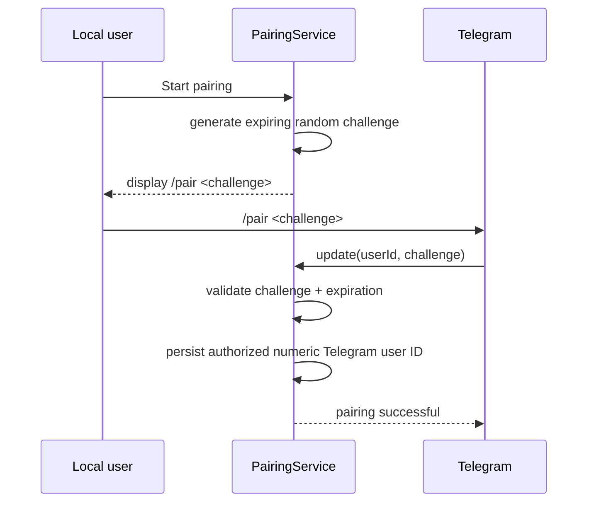

Security properties:

- pairing code is single-use,
- code expires quickly,
- authorization is bound to Telegram numeric user ID, not username,
- bot token alone does not authorize a Telegram user.

## 4. Session list and selection

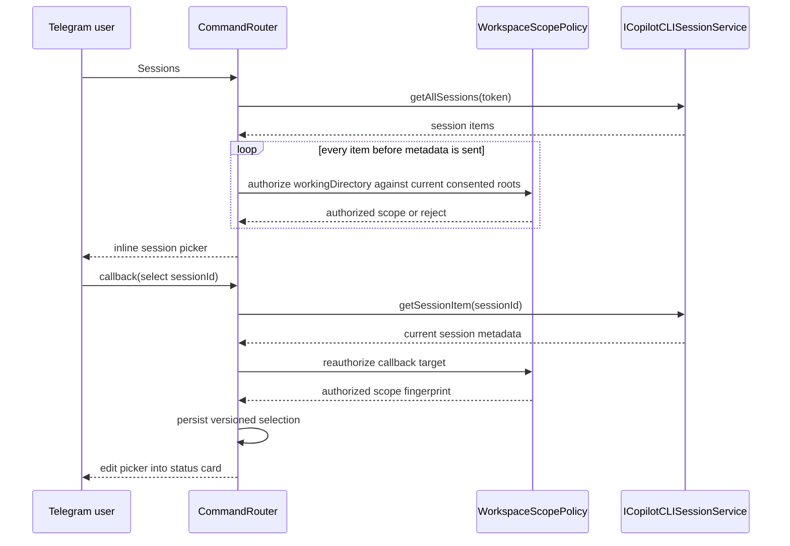

Listing and selecting sessions do not acquire a live wrapper reference and never expose metadata for rejected sessions. Empty windows, missing/invalid working directories, foreign roots and stale consent/session-scope fingerprints fail closed. Prompt, steering, stop, restoration, activity edits and final answers repeat the authorization check rather than trusting the picker-time decision.

## 5. Normal prompt to idle session

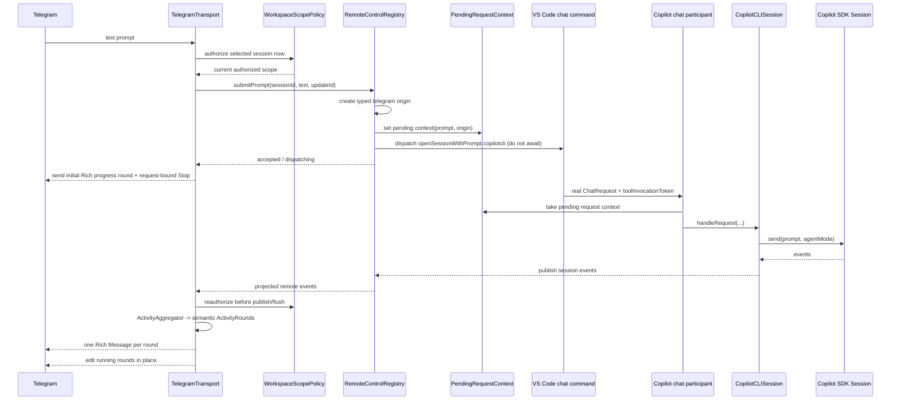

`executeCommand()` remains pending until `responseCompletePromise` settles, so the transport does not await it. It attaches a rejection handler and reports progress/completion through registry events. If dispatch later fails, clear only the correlated pending context and return an explicit Telegram error. Direct SDK `send()` is not a fallback because it bypasses the VS Code request lifecycle and cannot supply the required `ChatParticipantToolToken`.

## 6. Mid-turn steering

Upstream Copilot already treats a request received while the session is busy as steering and sends the SDK request with `mode: 'immediate'`.

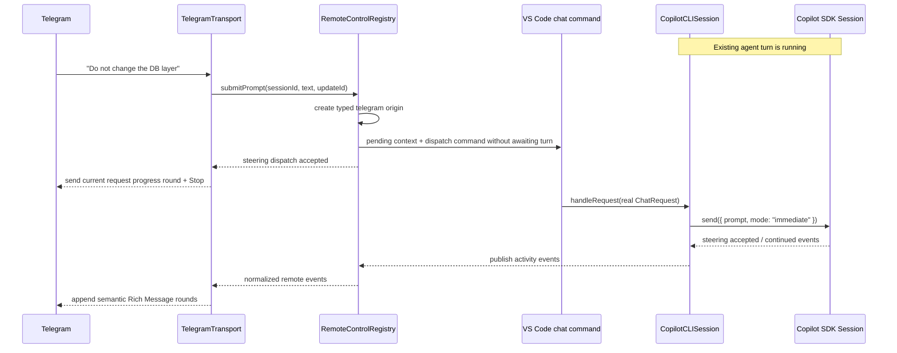

Reference: https://docs.github.com/en/copilot/how-tos/copilot-sdk/features/steering-and-queueing

### Reply to a specific activity bubble

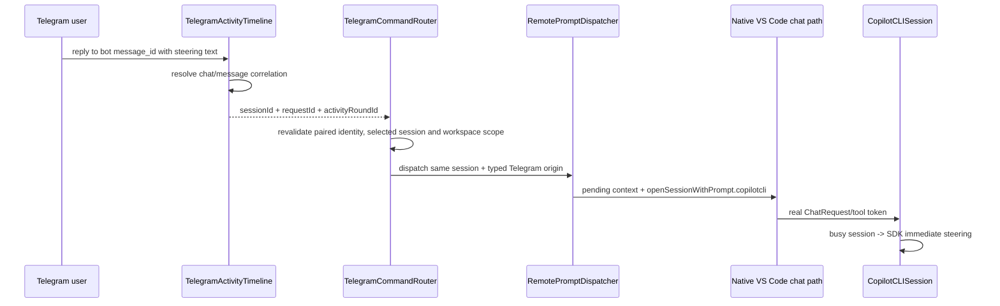

If the activity generation is complete, replaced, expired, deleted from correlation state or no longer steerable, the router returns an explicit stale-activity response and does not dispatch.

## 7. Tool execution activity

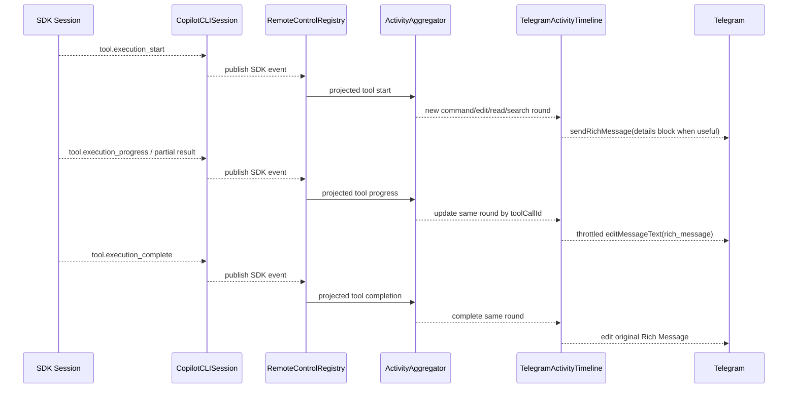

Consecutive read/search tools share a semantic inspection round until a reasoning, progress, command, edit, subagent, interaction or terminal boundary. Consecutive SDK-visible intent/reasoning events append to one **Thinking…** Rich Message until one of those non-reasoning boundaries occurs. Commands and file edits remain separate rounds. An edit failure falls back to a new Rich Message linked to the former one with `ReplyParameters`.

## 8. Permission request

Telegram is an attached registry responder for a concrete pending permission request. The existing first-valid-response-wins race remains authoritative.

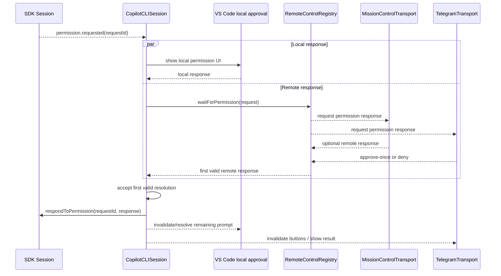

Stale Telegram callbacks MUST NOT be allowed to resolve a later permission request.

Telegram cannot set the session permission level and cannot return an `autoApprove`/`autopilot` escalation. The only V1 results are approve-once and deny.

## 9. Agent user question

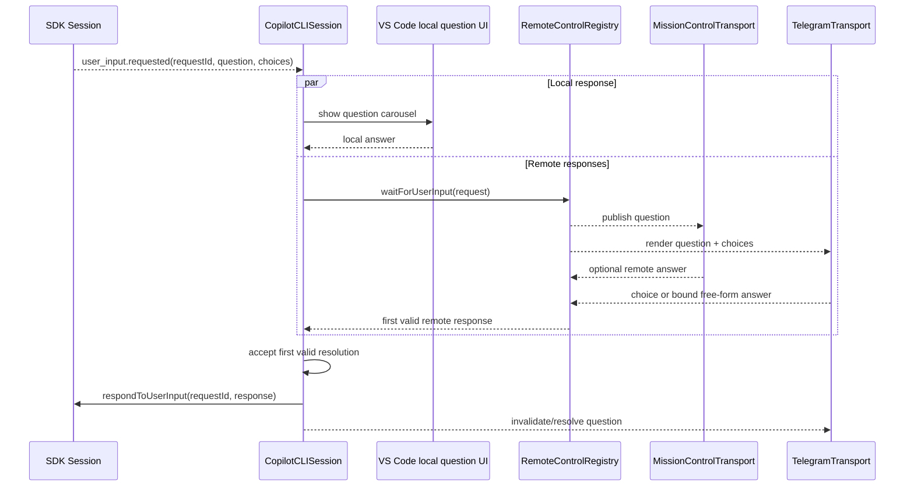

## 10. Abort

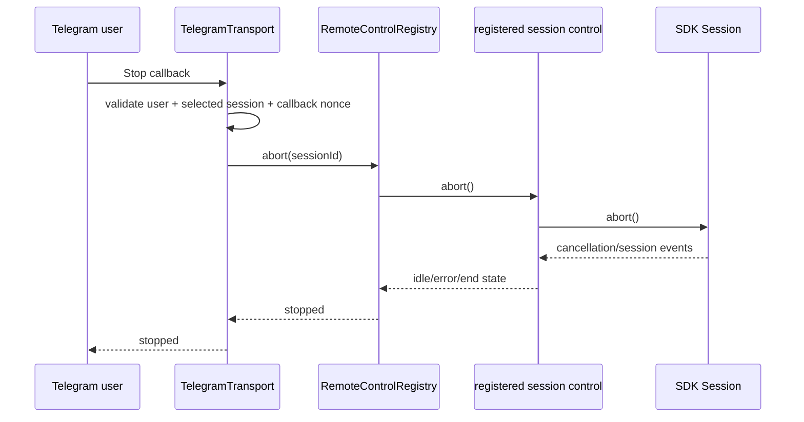

## 11. Model selection

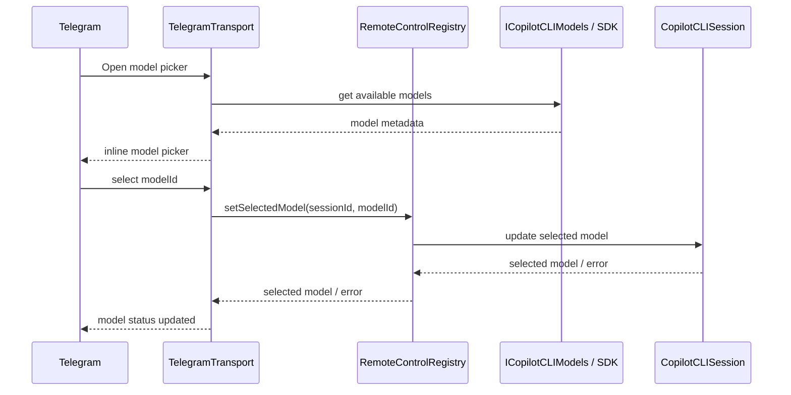

Cross-provider/BYOK changes may have stronger constraints than same-provider model changes. The implementation must follow the current upstream API rather than assuming all provider changes are hot-swappable.

## 12. Session event projection

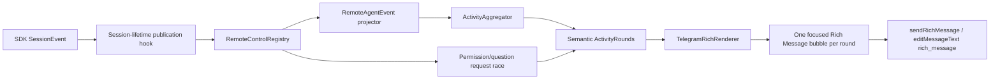

Persisted SDK events may be replayed when attaching Telegram to an existing session. Ephemeral deltas should not be expected to exist after the fact. Replay seeds bounded internal correlation/state only and is never presented as new current activity or a new answer.

Phase 5.3 marks replay delivery explicitly and ignores replay for current UI output. Each current request can have multiple chronological semantic bubbles, but not one bubble per microscopic event. Bubbles with useful round-local detail are independently expandable; short status/progress bubbles remain compact, while the final assistant answer is directly visible and formatted. Running rounds update no faster than the configured 750 ms minimum edit interval; new/waiting/failed/terminal rounds flush immediately. Every send/edit revalidates the paired identity, selected session and current workspace scope. Permission and user-input requests are individual correlated rounds, not generic activity output.

The session-lifetime hook is distinct from native request-scoped listeners, which are disposed after each request. Its disposable belongs to the registry session binding.

Attach/replay order:

```text
install live listener into temporary buffer
  -> call sdkSession.getEvents()
  -> filter supported persisted event types
  -> replay in event order while recording event IDs
  -> flush unseen buffered live events
  -> switch to direct live publication
```

Remote forwarding has exactly one publication point. Request-scoped native rendering may still observe the same SDK events, but it MUST NOT also publish them to the registry. Duplicate IDs are suppressed and no forwarded event may reference its own ID as `parentId`.

Reference: https://docs.github.com/en/copilot/how-tos/copilot-sdk/features/streaming-events

## 13. Future own-ID extension proposal authorization

### 13.1 Fork-bundled V2 companion

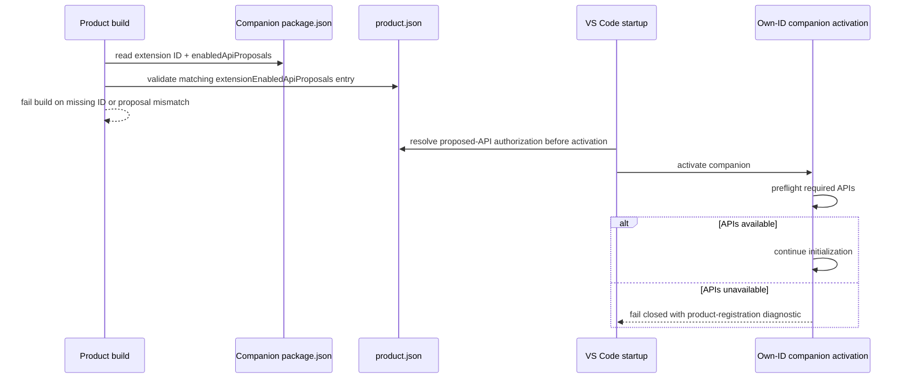

Activation never edits `product.json`. This path is not needed by V1, which runs inside the bundled Copilot extension.

### 13.2 Private standalone V2 experiment

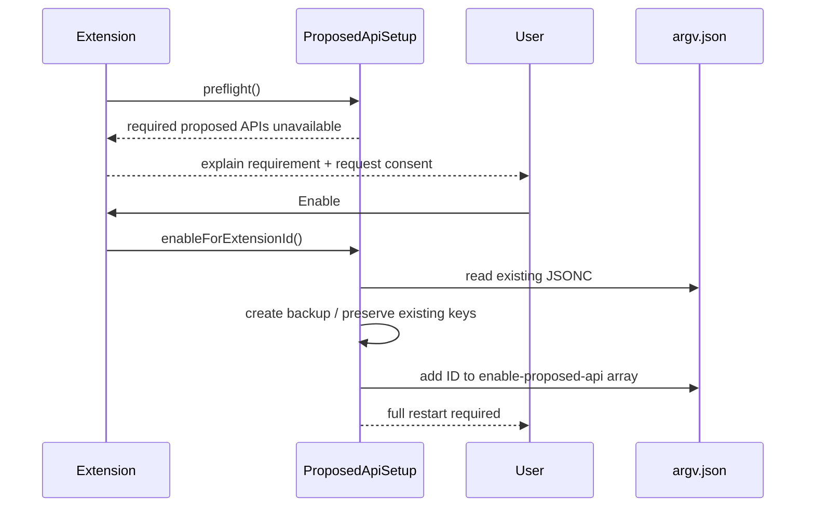

A simple window reload is not considered sufficient because startup arguments are read by the VS Code main process.

This `argv.json` flow does not run for V1 or for a correctly registered fork-bundled V2 companion.

Reference: https://code.visualstudio.com/api/advanced-topics/using-proposed-api

## 14. Error handling flow

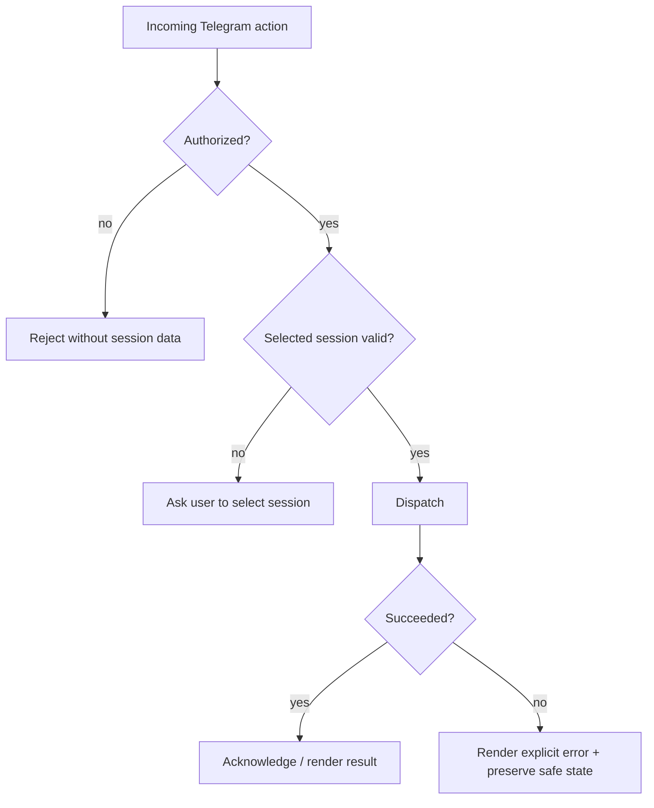

No accepted Telegram action should disappear silently.
