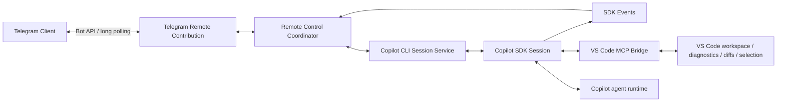

# Telegram Remote Control for VS Code Copilot

> Project documentation for the `copilot-telegram` downstream branch.
>
> Baseline validated against VS Code/Copilot source commit `0984c920744f2013d0ad2bc5e826fa45a64069ab` (August 2026).

## Purpose

This project adds Telegram-based remote control to the existing VS Code Copilot implementation while preserving as much upstream behavior as possible.

The project is intentionally **not** a new coding-agent implementation. The existing Copilot extension remains responsible for sessions, agent execution, tools, worktrees, checkpoints, permissions, model handling, MCP integration, VS Code chat rendering, and other core behavior. The Telegram feature should be a thin remote-control layer over those existing services.

The design is based on two upstream patterns already present in the Copilot codebase:

1. **Copilot SDK session -> event projection -> remote transport** — the same pattern used by GitHub Mission Control remote sessions.
2. **Copilot SDK -> VS Code MCP bridge -> IDE context/tools** — the existing Copilot CLI integration pattern for diagnostics, selection, diffs, and other IDE-aware behavior.

## Core design rule

> Do not reimplement functionality already provided by upstream Copilot. Add only the minimum integration surface required for Telegram transport, authentication, rendering, and remote actions.

This keeps the downstream patch small and allows upstream bug fixes and new Copilot features to flow into the fork with minimal conflict.

## Documentation map

| Document | Purpose |
| --- | --- |
| [PROJECT_SPEC.md](./PROJECT_SPEC.md) | Product scope, goals, non-goals, requirements, constraints and success criteria |
| [FEATURES.md](./FEATURES.md) | Feature catalogue, priority and implementation status target |
| [ARCHITECTURE.md](./ARCHITECTURE.md) | Target architecture, components, integration seams and source ownership |
| [CALL_FLOWS.md](./CALL_FLOWS.md) | Mermaid call/sequence diagrams for prompts, steering, events, permissions, models and setup |
| [API_AND_COMPATIBILITY.md](./API_AND_COMPATIBILITY.md) | Mapping from features to Copilot SDK, VS Code APIs, proposed APIs and Telegram APIs |
| [SECURITY.md](./SECURITY.md) | Threat model, pairing, authorization, secret handling and permission policy |
| [SETUP_RELEASE_AND_LICENSING.md](./SETUP_RELEASE_AND_LICENSING.md) | First-run setup, proposed API enablement, VSIX distribution, licensing and release constraints |
| [UPSTREAM_SYNC.md](./UPSTREAM_SYNC.md) | Fork maintenance, patch discipline and upstream rebase process |
| [IMPLEMENTATION_PLAN.md](./IMPLEMENTATION_PLAN.md) | Phased implementation plan and initial source touch-points |
| [TEST_STRATEGY.md](./TEST_STRATEGY.md) | Unit, integration, regression, security and release testing |

## High-level architecture

Telegram is a **transport and presentation layer**, not the owner of the agent runtime.

## Upstream source seams

The initial implementation should prefer existing Copilot services instead of creating parallel equivalents:

- [`src/extension/chatSessions/vscode-node/chatSessions.ts`](../../src/extension/chatSessions/vscode-node/chatSessions.ts) — composition root for Copilot CLI session services.
- [`src/extension/chatSessions/copilotcli/node/copilotcliSessionService.ts`](../../src/extension/chatSessions/copilotcli/node/copilotcliSessionService.ts) — session discovery, creation, resume, history and lifecycle.
- [`src/extension/chatSessions/copilotcli/node/copilotcliSession.ts`](../../src/extension/chatSessions/copilotcli/node/copilotcliSession.ts) — active SDK session, steering, events, permissions, user-input requests, model changes and Mission Control integration.
- [`src/extension/chatSessions/copilotcli/node/mcpHandler.ts`](../../src/extension/chatSessions/copilotcli/node/mcpHandler.ts) — existing IDE-to-agent MCP bridge.
- [`src/extension/chatSessions/copilotcli/node/copilotCli.ts`](../../src/extension/chatSessions/copilotcli/node/copilotCli.ts) — Copilot SDK and model services.

The preferred first integration point is the existing Copilot CLI service composition in `ChatSessionsContrib`: instantiate a Telegram contribution after the upstream Copilot CLI services are available.

## V1 product boundary

V1 targets **VS Code Desktop with a local extension host** and Telegram long polling. It should provide:

- Telegram bot connection and pairing.
- Session discovery, selection, creation and resume.
- Prompting and mid-turn steering.
- Live agent activity projection.
- Permission and user-question responses from Telegram.
- Abort/stop.
- Mode and model selection where the underlying session supports it.
- Workspace/session metadata.
- Secure storage of the Telegram bot token.
- First-run proposed-API enablement support for a downstream extension identity.
- Reliable VSIX packaging and upstream-version tracking.

Remote SSH, Dev Containers, Codespaces, multi-machine federation, Telegram Mini Apps and additional messaging channels are later phases.

## Networking principle

V1 uses Telegram `getUpdates` long polling. The workstation creates outbound HTTPS connections to Telegram. Therefore the default deployment requires:

- no public inbound port,
- no port forwarding,
- no static IP,
- no webhook endpoint,
- no Tailscale.

Tailscale may be added later for an optional rich local web dashboard, but it is not a core dependency.

## Important constraints

- The downstream implementation may use VS Code proposed APIs already used by upstream Copilot. A renamed extension identity requires explicit proposed-API enablement at VS Code startup.
- Proposed APIs are not suitable for normal Visual Studio Marketplace publication. Initial distribution is therefore VSIX/internal/developer release.
- Do not depend on undocumented native Copilot commands for core behavior when the same operation can be performed through the Copilot SDK/session services.
- Do not promise access to hidden chain-of-thought. Surface SDK-exposed reasoning/status events where available plus reliable tool/activity telemetry.
- Do not patch the `@github/copilot` CLI runtime. Keep third-party runtime dependencies unmodified.

## External references

- Copilot SDK features: https://docs.github.com/en/copilot/how-tos/copilot-sdk/features
- Copilot SDK streaming events: https://docs.github.com/en/copilot/how-tos/copilot-sdk/features/streaming-events
- Copilot SDK steering and queueing: https://docs.github.com/en/copilot/how-tos/copilot-sdk/features/steering-and-queueing
- Copilot SDK session persistence: https://docs.github.com/en/copilot/how-tos/copilot-sdk/features/session-persistence
- VS Code proposed API guidance: https://code.visualstudio.com/api/advanced-topics/using-proposed-api
- Telegram Bot API: https://core.telegram.org/bots/api
