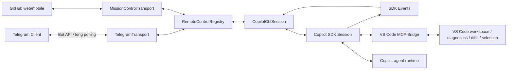

# Telegram Remote Control for VS Code Copilot

> Project documentation for the `copilot-telegram` downstream branch.
>
> Baseline validated against VS Code/Copilot source commit `58af001e0c7b342016db51cef2a026c7791f5d58` (August 2026).

Phases 0-2 are implemented. The Bot API client, long poller, durable offset state and singleton poller lease are available, while production activation remains disabled until Phase 3 adds consented secret storage and pairing.

For the Phase 2 mock and opt-in real-bot tests, see [IMPLEMENTATION_PLAN.md](./IMPLEMENTATION_PLAN.md#real-bot-smoke-test) or run `script/telegram-remote/test-phase2.ps1` from the Copilot extension directory.

## Purpose

This project adds Telegram-based remote control to the existing VS Code Copilot implementation while preserving as much upstream behavior as possible.

The project is intentionally **not** a new coding-agent implementation. The existing Copilot extension remains responsible for sessions, agent execution, tools, worktrees, checkpoints, permissions, model handling, MCP integration, VS Code chat rendering, and other core behavior. The Telegram feature should be a thin remote-control layer over those existing services.

The design is based on two upstream patterns already present in the Copilot codebase:

1. **Copilot SDK session -> event projection -> remote transport** — the same pattern used by GitHub Mission Control remote sessions.
2. **Copilot SDK -> VS Code MCP bridge -> IDE context/tools** — the existing Copilot CLI integration pattern for diagnostics, selection, diffs, and other IDE-aware behavior.

The source review also found that Mission Control is currently hard-coded into permission/question handling and that `ICopilotCLISession` does not expose a complete remote-control API. The first code milestone is therefore a transport-neutral `RemoteControlRegistry` that preserves Mission Control and then hosts Telegram as a second transport.

## Core design rule

> Do not reimplement functionality already provided by upstream Copilot. Add only the minimum integration surface required for Telegram transport, authentication, rendering, and remote actions.

This keeps the downstream patch small and allows upstream bug fixes and new Copilot features to flow into the fork with minimal conflict.

## Documentation map

| Document | Purpose |
| --- | --- |
| [PROJECT_SPEC.md](./PROJECT_SPEC.md) | Product scope, goals, non-goals, requirements, constraints and success criteria |
| [FEATURES.md](./FEATURES.md) | Feature catalogue, priority and implementation status target |
| [ARCHITECTURE.md](./ARCHITECTURE.md) | Target architecture, components, integration seams, native UI surfaces and source ownership |
| [CALL_FLOWS.md](./CALL_FLOWS.md) | Mermaid call/sequence diagrams for prompts, steering, events, permissions, models and setup |
| [API_AND_COMPATIBILITY.md](./API_AND_COMPATIBILITY.md) | Mapping from features to Copilot SDK, VS Code APIs, proposed APIs and Telegram APIs |
| [SECURITY.md](./SECURITY.md) | Threat model, pairing, authorization, secret handling and permission policy |
| [SETUP_RELEASE_AND_LICENSING.md](./SETUP_RELEASE_AND_LICENSING.md) | V1 bundled-fork setup, optional V2 own-ID paths, licensing and distribution constraints |
| [UPSTREAM_SYNC.md](./UPSTREAM_SYNC.md) | Fork maintenance, patch discipline and upstream rebase process |
| [IMPLEMENTATION_PLAN.md](./IMPLEMENTATION_PLAN.md) | Phased implementation plan and initial source touch-points |
| [TEST_STRATEGY.md](./TEST_STRATEGY.md) | Unit, integration, regression, security and release testing |

## High-level architecture

Telegram is a **transport and presentation layer**, not the owner of the agent runtime.

Remote prompts and steering enter through `setPendingCopilotCLIRequestContext(...)` plus `workbench.action.chat.openSessionWithPrompt.copilotcli`. That native path creates the real VS Code request/tool token and preserves chat rendering; Telegram does not call SDK `send()` directly.

## Upstream source seams

The initial implementation should prefer existing Copilot services instead of creating parallel equivalents:

- [`src/extension/chatSessions/vscode-node/chatSessions.ts`](../../src/extension/chatSessions/vscode-node/chatSessions.ts) — composition root for Copilot CLI session services.
- [`src/extension/chatSessions/copilotcli/node/copilotcliSessionService.ts`](../../src/extension/chatSessions/copilotcli/node/copilotcliSessionService.ts) — session discovery, creation, resume, history and lifecycle.
- [`src/extension/chatSessions/copilotcli/node/copilotcliSession.ts`](../../src/extension/chatSessions/copilotcli/node/copilotcliSession.ts) — active SDK session, steering, events, permissions, user-input requests, model changes and Mission Control integration.
- [`src/extension/chatSessions/copilotcli/node/mcpHandler.ts`](../../src/extension/chatSessions/copilotcli/node/mcpHandler.ts) — existing IDE-to-agent MCP bridge.
- [`src/extension/chatSessions/copilotcli/node/copilotCli.ts`](../../src/extension/chatSessions/copilotcli/node/copilotCli.ts) — Copilot SDK and model services.

The first integration points are the controller-path service composition in `ChatSessionsContrib` and a narrow, transport-neutral hook in `CopilotCLISession`. Mission Control is moved behind the registry before Telegram is registered. The older V1/non-controller registration path is a later compatibility target.

## V1 product boundary

V1 targets **VS Code Desktop with a local extension host** and Telegram long polling. It should provide:

- Telegram bot connection and pairing.
- Session discovery, selection, creation and resume.
- Prompting and mid-turn steering.
- Live agent activity projection.
- Permission and user-question responses from Telegram.
- Abort/stop.
- Mode and model selection where the underlying session supports it.
- Workspace/session metadata.
- Secure storage of the Telegram bot token.
- Reliable bundled-fork packaging/configuration and upstream-version tracking.
- Optional V2 research for an own-ID companion extension. A fork-bundled companion must be registered at build time in the product proposal configuration; a private standalone VSIX may instead use the consent-based `argv.json` flow. Neither path is required by V1.

Remote SSH, Dev Containers, Codespaces, multi-machine federation, Telegram Mini Apps and additional messaging channels are later phases.

## Networking principle

V1 uses Telegram `getUpdates` long polling. The workstation creates outbound HTTPS connections to Telegram. Therefore the default deployment requires:

- no public inbound port,
- no port forwarding,
- no static IP,
- no webhook endpoint,
- no Tailscale.

Tailscale may be added later for an optional rich local web dashboard, but it is not a core dependency.

## Important constraints

- The V1 downstream implementation lives inside the bundled Copilot extension, whose manifest already declares the proposed APIs it uses. A future own-ID companion needs explicit proposal authorization: product configuration at build time when bundled into a fork, or runtime enablement for a private standalone experiment.
- V2 proposal authorization does not by itself expose Copilot session control to another extension; an upstream-supported seam or an explicit fork bridge is still required.
- Proposed APIs and source-level Copilot internals are not a normal Marketplace contract.
- The internal native chat command is a required, high-risk dependency in the current fork because `handleRequest()` needs a real `ChatParticipantToolToken`; protect it with compatibility tests.
- Dispatch the native command without awaiting the full turn; its promise follows `responseCompletePromise`. Acknowledge Telegram immediately and correlate any later failure cleanup.
- Remote origin is a registry-created typed value. Never treat SDK `source` prefixes such as `command-` as authorization or permission-mode evidence.
- Remote events have one session-lifetime publication point. Use filtered `sdkSession.getEvents()` replay plus buffered live-event deduplication when attaching to an existing session.
- `getSession()`/`createSession()` return disposable session references; every remote binding must release them deterministically.
- Only one long poller may consume a bot token. Competing VS Code hosts must coordinate or the later consumer must fail visibly.
- Telegram may approve once or deny, but it may never raise the session permission level to `autoApprove`/`autopilot`.
- Enabling the transport requires an explicit modal consent gate; cancel is the default and declining persists nothing.
- A remotely attached session must always carry a local indicator in the session list and status bar, with the kill switch one click away. Mission Control today shows only a one-time chat banner, which is not sufficient.
- Native indicators render transport-neutral registry state. Telegram labels, icons and identities never enter upstream files.
- Telegram bot chats are not end-to-end encrypted. Selected prompts, code, paths, diffs and tool metadata transit Telegram infrastructure.
- Do not promise access to hidden chain-of-thought. Surface SDK-exposed reasoning/status events where available plus reliable tool/activity telemetry.
- Do not patch the `@github/copilot` CLI runtime. Keep third-party runtime dependencies unmodified.

## External references

- Copilot SDK features: https://docs.github.com/en/copilot/how-tos/copilot-sdk/features
- Copilot SDK streaming events: https://docs.github.com/en/copilot/how-tos/copilot-sdk/features/streaming-events
- Copilot SDK steering and queueing: https://docs.github.com/en/copilot/how-tos/copilot-sdk/features/steering-and-queueing
- Copilot SDK session persistence: https://docs.github.com/en/copilot/how-tos/copilot-sdk/features/session-persistence
- VS Code proposed API guidance: https://code.visualstudio.com/api/advanced-topics/using-proposed-api
- Telegram Bot API: https://core.telegram.org/bots/api
