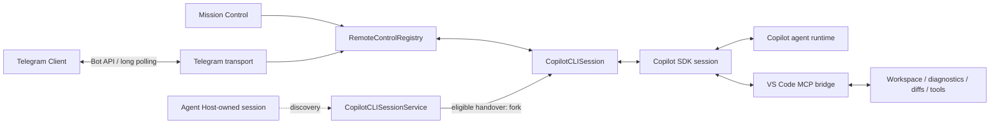

# Telegram Remote Control for VS Code Copilot

> Experimental downstream architecture project on the `copilot-telegram` branch.
>
> **Status:** active proof of concept, source-first and not a Marketplace-ready standalone extension.
>
> **Last implementation review:** 2026-09-01 against downstream code including commit `92d4e4462c0e872193fb0b6b31d3b4f008df8fcd` (`Support Agent Host session handover over Telegram`).
>
> This is an unofficial project. It is not affiliated with, endorsed by, or distributed by GitHub or Microsoft.

## What this project demonstrates

This project adds a remote-control layer to the existing VS Code Copilot implementation and uses Telegram as the first concrete remote client.

It is intentionally **not** a new coding-agent runtime. Copilot remains responsible for the agent loop, sessions, tools, permissions, models, MCP integration, checkpoints, worktrees, native VS Code chat rendering and other core behavior. The downstream work adds a transport-neutral control seam plus Telegram-specific authorization, routing and presentation.

The core design rule is:

> Reuse upstream behavior first. Add only the minimum integration surface required to observe and control existing agent sessions remotely.

That rule is reflected directly in the codebase:

```text
extensions/copilot/src/extension/remoteControl/**
    transport-neutral remote-control framework

extensions/copilot/src/extension/telegramRemote/**
    Telegram Bot API, authorization, routing and presentation

extensions/copilot/src/extension/chatSessions/copilotcli/**
    narrow upstream integration seams for session discovery/control
```

The generic `remoteControl/**` layer contains no Telegram Bot API or pairing logic. Telegram consumes that layer as one transport, alongside the Mission Control integration.

## Current capabilities

The current branch can, within the explicitly consented VS Code workspace scope:

- configure and pair a Telegram bot using a numeric Telegram identity;
- list, create and select Copilot controller sessions;
- send prompts through the native VS Code Copilot request path;
- steer a running turn;
- stop the selected attached task through the transport-neutral abort seam;
- project SDK-visible agent activity into Telegram;
- answer approve-once/deny permission requests;
- answer agent questions and non-elevating plan-exit requests;
- select supported Copilot/Agent Chat models and reasoning effort;
- expose read-only, bounded workspace-file browsing;
- preserve local VS Code and Mission Control first-valid-response behavior;
- keep Telegram authorization scoped to the current consented workspace;
- discover Agent Host-owned sessions and hand an eligible session over into a new Telegram-controllable Remote Pilot session.

The implementation also includes local status/kill-switch controls, bounded callback state, redacted diagnostics, singleton long-poller ownership and deterministic regression suites. See [FEATURES.md](./FEATURES.md) for the detailed implementation matrix.

## Current architecture



`RemoteControlRegistry` is implemented under `extension/remoteControl`. Its contract is deliberately narrow: transport registration, session attachment, event publication, typed request provenance, interactive responses and abort. The live session bridge exposes only the capabilities required by remote transports rather than handing Telegram the full SDK session.

Remote prompts are dispatched by `RemotePromptDispatcher` through:

```text
setPendingCopilotCLIRequestContext(...)
        +
workbench.action.chat.openSessionWithPrompt.copilotcli
```

This preserves the native VS Code request lifecycle and real tool-invocation token. Telegram does not call SDK `send()` directly for normal prompt dispatch.

## Agent Host session handover

The current branch can surface both extension-host and Agent Host-owned Copilot sessions in Telegram's session picker.

This is **not direct AHP control of the live Agent Host session**.

Current behavior is intentionally conservative:

1. `CopilotCLISessionService.getRemoteControlSessions()` combines normal extension-host sessions with Agent Host-owned session metadata.
2. Agent Host sessions are marked `↪` in Telegram.
3. Selecting one requests `forkAgentHostSession(...)`.
4. If the source session is still in use by VS Code, the handover is rejected.
5. If eligible, the session is forked into a new extension-host Copilot CLI session and that fork becomes the selected Remote Pilot session.

This gives Telegram continuity from existing Agent Host work without pretending that the current fork is already an AHP multi-client implementation.

A future architecture may replace this handover with direct Agent Host/AHP client participation if VS Code exposes a suitable supported integration boundary. That is a future direction, not a current capability.

## Security boundary

Remote control of a coding agent is a privileged capability. A Telegram action can indirectly result in file writes, shell commands, network calls or Git operations.

The implementation therefore treats Telegram as an external security boundary:

- explicit local consent is required before enabling the transport;
- authorization uses Telegram's numeric user identity, not usernames;
- session access is revalidated against current consented workspace roots;
- callbacks are opaque, bounded and expiring;
- remote permission responses are limited to approve-once or deny;
- Telegram cannot raise the session into `autoApprove`, `autopilot` or `autopilot_fleet`;
- sensitive credentials remain local;
- Telegram bot chats are explicitly treated as **not end-to-end encrypted**;
- hidden chain-of-thought is not exposed or promised.

See [SECURITY.md](./SECURITY.md) for the complete threat model and control policy.

## Current packaging boundary

The implemented proof of concept lives inside the bundled Copilot extension in this VS Code fork. That is deliberate: the required session/control seams are internal to the current Copilot implementation and are not exposed as a normal stable Marketplace extension contract.

An own-ID extension was investigated separately. Proposed-API authorization alone does not expose another extension's Copilot session-control services, and session/provider ownership introduces additional visibility constraints. The current project therefore treats independent packaging as a separate architecture problem rather than hiding it behind packaging changes.

See [SETUP_RELEASE_AND_LICENSING.md](./SETUP_RELEASE_AND_LICENSING.md) for the release and licensing constraints.

## Documentation map

The documents in this folder have different roles. `README.md`, `FEATURES.md` and `ARCHITECTURE.md` should describe the **current branch**; implementation plans and acceptance files may also preserve historical phase context.

| Document | Purpose |
| --- | --- |
| [PROJECT_SPEC.md](./PROJECT_SPEC.md) | Product scope, requirements, constraints and success criteria |
| [FEATURES.md](./FEATURES.md) | Current implementation/priority matrix |
| [ARCHITECTURE.md](./ARCHITECTURE.md) | Detailed component architecture and integration seams |
| [CALL_FLOWS.md](./CALL_FLOWS.md) | Sequence/call flows for prompts, events and interactive controls |
| [API_AND_COMPATIBILITY.md](./API_AND_COMPATIBILITY.md) | Copilot SDK, VS Code and Telegram API compatibility mapping |
| [SECURITY.md](./SECURITY.md) | Threat model, authorization and permission policy |
| [SETUP_RELEASE_AND_LICENSING.md](./SETUP_RELEASE_AND_LICENSING.md) | Bundled-fork setup, release and distribution constraints |
| [UPSTREAM_SYNC.md](./UPSTREAM_SYNC.md) | Downstream patch discipline and upstream sync strategy |
| [IMPLEMENTATION_PLAN.md](./IMPLEMENTATION_PLAN.md) | Phased implementation history and remaining work |
| [PHASE8_ACCEPTANCE.md](./PHASE8_ACCEPTANCE.md) | Release-candidate acceptance checklist for the Phase 8 baseline |
| [TEST_STRATEGY.md](./TEST_STRATEGY.md) | Automated, integration, security and release testing |
| [adr/](./adr/) | Architecture decisions and platform findings |

## Testing

The branch contains deterministic Telegram/remote-control regression scripts under:

```text
extensions/copilot/script/telegram-remote/
```

The release-candidate gate is documented in [PHASE8_ACCEPTANCE.md](./PHASE8_ACCEPTANCE.md). Real Telegram smoke testing remains deliberately separated from deterministic suites so normal tests do not require bot credentials or transmit workspace content.

## Networking model

The default Telegram transport uses Bot API `getUpdates` long polling. The workstation initiates outbound HTTPS requests, so normal operation does not require:

- a public inbound port;
- port forwarding;
- a static public IP;
- a Telegram webhook endpoint;
- Tailscale.

Only one healthy poller may own a configured bot token at a time.

## Non-goals of the current proof of concept

The current branch does not claim:

- a replacement Copilot runtime;
- direct control of a live Agent Host session through AHP;
- a stable public VS Code extension API for Copilot remote control;
- Marketplace-ready standalone packaging;
- access to hidden chain-of-thought;
- multi-user SaaS isolation;
- guaranteed Remote SSH, Dev Containers or Codespaces support;
- end-to-end encryption through Telegram bot chats.

## Architecture direction

The project has deliberately evolved in stages:

```text
Bundled Copilot integration
        ↓
transport-neutral RemoteControlRegistry
        ↓
Telegram as one remote transport
        ↓
Agent Host session discovery + safe fork/handover
        ↓
future investigation: SDK/AHP-supported decoupling
```

The objective is to keep moving the remote-control concern away from product-specific agent internals without losing native VS Code session behavior. Architecture decisions and the reasons behind these boundaries are tracked in [adr/](./adr/).

## External references

- Copilot SDK features: https://docs.github.com/en/copilot/how-tos/copilot-sdk/features
- Copilot SDK streaming events: https://docs.github.com/en/copilot/how-tos/copilot-sdk/features/streaming-events
- Copilot SDK steering and queueing: https://docs.github.com/en/copilot/how-tos/copilot-sdk/features/steering-and-queueing
- Copilot SDK session persistence: https://docs.github.com/en/copilot/how-tos/copilot-sdk/features/session-persistence
- VS Code proposed API guidance: https://code.visualstudio.com/api/advanced-topics/using-proposed-api
- Telegram Bot API: https://core.telegram.org/bots/api
