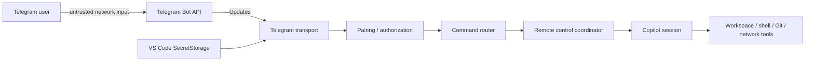

# Security Model

Remote control of a coding agent is a privileged capability. Telegram messages can indirectly cause file writes, shell commands, network access and Git operations, so the Telegram transport must be treated as a security boundary rather than a convenience UI.

> **Confidentiality warning:** Telegram bot conversations are not end-to-end encrypted Secret Chats. Prompts, code excerpts, file paths, commands, diffs, tool output and repository metadata sent to the bot transit Telegram infrastructure and are available to the bot endpoint. Do not enable this transport for content whose policy forbids that disclosure.

## 1. Security objectives

The system MUST:

- reject all unpaired Telegram users,
- prevent stale/replayed callbacks from authorizing a different action,
- preserve upstream Copilot permission semantics,
- prevent every Telegram action from raising the session permission level to `autoApprove` or `autopilot`,
- keep secrets off Telegram,
- prevent accidental cross-session/workspace control,
- make destructive actions explicit,
- fail closed when state is ambiguous,
- provide a local emergency disable mechanism.

## 2. Trust boundaries



Trust levels:

- Telegram Bot API is an external transport.
- Incoming update content is untrusted until authorized and validated.
- A paired Telegram user is trusted to request operations, but upstream permission policy still governs sensitive tool execution.
- The Copilot session/runtime remains the authority for tool permissions and agent state.
- Telegram is not a trusted confidential storage boundary; authorization prevents other bot users from controlling the workstation but does not provide end-to-end encryption against the transport provider.

## 3. Pairing

V1 pairing flow:

1. Local user starts pairing from VS Code.
2. Extension generates a cryptographically random, single-use challenge.
3. Challenge has a short expiration.
4. User sends `/pair <challenge>` to the configured bot.
5. Extension validates the challenge and captures Telegram's numeric `from.id`.
6. Numeric user ID is stored as authorized.
7. Challenge is destroyed immediately.

Requirements:

- Never authorize by Telegram username/display name.
- Never make the bot token itself sufficient for user authorization.
- Pairing challenge attempts are rate-limited.
- Pairing responses do not expose workstation/session data until successful.

## 4. Bot token handling

The bot token is a secret with full control over the bot.

Requirements:

- store through VS Code `SecretStorage` where available,
- never place the token in `settings.json`, logs, telemetry, Telegram messages or repository files,
- redact URLs/headers that may contain the token,
- provide a local command to forget/revoke the configured token,
- never send the bot token to Copilot/model context.

## 5. Authorization pipeline

Every incoming update follows:

```text
Update received
  -> validate Bot API shape
  -> deduplicate update_id
  -> identify numeric Telegram user ID
  -> check pairing/allowlist
  -> validate callback/request token if applicable
  -> resolve selected session
  -> check action allowed in current state
  -> dispatch
```

No session metadata should be returned to unauthorized users.

## 6. Session isolation

Every remote action is bound to a selected session ID.

Destructive callbacks should additionally bind:

```text
telegramUserId
sessionId
requestId/toolCallId where applicable
nonce
expiry
```

If the active selection changes, old callbacks should be rejected.

Telegram status messages should show enough context to prevent operator mistakes:

```text
Session: <title>
Workspace: <folder/repo>
Branch: <branch when available>
Model: <model>
```

## 7. Permissions

Telegram must not bypass upstream permission handling.

A Telegram approval is a user-interface response to an existing SDK permission request, not a blanket permission to execute arbitrary actions.

V1 response choices should be conservative:

- Approve once
- Deny

Telegram MUST NOT expose session-wide approval, persistent allow rules, `setPermissionLevel()`, `autoApprove` or `autopilot`. A remote mode change that would implicitly raise permission is rejected. Any future expansion requires a new security review and a locally configured ceiling that remote input cannot increase.

### Transport-origin isolation

The current upstream code recognizes Mission Control through a string prefix (`source.startsWith('command-')`) and may apply the shared Mission Control mode to that request. The multi-transport implementation MUST NOT use that string as an authorization or permission signal.

Requirements:

- the registry constructs a discriminated internal origin for each accepted remote command,
- Telegram updates/callback payloads cannot provide or override `transportId`, origin kind or effective mode,
- only a `missionControl` origin may consume Mission Control mode,
- a Telegram-origin prompt remains non-elevated even when the same session has active Mission Control state in `autopilot`,
- SDK `SendOptions.source` is correlation/telemetry metadata only,
- Telegram source strings use a distinct namespace and never start with `command-`, as defense in depth.

### First-valid-response semantics

If local VS Code and Telegram both display the same permission, only one resolution may win. The losing UI is invalidated.

### Stale callbacks

A callback is accepted only if its request is still pending and all correlation fields match. Otherwise the bot returns a harmless "request expired/already resolved" response.

## 8. User-input requests

Freeform responses to an agent question must be explicitly bound to the pending question state. An arbitrary new Telegram message must not be interpreted as an answer to a sensitive question unless the router is in a known pending-input state or the user explicitly replies/selects the prompt.

## 9. Command injection and callback payloads

Telegram callback data is untrusted.

Requirements:

- do not embed shell commands or file paths as blindly executable callback payloads,
- use opaque action IDs/nonces that map to server-side pending state,
- validate lengths and expected action types,
- never `eval` callback content,
- do not construct shell commands through string concatenation from Telegram data.

## 10. Telegram formatting safety

Agent/tool output may contain Markdown/HTML characters.

The renderer must either:

- escape content correctly for the selected Telegram parse mode, or
- send plain text when safety is uncertain.

Do not allow tool output to inject unintended links/buttons or alter callback routing.

## 11. Secret and data leakage controls

Agent tool output can contain credentials, environment variables, repository secrets or private code.

V1 controls:

- prefer summaries for verbose tool results,
- do not forward environment dumps by default,
- redact known credential/token formats where practical,
- truncate oversized outputs,
- allow debug verbosity only as an explicit setting,
- log locally with redaction,
- document that Telegram transport sends selected agent/session content through Telegram infrastructure.

The renderer should show a one-time local disclosure before Telegram is enabled and the setup guide should repeat it. Pairing is authorization, not encryption.

A future enterprise mode may require stronger configurable redaction/DLP controls.

## 12. Files and attachments

P1 attachment rules:

- download only after authorization,
- place files in a controlled temporary directory first,
- sanitize filenames and never trust remote paths,
- enforce size limits,
- do not overwrite repository files implicitly,
- require explicit user/agent action to move an attachment into the workspace,
- delete temporary files according to a retention policy.

## 13. Git and shell

Telegram does not receive direct shell or Git credentials.

Sensitive operations follow the same local tool/permission system as native Copilot.

Recommended defaults:

| Operation | Default remote policy |
| --- | --- |
| Read workspace file | follow upstream policy |
| Write workspace file | follow upstream permission/sandbox policy |
| Shell command | follow upstream permission/sandbox policy |
| Delete file | explicit permission |
| Commit | explicit permission if exposed remotely |
| Push | explicit permission; P2 |
| Force push / destructive Git | deny by default |

## 14. Network model

Long polling requires outbound HTTPS only. This reduces attack surface compared with running a public webhook endpoint.

V1 MUST NOT automatically expose a local HTTP server to the public Internet.

Tailscale is not required. If a later dashboard uses Tailscale, it receives a separate threat model.

## 15. Local kill switches

Required local controls:

- Disable Telegram remote control immediately.
- Unpair/revoke Telegram user.
- Forget bot token.
- Stop active remote-controlled task.

The local VS Code UI is authoritative over remote enablement.

## 16. Logging and audit

Logs SHOULD include:

- Telegram update ID (not secret token),
- authorized user ID in a privacy-conscious form,
- action type,
- selected session ID,
- permission request/result,
- errors,
- connection/retry state.

Logs MUST NOT include bot tokens, provider API keys or unredacted credential-bearing headers.

P1 should add an audit record such as:

```text
timestamp | user | session | action | request | outcome
```

## 17. Denial of service and rate limits

Implement bounded limits for:

- update processing queue,
- pairing attempts,
- Telegram message edits,
- status refreshes,
- attachment size,
- pending permission/question registry,
- output length.

High-frequency SDK events must be coalesced before Bot API calls.

Only one `getUpdates` consumer may hold the poller lease for a bot token. Competing VS Code windows/processes must coordinate through a lock/lease or the later consumer must fail closed with a visible diagnostic. Silent competing pollers can lose or reorder control messages.

## 18. Future V2 own-ID proposed API setup security

A fork-bundled V2 companion receives its proposal authorization from build-time product configuration. It may diagnose missing registration during activation, but it must never edit `product.json` at runtime. A private standalone V2 experiment may offer to modify VS Code `argv.json` after explicit consent. V1 does neither because Telegram runs inside the built-in Copilot extension.

Rules:

- show the exact extension ID being enabled,
- read/parse existing JSONC safely,
- preserve unrelated runtime arguments,
- create a backup before modifying,
- never enable proposed APIs globally when enabling only this extension is sufficient,
- never silently change `argv.json`,
- explain that a full restart is required.

## 19. Threat table

| Threat | Mitigation |
| --- | --- |
| Stranger messages the bot | Numeric-ID allowlist; no metadata before pairing |
| Pairing code guessed | Cryptographic random code, short expiry, attempt throttling |
| Old Allow button reused | Request ID + nonce + pending-state validation |
| Wrong session receives prompt | Explicit selected-session state + session validation |
| Telegram output leaks secret | Summary/redaction/truncation policy |
| Bot token leaked in logs | SecretStorage + structured redaction |
| Update replay | Track Telegram `update_id` |
| Telegram flood | Queue/rate limits |
| Remote user bypasses Copilot permission | Telegram only resolves real pending SDK permission requests |
| Remote user escalates session to auto-approval/autopilot | No remote permission-level mutation; approve-once/deny only; reject privilege-raising mode changes |
| Telegram request is misclassified as Mission Control | Registry-created typed origin; mode derived from origin kind, never from a transport-supplied `source` prefix |
| User assumes bot chat is E2E encrypted | Prominent setup/runtime disclosure; minimize/redact projected content |
| Two extension hosts poll the same bot | Singleton poller lease; second consumer fails visibly |
| Extension disabled remotely by attacker | Local enablement/disable state remains authoritative |
| Public inbound service exposed | Long polling; no inbound listener in V1 |

## 20. Consent, disclosure and local visibility

Remote control is opt-in, must be understood before it is enabled, and must remain visible while it is active. Pairing proves *who* is connected; it does not make the transport safe or private.

### 20.1 Enable-time consent gate

Enabling the transport for the first time (and again after the token is changed) requires an explicit modal acknowledgement. Default action is cancel.

The modal MUST state, in plain language:

1. A paired Telegram user can send prompts that cause this machine to **write files, run shell commands, access the network and perform Git operations**.
2. That user can **approve permission requests remotely**, so an operation may proceed without anyone at the keyboard.
3. Telegram bot chats are **not end-to-end encrypted**. Prompts, code, file paths, diffs and tool output sent to the bot transit Telegram infrastructure.
4. Anyone who obtains the **bot token** can impersonate the bot; anyone who obtains the paired **Telegram account** gains this control.
5. Exactly which workstation and workspace will be exposed.
6. How to turn it off (status bar item → *Disable remote access*).

The implementation MUST ensure:

- enabling the transport without passing the modal consent gate is not possible from any entry point, including the setting,
- an attached session always renders a local indicator in the session list and status bar,
- the kill switch is reachable in one click from the status bar item.

Wording rules:

- No minimizing language ("just", "simply", "safe").
- Do not imply GitHub or Microsoft endorsement.
- The `Enable` button is never the pre-selected default.
- Declining persists nothing — no token, no pairing, no enabled flag.

### 20.2 Settings disclosure

`github.copilot.telegram.enabled` uses a `markdownDescription` carrying an abbreviated form of the same warning, so the risk is visible to anyone who finds the setting without running the wizard. Toggling the setting on directly still routes through the consent gate; the setting alone must not activate the transport.

### 20.3 Continuous local visibility

A remotely attached session MUST be identifiable without opening a chat:

- session list entry carries a remote indicator and tooltip,
- the status bar shows an attached-state item with a warning background,
- a one-time in-chat notice is emitted when a transport attaches during a live request.

See [ARCHITECTURE.md](./ARCHITECTURE.md) section 16 for the implementation. **A session that is remotely controllable with no local indicator is a security defect, not a cosmetic one**, and is covered by the architecture quality gate.

### 20.4 Telegram-side context

The bot must not let an operator forget what they are driving. `/start`, the home card and every permission or destructive-action prompt state the workstation name, workspace/repository and session title. A permission prompt that does not identify its session is rejected rather than rendered.

### 20.5 Non-goals of consent

Acknowledgement is not a substitute for the technical controls. Consent does not permit relaxing pairing, permission-escalation prevention, redaction or the singleton poller lease.

## 21. Security acceptance criteria

Before V1 release:

- unauthorized-user tests pass,
- expired/replayed callback tests pass,
- wrong-session callback tests pass,
- duplicate Telegram update tests pass,
- bot token never appears in test logs,
- permission response race is deterministic and safe,
- Telegram cannot raise permission level directly or through a mode change,
- Telegram-origin requests do not inherit Mission Control mode when `_mcState.mcMode` is `autopilot`,
- a Telegram payload containing `command-*` cannot alter its typed origin or effective permission level,
- long-poll retry cannot spawn duplicate consumers,
- a competing process/window cannot acquire a second poller lease,
- setup displays and records acknowledgement of the non-E2E confidentiality warning,
- if a V2 fork-bundled companion is built, activation never attempts to edit `product.json`,
- if the optional standalone V2 setup is built, it never overwrites unrelated `argv.json` entries.
