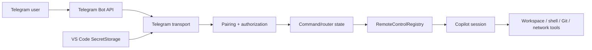

# Security Model

> **Status:** Current security reference
> **Scope:** `copilot-telegram` downstream branch
> **Last reviewed:** 2026-09-01
>
> Remote control of a coding agent is a privileged capability. Telegram input can indirectly cause file writes, shell commands, network access and Git operations. The Telegram path is therefore a security boundary, not a convenience UI.

> **Confidentiality warning:** Telegram bot conversations are not end-to-end encrypted Secret Chats. Prompts, assistant output, file paths, tool summaries and other content intentionally projected to the bot transit Telegram infrastructure. Do not enable the transport for content whose policy forbids that disclosure.

## 1. Security objectives

The implementation must:

- reject unpaired or stale identities,
- disclose no session metadata before authorization,
- bind every action to the current authorized workspace/session,
- prevent callback/reply replay and cross-request confusion,
- preserve upstream Copilot permission semantics,
- prevent Telegram from raising the session permission policy,
- keep provider/bot credentials out of Telegram and model context,
- make remote attachment and disablement locally visible,
- fail closed when ownership or state is ambiguous.

## 2. Trust boundaries



Telegram is an external transport. Pairing identifies an allowed operator; it does not make Telegram a confidential channel and does not bypass upstream tool permissions.

## 3. Pairing and identity

Current pairing is initiated locally and uses a cryptographically random, short-lived, single-use challenge.

The accepted remote identity is based on Telegram's numeric user/chat identity, not username/display name.

Rules:

- the bot token alone is not user authorization,
- pairing attempts are bounded,
- pairing-only state accepts only the exact pending pairing action,
- normal commands/callbacks/prompts remain blocked until the identity and workspace consent are current.

## 4. Secret handling

The bot token is stored through VS Code protected secret storage and must never be placed in:

- settings JSON,
- repository files,
- Telegram messages,
- model prompts,
- diagnostics/log output.

Configured model/provider credentials remain owned by the corresponding VS Code/provider implementation. The downstream VS Code-LM bridge must not copy raw provider credentials into Telegram state or Copilot SDK provider configuration.

## 5. Authorization pipeline

Every incoming action follows the same conceptual pipeline:

```text
validate update shape
  -> deduplicate update_id
  -> identify numeric Telegram identity
  -> require current pairing
  -> validate callback/reply correlation when applicable
  -> resolve selected session
  -> authorize session workingDirectory against current consented roots
  -> validate current lifecycle/action state
  -> dispatch
```

No callback, message ID, keyboard visibility or session ID is authorization by itself.

## 6. Workspace and session isolation

The session service can discover sessions outside the current window. Therefore session discovery and authorization are deliberately separate.

`CurrentWorkspaceTelegramSessionScopePolicy` permits a session only when its valid file-URI working directory is equal to or below a currently consented workspace root according to VS Code resource identity.

The following fail closed:

- empty/no-root window,
- missing/invalid/non-file working directory,
- foreign URI authority,
- sibling/out-of-scope repository,
- changed workspace roots,
- stale selection schema/fingerprint.

Scope is revalidated at important boundaries such as listing, selection, restoration, prompt/steering, stop and output publication. A previous successful picker action is not permanent authorization.

## 7. Agent Host handover boundary

Agent Host-owned sessions are discoverable in the current branch, but they are not remotely controlled in place.

Security-relevant behavior:

- Agent Host metadata is still workspace-authorized before display,
- a `↪` selection explicitly requests handover,
- `forkAgentHostSession()` first attempts to register the source session as in-use,
- if the source is already in use, Telegram control is rejected,
- when available, a **new extension-host Remote Pilot session** is created and selected,
- the original live Agent Host session is not treated as a registry-bound Telegram session.

This avoids pretending that two runtime owners safely mutate one live session without a validated shared-client protocol.

Direct AHP client attachment has a separate security model and is not implemented here.

## 8. Trusted request provenance

Remote mode/authority is based on a registry-created `RemoteRequestOrigin`, not on Telegram payload data or SDK `source` prefixes.

Rules:

- transports cannot supply or override their trusted registry identity,
- structurally copying the visible fields of an origin object does not recreate trust,
- SDK `SendOptions.source` is correlation/telemetry metadata only,
- Mission Control and Telegram modes remain isolated,
- Telegram remains non-elevated even when Mission Control is operating in an elevated mode.

## 9. Permission ceiling

Telegram can answer a concrete pending permission request only with:

- **Approve once**
- **Deny**

Telegram cannot:

- enable `autoApprove`,
- select `autopilot`/`autopilot_fleet`,
- create persistent allow rules,
- mutate the global/session permission policy.

A Telegram approval is a UI response to one upstream SDK permission request, not authority to execute arbitrary future operations.

Local VS Code, Mission Control and Telegram use first-valid-response-wins behavior. Losing/stale controls are invalidated.

## 10. Plan and user-input safety

User-question replies are accepted only when correlated to the active request/question.

Plan-exit responses use a separate non-elevating type that can represent only:

- `interactive`,
- `exit_only`,
- denial,
- bounded feedback.

The remote response type cannot encode autopilot/autopilot-fleet/autoApproveEdits, and runtime validation rejects forged/unoffered values.

## 11. Callback and reply correlation

Interactive Telegram state is opaque and server-side.

Callbacks/replies should bind enough current state to prevent reuse, including as applicable:

```text
paired identity
chat/message ID
session ID
request/tool-call/activity ID
generation/revision
nonce
expiry
```

A callback/reply that is stale, wrong-session, wrong-user, replaced-generation or already resolved returns a harmless explicit failure and does not dispatch.

## 12. Command injection and formatting

Telegram callback data is untrusted.

Never:

- execute callback payload text as a shell command,
- embed blindly executable file paths in callbacks,
- `eval` callback content,
- construct shell commands through unsanitized string concatenation.

Agent/tool output is rendered through a bounded Telegram-safe presentation layer. Unsupported/raw markup must not be allowed to inject buttons, links or control state.

## 13. Workspace file browser

The current Telegram file browser is read-only.

Security properties include:

- selected authorized workspace only,
- containment checks on every navigation/preview,
- traversal rejection,
- symlink-sensitive entry handling,
- binary rejection,
- bounded preview size,
- opaque callbacks.

The browser does not imply arbitrary file write capability from Telegram.

## 14. Data minimization and redaction

Remote presentation should prefer useful bounded summaries over raw dumps.

Controls include:

- bounded event projection,
- bounded tool detail/output,
- redaction of known credential-shaped data where practical,
- no environment dumps by default,
- content-free lifecycle diagnostics,
- no bot/provider credentials in logs.

Pairing is authorization, not encryption.

## 15. Network model

The Telegram transport uses outbound HTTPS long polling.

Default V1 requires no public inbound service, webhook server, port forwarding or Tailscale.

The configured-model adapter is a loopback-only boundary. It binds locally, authenticates requests with a strong nonce and is not intended as a public server.

Any future public dashboard/tunnel architecture requires its own threat model.

## 16. Singleton poller and lifecycle races

Only one active `getUpdates` consumer may own a bot token.

- automatic competing consumers fail visibly,
- explicit reconnect may transfer the lease through the implemented nonce/heartbeat handoff,
- lifecycle generations prevent late async startup from reviving disabled access,
- disable blocks new remote dispatch before awaiting network cleanup.

A silent second poller is a correctness and security defect because it can lose/reorder control messages.

## 17. Local visibility and kill switches

The local VS Code user remains authoritative over remote enablement.

Required controls include:

- disable remote access,
- unpair user,
- forget configuration/token,
- stop selected remote-controlled work.

Remote attachment/state must remain locally discoverable through the implemented status/indicator surfaces. A remotely controllable session with no meaningful local indication is considered a security defect.

## 18. Consent requirements

Initial enablement is blocked on explicit local acknowledgement.

The disclosure should clearly state that:

1. a paired user can trigger an agent that may write files, run commands, access the network and perform Git operations;
2. Telegram may answer individual allowed permission requests but cannot elevate the permission policy;
3. bot chats are not end-to-end encrypted;
4. compromise of the bot token or paired Telegram account is security-relevant;
5. the current workstation/workspace scope is being exposed;
6. local disablement remains available.

Do not use minimizing language or imply GitHub/Microsoft endorsement.

## 19. Threat table

| Threat | Primary mitigation |
| --- | --- |
| Stranger messages bot | Numeric pairing + no metadata before authorization |
| Pairing code guessed/reused | Random short-lived single-use challenge + rate limit |
| Old approval button reused | One-shot callback state + request/session/message correlation |
| Wrong workspace/session receives command | Current URI-based workspace authorization on every control boundary |
| Telegram prompt misclassified as Mission Control | Registry-issued trusted origin, never `source` prefix inference |
| Telegram escalates permission policy | Non-elevating modes + approve-once/deny-only permission surface |
| Reply steers wrong turn | Bounded message/activity/generation correlation + revalidation |
| Agent Host session concurrently controlled | Source lock check; in-use source is rejected before fork handover |
| Bot token appears in diagnostics | SecretStorage + content-free/redacted diagnostics |
| Two VS Code windows poll same bot | Singleton lease + explicit takeover flow |
| Disable races startup | Synchronous admission block + lifecycle generation invalidation |
| Telegram flood | Bounded update/callback/outbound queues and retry policy |
| User assumes E2E confidentiality | Prominent disclosure and data minimization |

## 20. Security acceptance criteria

Before distributing a build as a release candidate, verify at minimum:

- unauthorized user receives no session metadata,
- pairing expiry/replay tests pass,
- callback/reply wrong-user/session/request/generation tests pass,
- out-of-scope/missing/foreign workspace tests pass,
- Agent Host in-use handover is rejected,
- Agent Host fork selects only the new authorized Remote Pilot session,
- Telegram cannot produce an elevating permission/mode response,
- Telegram-origin requests cannot inherit Mission Control elevation,
- duplicate update handling and poller ownership tests pass,
- disable prevents new remote dispatch immediately,
- tokens/provider secrets do not appear in diagnostics/test logs,
- confidentiality disclosure is shown before enablement.

See [TEST_STRATEGY.md](./TEST_STRATEGY.md) and [PHASE8_ACCEPTANCE.md](./PHASE8_ACCEPTANCE.md).