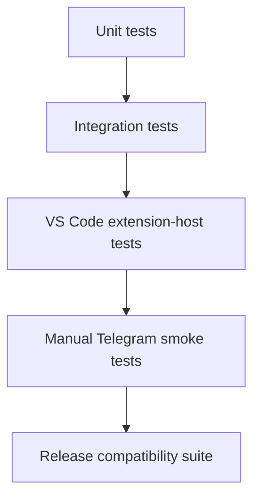

# Test Strategy

## 1. Goal

The highest-risk failure is not a cosmetic Telegram bug. It is remote input being routed to the wrong session, permission request or workspace, or a downstream rebase silently changing Copilot behavior.

Tests therefore prioritize:

1. authorization,
2. request/session correlation,
3. same-session control semantics,
4. Mission Control compatibility after registry migration,
5. deterministic reference/listener/poller ownership,
6. upstream compatibility,
7. transport reliability,
8. rendering correctness.

## 2. Test layers



## 3. Unit tests

Unit-test downstream modules without a real Telegram account or real Copilot model wherever possible.

### Telegram update parser/router

Cover:

- authorized text update,
- unauthorized text update,
- callback query,
- duplicate `update_id`,
- malformed update,
- missing `from.id`,
- unsupported chat/update type,
- message during idle session,
- message during running session,
- message with no selected session.

### Pairing

Cover:

- valid challenge,
- expired challenge,
- reused challenge,
- wrong challenge,
- throttled attempts,
- username change does not affect numeric-ID authorization,
- revocation removes access.

### Callback/request registry

Cover:

- valid pending request,
- expired request,
- already-resolved request,
- wrong session ID,
- wrong Telegram user,
- wrong nonce,
- same callback replayed twice.

### Activity aggregation and Rich renderer

Snapshot/test rendering for:

- transport-neutral `ActivityRound` creation,
- read/search burst grouping and semantic-boundary separation,
- command/edit `toolCallId` start-to-completion lifecycle,
- failed command rendering,
- SDK-visible reasoning/progress rounds without hidden chain-of-thought reconstruction,
- compact lifecycle paragraphs, `InputRichBlockDetails` generation with only round-local details, and formatted direct final-answer HTML,
- redaction and hard bounds before Telegram presentation,
- compact/detailed/debug disclosure of successful tool output and correlation metadata,
- subagent state,
- errors,
- context usage,
- output truncation.

### Granular activity timeline

Cover:

- one meaningful round creates one persistent Rich Message,
- command start and completion edit the same `message_id`,
- high-frequency updates respect the minimum edit interval,
- replay seeds internal state without appearing as new current work,
- new prompt generation clears old visible activity state,
- session switch clears previous activity state,
- Stop markup is removed on complete, failure, cancel, supersession and invalid scope,
- Disable during a correlated turn removes Stop, reports drain-only local continuation, and waits for the SDK terminal event before final completion/answer delivery,
- `message-not-modified` is accepted, while deleted/expired/failed edits create a reply-linked replacement,
- `(chatId,messageId)` correlation resolves live steering and rejects completed/expired/wrong-generation replies,
- timeline metadata never calls `getSession()` or retains `IReference<ICopilotCLISession>`,
- Bot API failures do not leak credentials or raw content.

### Session scope policy

Cover:

- empty-window/no-workspace rejection even when `getAllSessions()` returns a foreign session,
- metadata filtering before session titles or paths reach Telegram,
- missing/invalid working-directory rejection,
- current root, multi-root and nested-directory authorization,
- Windows case-insensitive identity, sibling-path rejection and URI-authority mismatch,
- callback-time and dispatch-time root/working-directory changes,
- v1/stale persisted selection rejection and valid v2 restoration,
- prompt, steering, Stop, activity flush and final-answer revalidation.

The current Phase 4.1 policy intentionally does not implement cross-workspace local approval. Tests assert the safer temporary behavior: only sessions inside the current consented window roots are visible; every other scope requires reopening/consenting in the appropriate window.

### Enable/reconnect lifecycle

Cover:

- disable → enable reuses the exact-scope SecretStorage token without an input prompt,
- disable → extension reload → enable preserves only the non-secret configured marker and revalidates token/consent/pairing,
- retryable failure → Reconnect reuses stored state,
- authentication/API failure offers setup rather than blind reconnect,
- a changed workspace enters `needs-workspace-consent`, blocks old commands, and reuses the stored token/paired identity after local consent without a token prompt or pairing challenge,
- missing token enters complete setup; missing pairing reuses the saved token but requires pairing; token replacement invalidates token-bound pairing,
- pairing-only admission ignores `/status`, `/sessions`, callbacks, and prompts until the exact challenge succeeds,
- pairing timeout/cancellation preserves saved recovery configuration,
- concurrent Enable/Setup/Reconnect share one operation/start,
- concurrent Disable blocks dispatch immediately and a late startup completion cannot revive the cancelled generation,
- existing cross-process singleton lease tests still reject a second host.

### Optional V2 standalone `argv.json` updater

Use temporary files covering:

- empty/missing file,
- comments/JSONC,
- existing unrelated keys,
- existing `enable-proposed-api`,
- ID already present,
- multiple other IDs,
- backup creation,
- invalid file handling,
- failed write rollback,
- removal of only this extension ID.

## 4. Mock interfaces

Create small mocks/fakes around the registry seam rather than mocking the whole Copilot extension or exposing the raw SDK session to Telegram.

Suggested interfaces:

```ts
interface TestRemoteTransport {
    id: string;
    publish(event: TestRemoteEvent): void;
    answerPermission(...): void;
    answerUserInput(...): void;
}

interface TestSessionControl {
    abort(): Promise<void>;
}

interface TestTelegramClient {
    getUpdates(...): Promise<Update[]>;
    sendMessage(...): Promise<Message>;
    editMessageText(...): Promise<Message>;
    answerCallbackQuery(...): Promise<void>;
}
```

The production code should remain close enough to these abstractions that transport and routing tests do not require real LLM calls.

### Remote-control registry

Cover:

- zero, one and two registered remote transports,
- event fan-out ordering,
- exactly one publication per SDK event ID when request-scoped and persistent legacy observers overlap,
- duplicate event IDs are suppressed before fan-out,
- no forwarded event has `parentId === id`,
- one transport failing without breaking the other,
- first valid permission/question response wins,
- losing transport is cancelled/invalidated,
- session attachment replacement disposes the old binding,
- registry shutdown cancels pending waiters and listeners.

## 5. Integration tests — session bridge

Critical cases:

### Same-session prompt

- create/get an upstream session,
- select it through the Telegram session router/registry binding,
- stage `setPendingCopilotCLIRequestContext(...)`,
- verify `workbench.action.chat.openSessionWithPrompt.copilotcli` is invoked with the selected session resource,
- simulate VS Code creating the real `ChatRequest`/`toolInvocationToken`,
- verify the chat participant resolves and invokes that same session object,
- verify no second Copilot SDK client/session is created for Telegram.
- verify Telegram receives an immediate acknowledgement without awaiting `responseCompletePromise`,
- verify the command promise is observed for rejection without blocking the transport update loop,
- verify command failure clears only its correlated pending request context and cannot clear a newer request,
- verify failure does not fall back to direct SDK `send()`.

### Steering

- mark/start session as busy,
- send Telegram text,
- verify the native request command path is used,
- verify upstream busy handling selects `mode: immediate`,
- verify original turn remains the same session.

### Abort

- start active work,
- invoke remote Stop,
- verify session abort path called exactly once,
- verify pending Telegram state resolves.

### Session close/change

- select session,
- delete/close it upstream,
- remote command must fail explicitly and require reselection.

### Session reference lifecycle

- listing, selection, activity correlation and timeline delivery use metadata APIs and do not call `getSession()`,
- `/new` creates provisional controller metadata and does not acquire a wrapper reference; the first native prompt owns materialization,
- live wrapper control remains owned by the native request path and registry binding,
- session deletion, Telegram disable and extension deactivation leave no downstream wrapper/listener reference,
- repeated attach/detach leaves no listener leak and disposed sessions receive no later remote action.

## 6. Permission integration tests

The Telegram responder is active, so callback correlation and the registry response race are release-gating behavior.

Simulate:

```text
permission.requested
 -> local prompt pending
 -> Telegram prompt pending
```

Cases:

- Telegram approves first,
- local UI approves first,
- Telegram denies first,
- request cancelled,
- callback arrives after local resolution,
- callback for wrong request/session,
- two permission requests concurrently.

Invariant:

> Exactly one valid response reaches the SDK for each request.

Additional invariants:

- Telegram can return only approve-once or deny,
- Telegram cannot call `setPermissionLevel()`,
- remote mode input cannot raise the effective permission level to `autoApprove` or `autopilot`,
- with Mission Control active in `autopilot`, a typed Telegram-origin prompt still uses the non-elevated local permission policy,
- a Telegram payload/source value beginning `command-` cannot change the registry-created origin or inherit Mission Control mode,
- only a typed `missionControl` origin may apply `mcMode`.

## 7. User-input integration tests

Cases:

- choice question,
- freeform question,
- local answer wins,
- Telegram answer wins,
- stale reply,
- unrelated Telegram message while a question is pending,
- cancellation.

### Existing-session event replay

Cover:

- the live listener is installed before the history snapshot and buffers during replay,
- `sdkSession.getEvents()` is reached only through the session bridge,
- only the supported persisted event types are replayed,
- persisted events retain order and upstream IDs/timestamps where present,
- ephemeral deltas are not assumed to exist,
- live events arriving during replay are flushed afterward,
- an event present in both history and the temporary live buffer is published once.

## 8. Telegram transport tests

Use a local/mock HTTP server or dependency mock.

Cover:

- successful long poll,
- empty poll,
- timeout,
- HTTP 429/rate limit,
- temporary 5xx,
- network reset,
- invalid token/401,
- reconnect after failure,
- clean shutdown,
- no duplicate pollers after restart/re-enable,
- a second VS Code host/process cannot acquire the same bot-token poller lease,
- an abandoned lease is recovered only under the documented safe-expiry rules,
- update offset persistence/recovery behavior.

## 9. VS Code extension-host tests

Run against the matching VS Code build/API set.

Cover:

- contribution activation,
- access to `ICopilotCLISessionService`,
- session list integration,
- secret storage interaction,
- configuration commands,
- proposed API preflight behavior,
- extension deactivation disposes poller/listeners.

For V1, verify that the built-in modified Copilot extension retains every proposal declared by its manifest without adding a Telegram extension ID or changing user `argv.json`.

If a V2 own-ID companion is produced, add a build-level contract test that:

- its exact extension ID exists in `product.json#extensionEnabledApiProposals` for a fork-bundled build,
- the product and companion-manifest proposal lists match exactly,
- a missing or incomplete product entry fails the build,
- activation preflight fails closed rather than attempting to edit `product.json`.

Run `argv.json` updater tests only for the optional private standalone V2 experiment.

When proposed APIs are part of the test, CI must launch the test host with the correct extension-ID enablement.

## 10. Upstream regression tests

After every upstream rebase run:

- upstream Copilot build/typecheck,
- upstream tests relevant to Copilot CLI sessions,
- Telegram unit tests,
- Telegram session integration tests,
- optional V2 own-ID proposal registration/preflight test when that artifact is in scope,
- packaging smoke test.

Specific upstream behavior to protect:

- native VS Code Copilot session still works without Telegram configured,
- Mission Control remote control still works,
- Mission Control replay/export, prompt, steering, abort, permission, question and command-completion semantics are unchanged behind `MissionControlTransport`,
- each SDK event is exported once even when a request is active and the session-lifetime listener is installed,
- local permission UI still works,
- normal session model selection still works,
- worktree/checkpoint behavior unchanged,
- Telegram disabled means no Telegram network activity.
- transport attachment warnings reflect the actual registered permission-response capability.

Run the Mission Control suite once with only its transport registered and once with an in-memory second transport registered to catch hidden single-transport assumptions.

## 11. Local/BYOK model tests

P1 matrix:

| Backend | Test |
| --- | --- |
| GitHub-hosted model | prompt, steering, tool, permission, abort |
| vLLM/OpenAI-compatible provider | same agent-loop tests where upstream supports it |
| Ollama | same agent-loop tests where upstream supports it |

A backend is not marked compatible merely because text generation works. Agent compatibility requires the upstream runtime/tool loop to function correctly.

## 12. Security tests

Required before V1:

- unauthorized user cannot list sessions,
- unauthorized callbacks rejected,
- pairing code expires,
- pairing code cannot be reused,
- callback replay rejected,
- cross-session permission callback rejected,
- cross-user callback rejected,
- duplicate updates do not duplicate actions,
- bot token absent from logs/errors/snapshots,
- Telegram HTML sanitization prevents unintended markup/control and unsafe links,
- empty-window, missing-working-directory, sibling/foreign-workspace and stale-scope selection fail closed without metadata leakage,
- high-rate input does not create unbounded queues,
- Stop action cannot target a different session through stale state,
- remote inputs cannot enable `autoApprove`/`autopilot`,
- Telegram-origin prompts cannot inherit active Mission Control `autopilot` state or spoof it with a `command-*` source string,
- setup clearly discloses that Telegram bot conversations are not end-to-end encrypted,
- a second poller cannot silently consume updates for the same bot token.

## 13. Manual smoke test script

Run for candidate bundled-fork builds:

```powershell
.\extensions\copilot\script\telegram-remote\launch-dev.ps1
```

This default profile is intentionally persistent so iterative runs reuse GitHub/Copilot sign-in, Telegram SecretStorage and settings. For the release-gate clean-profile run, pass a new empty directory with `-ProfilePath`. Close the previous development instance before rebuilding/relaunching so the new extension bundle is loaded.

1. Install/run a clean matching bundled-fork build.
2. Verify the built-in Copilot extension has every proposal declared by its manifest without adding a Telegram extension ID or editing `argv.json`.
3. Confirm the non-E2E Telegram disclosure.
4. Configure bot token.
5. Pair Telegram user.
6. Open/start a Copilot CLI session in a test repository.
7. Select the session from Telegram.
8. Send: `Inspect this repository and tell me the test command.`
9. Verify the remote message appears in native VS Code chat.
10. Start a longer task.
11. While running, steer: `Do not modify files yet; only diagnose.`
12. Trigger an operation that requires permission; verify an individual expandable bubble offers only **Approve once** and **Deny**, and that answering locally first makes Telegram's control stale.
13. Verify the activity appears as chronological semantic Rich Message bubbles: read/search bursts aggregate, while commands, edits, progress/direction changes and the final result remain separate.
14. Expand several detail-bearing bubbles and verify each contains only its own bounded, redacted details. Verify short lifecycle updates are not empty expanders and the final assistant answer is directly visible with formatted Markdown. Confirm no hidden chain-of-thought claim or unrelated request history appears.
15. Select another session and confirm the existing picker/status message is edited rather than duplicated; button labels remain concise while status shows the full authorized path.
16. Start a long task, verify the initial request bubble owns Stop, press Stop, and verify its buttons disappear.
17. Reply to a running reasoning/progress bubble and verify the text immediately steers the same native Copilot session; repeat after completion and verify a stale response with no dispatch.
18. Verify a running command bubble is edited in place on completion rather than duplicated.
19. Open an empty VS Code window using a separate profile and verify foreign session titles/paths are not listed. Repeat with a sibling repository and one authorized multi-root folder.
20. Return to VS Code and verify the same session/history/state is intact.
21. Enable/smoke-test Mission Control and confirm it still works.
22. Disable Telegram locally and verify remote commands no longer act, attached state clears immediately, and the status item becomes muted `Telegram: Off` with Enable but no Unpair/Disable action.
23. Enable again and verify the same exact-scope configuration reconnects without asking for the bot token; confirm the authorized selection restores only after connection/scope validation.
24. Restart the extension-development window while disabled, enable again, and repeat the no-token-prompt check.
25. Simulate a retryable network failure, use Reconnect, and confirm only one poller resumes. If the saved token/consent/pairing is intentionally invalidated, confirm Enable routes to setup instead.

Do not mark this real-bot checklist passed until a human performs it. Never print or inspect the persistent profile's bot token or GitHub/Copilot credentials.

## 13.1 Automated regression

From `extensions/copilot`:

```powershell
npx vitest run src/extension/telegramRemote
npx tsc --noEmit --project tsconfig.json
```

The Phase 5.3 deterministic run covers 26 files / 148 tests using fake tokens and in-memory Bot API hosts only. It includes the Phase 5.2 lifecycle corrections, Rich Message payloads, semantic rounds and reply/callback control flow; it does not read `.env` or contact Telegram. The older PowerShell runners remain useful phase-history gates but do not yet enumerate every new Phase 5.3 file.

## 14. Release compatibility report

Every released build/artifact should have a machine-generated report containing at least:

```text
Upstream VS Code commit
Copilot extension version
Downstream patch version
Tested OS
Required proposed APIs
Copilot backend(s) tested
Telegram Bot API smoke result
Build/test result
```

## 15. Performance targets

Initial non-binding targets:

- normal Telegram command acknowledgement: prompt response/ack begins without artificial multi-second local delay,
- no more than a small bounded number of Telegram status edits per second,
- event queues bounded under verbose tool output,
- long polling consumes negligible CPU when idle,
- Telegram integration adds no material overhead when disabled.

Measure before setting hard thresholds.

## 16. Test data policy

Automated tests should use synthetic repositories/session content and fake bot tokens.

Never place real Telegram bot tokens, GitHub tokens, Copilot credentials or private repository content in fixtures/snapshots.

## 17. Definition of release-ready

A candidate is release-ready only if:

- build/typecheck passes,
- required upstream Copilot tests pass,
- all P0 Telegram tests pass,
- security suite passes,
- clean-profile manual smoke test passes,
- V1 bundled Copilot manifest proposal access passes,
- V2 fork-bundled companion product registration passes if that artifact is produced,
- V2 standalone proposed API setup/rollback passes if that artifact is produced,
- exact upstream compatibility metadata is recorded,
- license/notice packaging has been reviewed.
