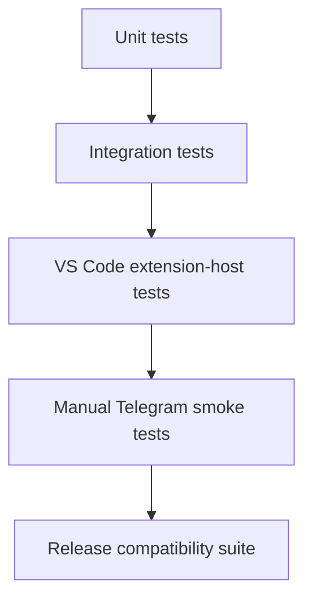

# Test Strategy

## 1. Goal

The highest-risk failure is not a cosmetic Telegram bug. It is remote input being routed to the wrong session, permission request or workspace, or a downstream rebase silently changing Copilot behavior.

Tests therefore prioritize:

1. authorization,
2. request/session correlation,
3. same-session control semantics,
4. upstream compatibility,
5. transport reliability,
6. rendering correctness.

## 2. Test layers



## 3. Unit tests

Unit-test downstream modules without a real Telegram account or real Copilot model wherever possible.

### Telegram update parser/router

Cover:

- authorized text update,
- unauthorized text update,
- callback query,
- duplicate `update_id`,
- malformed update,
- missing `from.id`,
- unsupported chat/update type,
- message during idle session,
- message during running session,
- message with no selected session.

### Pairing

Cover:

- valid challenge,
- expired challenge,
- reused challenge,
- wrong challenge,
- throttled attempts,
- username change does not affect numeric-ID authorization,
- revocation removes access.

### Callback/request registry

Cover:

- valid pending request,
- expired request,
- already-resolved request,
- wrong session ID,
- wrong Telegram user,
- wrong nonce,
- same callback replayed twice.

### Event renderer

Snapshot/test rendering for:

- assistant text,
- tool start/complete,
- long command output,
- Markdown special characters,
- reasoning present/absent,
- subagent state,
- errors,
- context usage,
- output truncation.

### Activity coalescer

Cover:

- many deltas collapse into bounded edits,
- final event flushes pending content,
- rate limit respected,
- old events drop from compact history,
- session switch clears previous activity state.

### `argv.json` updater

Use temporary files covering:

- empty/missing file,
- comments/JSONC,
- existing unrelated keys,
- existing `enable-proposed-api`,
- ID already present,
- multiple other IDs,
- backup creation,
- invalid file handling,
- failed write rollback,
- removal of only this extension ID.

## 4. Mock interfaces

Create small mocks/fakes around the seam rather than mocking the whole Copilot extension.

Suggested interfaces:

```ts
interface TestSession {
    sessionId: string;
    status: string;
    send(...): Promise<void>;
    abort(): void;
    emit(event: TestSessionEvent): void;
}

interface TestTelegramClient {
    getUpdates(...): Promise<Update[]>;
    sendMessage(...): Promise<Message>;
    editMessageText(...): Promise<Message>;
    answerCallbackQuery(...): Promise<void>;
}
```

The production code should remain close enough to these abstractions that transport and routing tests do not require real LLM calls.

## 5. Integration tests — session bridge

Critical cases:

### Same-session prompt

- create/get an upstream session,
- select it in remote coordinator,
- send remote prompt,
- verify prompt reaches that session object,
- verify no second Copilot SDK client/session is created for Telegram.

### Steering

- mark/start session as busy,
- send Telegram text,
- verify `mode: immediate`/existing upstream steering path is used,
- verify original turn remains the same session.

### Abort

- start active work,
- invoke remote Stop,
- verify session abort path called exactly once,
- verify pending Telegram state resolves.

### Session close/change

- select session,
- delete/close it upstream,
- remote command must fail explicitly and require reselection.

## 6. Permission integration tests

Simulate:

```text
permission.requested
 -> local prompt pending
 -> Telegram prompt pending
```

Cases:

- Telegram approves first,
- local UI approves first,
- Telegram denies first,
- request cancelled,
- callback arrives after local resolution,
- callback for wrong request/session,
- two permission requests concurrently.

Invariant:

> Exactly one valid response reaches the SDK for each request.

## 7. User-input integration tests

Cases:

- choice question,
- freeform question,
- local answer wins,
- Telegram answer wins,
- stale reply,
- unrelated Telegram message while a question is pending,
- cancellation.

## 8. Telegram transport tests

Use a local/mock HTTP server or dependency mock.

Cover:

- successful long poll,
- empty poll,
- timeout,
- HTTP 429/rate limit,
- temporary 5xx,
- network reset,
- invalid token/401,
- reconnect after failure,
- clean shutdown,
- no duplicate pollers after restart/re-enable,
- update offset persistence/recovery behavior.

## 9. VS Code extension-host tests

Run against the matching VS Code build/API set.

Cover:

- contribution activation,
- access to `ICopilotCLISessionService`,
- session list integration,
- secret storage interaction,
- configuration commands,
- proposed API preflight behavior,
- extension deactivation disposes poller/listeners.

When proposed APIs are part of the test, CI must launch the test host with the correct extension-ID enablement.

## 10. Upstream regression tests

After every upstream rebase run:

- upstream Copilot build/typecheck,
- upstream tests relevant to Copilot CLI sessions,
- Telegram unit tests,
- Telegram session integration tests,
- proposed API preflight test,
- packaging smoke test.

Specific upstream behavior to protect:

- native VS Code Copilot session still works without Telegram configured,
- Mission Control remote control still works,
- local permission UI still works,
- normal session model selection still works,
- worktree/checkpoint behavior unchanged,
- Telegram disabled means no Telegram network activity.

## 11. Local/BYOK model tests

P1 matrix:

| Backend | Test |
| --- | --- |
| GitHub-hosted model | prompt, steering, tool, permission, abort |
| vLLM/OpenAI-compatible provider | same agent-loop tests where upstream supports it |
| Ollama | same agent-loop tests where upstream supports it |

A backend is not marked compatible merely because text generation works. Agent compatibility requires the upstream runtime/tool loop to function correctly.

## 12. Security tests

Required before V1:

- unauthorized user cannot list sessions,
- unauthorized callbacks rejected,
- pairing code expires,
- pairing code cannot be reused,
- callback replay rejected,
- cross-session permission callback rejected,
- cross-user callback rejected,
- duplicate updates do not duplicate actions,
- bot token absent from logs/errors/snapshots,
- Telegram Markdown escaping prevents unintended markup/control,
- high-rate input does not create unbounded queues,
- Stop action cannot target a different session through stale state.

## 13. Manual smoke test script

Run for candidate VSIX builds:

1. Install on a clean matching VS Code profile.
2. Verify proposed-API setup prompt when using downstream ID.
3. Enable and fully restart VS Code.
4. Configure bot token.
5. Pair Telegram user.
6. Open/start a Copilot CLI session in a test repository.
7. Select the session from Telegram.
8. Send: `Inspect this repository and tell me the test command.`
9. Start a longer task.
10. While running, steer: `Do not modify files yet; only diagnose.`
11. Trigger an operation that requires permission.
12. Approve/deny remotely.
13. Trigger/answer an agent question if available.
14. Verify live tool/activity updates.
15. Press Stop during another long task.
16. Return to VS Code and verify the same session/history/state is intact.
17. Disable Telegram locally and verify remote commands no longer act.

## 14. Release compatibility report

Every released VSIX should have a machine/generated report containing at least:

```text
Upstream VS Code commit
Copilot extension version
Downstream patch version
Tested OS
Required proposed APIs
Copilot backend(s) tested
Telegram Bot API smoke result
Build/test result
```

## 15. Performance targets

Initial non-binding targets:

- normal Telegram command acknowledgement: prompt response/ack begins without artificial multi-second local delay,
- no more than a small bounded number of Telegram status edits per second,
- event queues bounded under verbose tool output,
- long polling consumes negligible CPU when idle,
- Telegram integration adds no material overhead when disabled.

Measure before setting hard thresholds.

## 16. Test data policy

Automated tests should use synthetic repositories/session content and fake bot tokens.

Never place real Telegram bot tokens, GitHub tokens, Copilot credentials or private repository content in fixtures/snapshots.

## 17. Definition of release-ready

A candidate is release-ready only if:

- build/typecheck passes,
- required upstream Copilot tests pass,
- all P0 Telegram tests pass,
- security suite passes,
- clean-profile manual smoke test passes,
- proposed API setup/rollback passes,
- exact upstream compatibility metadata is recorded,
- license/notice packaging has been reviewed.
