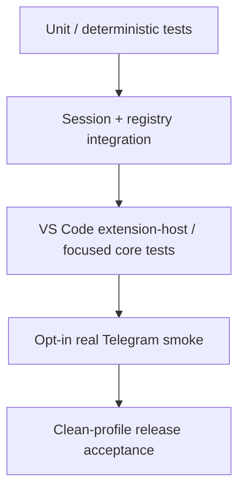

# Test Strategy

> **Status:** Current validation reference
> **Scope:** `copilot-telegram` downstream branch
> **Last reviewed:** 2026-09-01

## 1. Test priority

The highest-risk failures are not cosmetic Telegram defects. They are:

1. controlling the wrong session/workspace,
2. accepting stale or cross-request permission/control input,
3. accidentally elevating remote permission/mode,
4. corrupting session ownership during Agent Host handover,
5. diverging from native Copilot request/session behavior,
6. losing control messages through lifecycle/poller races,
7. silently breaking after an upstream rebase.

Tests are organized around those risks.

## 2. Test layers



Most automated tests should use fake credentials, synthetic workspaces and in-memory/fake Telegram hosts.

## 3. Authorization and pairing

Cover at minimum:

- valid private-chat pairing,
- expired/reused/wrong challenge,
- bounded pairing attempts,
- numeric identity rather than username authorization,
- unpaired user cannot list session metadata,
- pairing-only state ignores normal commands/callbacks/prompts,
- token/pairing replacement invalidates stale authorization,
- forget/revoke removes access.

## 4. Workspace/session scope

Cover:

- empty/no-root window rejection,
- missing/invalid/non-file working directory,
- nested/current root authorization,
- multi-root authorization,
- sibling repository rejection,
- URI authority mismatch,
- Windows path-case behavior,
- workspace-root change after selection,
- stale persisted selection fingerprint/schema,
- revalidation at prompt/steering/stop/activity/final-output time.

Invariant:

> A discoverable session ID is not sufficient authorization.

## 5. Session discovery and Agent Host handover

Current release-gating coverage should include both ownership domains.

### Extension-host sessions

- appear through `getRemoteControlSessions()`,
- are marked `source=extensionHost`,
- select directly after scope authorization,
- listing/selecting does not pin a wrapper reference.

### Agent Host-owned sessions

- are detected from current session ownership metadata/storage evidence,
- appear as `source=agentHost`,
- are filtered by the same workspace policy,
- picker action is `session.fork`, not direct select,
- source session already in use returns `inUse`,
- unavailable/missing metadata fails visibly,
- successful handover creates a new extension-host session ID,
- the new fork can then be selected normally,
- the original Agent Host session is never registered as a Telegram-controlled live registry session,
- source lock is released on success/failure paths,
- extension-host forks are not later misclassified as Agent Host-owned.

Invariant:

> Telegram controls the resulting Remote Pilot fork, not the original live Agent Host session.

## 6. Native prompt dispatch

Test the current native request path rather than only the final SDK behavior.

Cover:

- registry creates a trusted Telegram origin,
- `RemotePromptDispatcher` stages the correct pending context,
- `workbench.action.chat.openSessionWithPrompt.copilotcli` receives the selected session resource,
- VS Code/native participant resolves the intended session,
- real request/tool-token path is used,
- dispatch acknowledges without waiting for the full turn,
- command rejection is observed,
- rejection cleanup removes only the matching pending request context,
- a newer request cannot be erased by an older failure,
- no fallback creates a second SDK session/direct-send path.

## 7. Steering

For a busy selected session:

- dispatch uses the same native request path,
- upstream busy handling results in immediate steering semantics,
- no second Telegram/Copilot session is created,
- reply-to-activity steering resolves the correct session/request/generation,
- stale/completed/wrong-generation replies do not dispatch.

## 8. Remote-control registry

Cover:

- zero/one/multiple transports,
- Mission Control + Telegram coexistence,
- synthetic third transport to expose hidden two-transport assumptions,
- capability default-deny behavior,
- attachment add/remove/suspend lifecycle,
- session binding replacement/disposal,
- event fan-out exactly once per transport,
- duplicate event-ID suppression,
- typed provenance identity validation,
- forged structural origins rejected,
- elevating mode requires an explicitly capable transport,
- Telegram cannot request an elevating mode,
- pending response waiters cancel when transport/session/registry is removed.

## 9. Event projection and activity

Cover:

- supported SDK event projection,
- malformed/unknown event rejection,
- bounds/redaction before presentation,
- replay/live ordering and deduplication,
- replay does not appear as new current work,
- read/search aggregation boundaries,
- tool start/progress/complete correlation,
- command/edit separation,
- reasoning/intent summary aggregation without hidden CoT inference,
- nested-agent activity stays out of root assistant stream,
- final answer rendered once,
- transport failure does not break the other registered transport.

## 10. Telegram presentation

Cover:

- command menu registration,
- optional controls keyboard enable/remove,
- idle/running/disconnected control state,
- session picker direct-select vs `↪` handover behavior,
- model/file/mode callbacks remain opaque and bounded,
- every callback query is answered,
- unchanged message edits are treated idempotently,
- workspace file browser cannot traverse outside the authorized root,
- binary/oversized preview behavior,
- activity message correlation expiry/replacement,
- current live-draft Stop maps to the same abort seam as `/stop`,
- terminal completion/failure/cancel clears active Stop state.

Real Bot API behavior that cannot be faithfully simulated remains in the manual release checklist.

## 11. Permission tests

Simulate a real pending SDK permission with local and remote responders.

Cases:

- Telegram approve-once wins,
- Telegram deny wins,
- local VS Code wins,
- Mission Control wins,
- request cancelled,
- stale callback after another responder wins,
- wrong user/session/request/message/tool-call,
- concurrent permission requests.

Invariant:

> Exactly one valid response reaches the SDK for each permission request.

Additional invariants:

- Telegram cannot call/set the persistent permission level,
- Telegram cannot return autoApprove/autopilot,
- active Mission Control autopilot state does not elevate a Telegram-origin prompt,
- spoofed `command-*` source text cannot change provenance.

## 12. User questions and plan responses

### User questions

Cover choice, freeform, local-vs-remote race, stale reply and cancellation.

### Plan exit/approval

Cover:

- `interactive` action,
- `exit_only` action,
- reject,
- bounded feedback,
- local/Mission Control/Telegram race,
- stale callback/reply,
- forged/unoffered action,
- absence of autopilot/autopilot-fleet/autoApproveEdits in remote types/UI.

## 13. Abort and lifecycle

Cover:

- native Stop and `/stop` reach the same registry abort path,
- abort targets only the currently selected attached session,
- stale Stop cannot affect another request/session,
- disable blocks new dispatch synchronously,
- late startup completion cannot re-enable a cancelled generation,
- correlated terminal output may drain after disable without reopening remote input,
- reconnect after recoverable failure,
- authentication/configuration failure routes back to setup,
- only one poller owns a bot token,
- automatic competing host fails visibly,
- explicit takeover causes the displaced owner to stop before replacement polling.

## 14. Model/mode tests

Cover:

- merge native CLI and VS Code-LM catalogues,
- provider-qualified identity/deduplication,
- picker pagination,
- selected model validated again before dispatch,
- stale model/effort fails visibly,
- native selected model reaches the native request path,
- configured VS Code model resolves to the retained `LanguageModelChat`,
- loopback bridge rejects missing/stale auth/selection,
- active/inactive selected-model reads do not leak session references,
- Telegram mode is only `interactive`/`plan`,
- backend catalogue presence does not mark provider compatibility.

Provider matrix testing should verify the full agent loop, not just text generation.

## 15. Security tests

Release-gating tests include:

- unauthorized metadata disclosure,
- callback/reply replay,
- wrong identity/session/request correlation,
- stale scope,
- token/credential redaction,
- duplicate update handling,
- bounded input/output queues,
- permission/mode elevation prevention,
- Mission Control provenance isolation,
- Agent Host in-use handover rejection,
- poller ownership,
- disable/start race,
- non-E2E disclosure shown before enablement.

See [SECURITY.md](./SECURITY.md).

## 16. Upstream regression suite

After a relevant upstream update run:

- Copilot extension typecheck/build,
- focused Copilot CLI session/service tests,
- remote-control registry tests,
- Telegram deterministic tests,
- Agent Host discovery/handover tests,
- native prompt dispatch tests,
- Mission Control coexistence tests,
- packaging/report generation when preparing a release candidate.

Protect these upstream behaviors:

- native Copilot works with Telegram unconfigured,
- Mission Control still functions,
- local permission/question/plan UIs still function,
- normal model/session/worktree behavior is unchanged,
- Telegram-disabled state produces no Telegram polling.

## 17. Real Telegram smoke test

Use a dedicated test bot and non-sensitive test repository.

A candidate smoke run should verify:

1. clean setup and confidentiality disclosure,
2. private-chat pairing,
3. `/sessions` shows only authorized sessions,
4. direct extension-host session selection,
5. Agent Host `↪` handover behavior, including an in-use rejection case,
6. prompt appears in native VS Code chat,
7. mid-turn steering affects the same Remote Pilot/session,
8. permission approve-once/deny race,
9. user question and plan response,
10. live activity/final answer behavior,
11. native Stop and `/stop`,
12. workspace file browser containment,
13. model selection where relevant,
14. local disable prevents subsequent remote input,
15. re-enable/reconnect does not start duplicate pollers.

Never use private production credentials/content for this smoke test.

## 18. Current automated release runner

From `extensions/copilot`:

```powershell
.\script\telegram-remote\test-phase8.ps1
```

Use script switches only for explicitly scoped development runs. A release-candidate gate should run the complete supported suite after closing development Extension Hosts that could lock generated files.

## 19. Release report

Generate compatibility/checksum/license metadata with the current release-report script:

```powershell
.\script\telegram-remote\generate-release-report.ps1 -TestStatus passed -ArtifactPath <artifact-path>
```

The report should include exact source/build identity rather than examples copied into docs.

## 20. Test data policy

Automated tests use:

- synthetic repositories,
- fake Telegram tokens/identities,
- synthetic session/activity content.

Never store real bot tokens, GitHub/Copilot credentials or private repository data in fixtures, snapshots or generated diagnostics.

## 21. Release-ready definition

A candidate is release-ready only when:

- build/typecheck passes,
- required upstream/focused Copilot tests pass,
- remote-control + Telegram deterministic suites pass,
- security invariants pass,
- Agent Host handover behavior passes,
- clean-profile real-bot acceptance passes,
- Mission Control coexistence passes,
- exact compatibility metadata/checksums are produced,
- license/notice packaging has been reviewed.

The manual signoff checklist remains [PHASE8_ACCEPTANCE.md](./PHASE8_ACCEPTANCE.md).