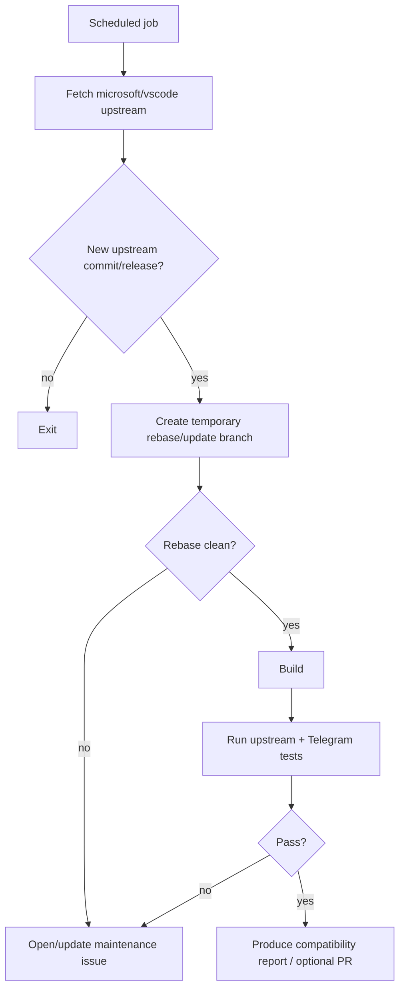

# Upstream Sync Strategy

The project is a thin downstream patch over the actively maintained VS Code Copilot source. Upstream compatibility is therefore a first-class engineering requirement.

## 1. Goal

Keep the Telegram feature isolated enough that new upstream VS Code/Copilot changes can be adopted with minimal manual conflict.

Primary rule:

> Prefer downstream files plus two deliberate, narrow integration points: service composition and the transport-neutral session hook. Avoid Telegram-specific changes in upstream Copilot code.

## 2. Repository model

Recommended remotes:

```text
origin   -> SachiHarshitha/vscode-telegram
upstream -> microsoft/vscode
```

Downstream development branch:

```text
copilot-telegram
```

The branch was created from upstream-equivalent commit:

```text
0984c920744f2013d0ad2bc5e826fa45a64069ab
```

## 3. Patch layout

Prefer a commit stack like:

```text
upstream/main
   |
   +-- T1 docs/specification
   +-- T2 remote-control registry + Mission Control migration
   +-- T3 Mission Control regression + in-memory second-transport tests
   +-- T4 Telegram transport + auth
   +-- T5 Telegram renderer/commands
   +-- T6 setup/release tooling
   +-- T7 tests
```

Do not squash every downstream concern into one giant commit. Small thematic commits make upstream rebases, `git range-diff`, conflict review and cherry-picking easier.

## 4. Source-touch policy

### Preferred: downstream-only files

```text
extensions/copilot/src/extension/telegramRemote/**
extensions/copilot/docs/telegram-remote/**
```

### Expected narrow upstream edits

Potential examples:

- `chatSessions.ts` — instantiate/register `TelegramRemoteContrib` using the existing Copilot CLI service container.
- `copilotcliSession.ts` — publish session events to the registry, race registry permission/question results with local UI, and attach safe controls. This is required because the current interface and request-scoped listeners are insufficient.
- new transport-neutral files beside the Copilot CLI integration — registry contracts, registry implementation and Mission Control adapter.
- a session/service interface — expose only the minimum additional lifecycle/action types if needed.
- `package.json` — downstream configuration/commands/settings/proposed API declarations if required.

### Avoid

- Telegram types/branches or broad rewrites in `copilotcliSession.ts`,
- copying the session service into a Telegram-specific version,
- replacing upstream Mission Control behavior,
- modifying tool implementations for Telegram-only reasons,
- forking SDK runtime code.

## 5. Sync procedure

Typical update:

```bash
git fetch upstream
git checkout copilot-telegram
git rebase upstream/main
```

If the project chooses a release-tag-based policy instead of tracking `main`, rebase onto the selected upstream release commit/tag and record it in compatibility metadata.

After rebase:

```bash
# inspect downstream patch movement
git range-diff <old-upstream>..<old-downstream> <new-upstream>..HEAD
```

Then run the compatibility test suite before accepting the rebase.

## 6. Conflict priority

When conflicts occur:

1. understand the upstream behavior change first,
2. preserve the new upstream behavior,
3. re-apply the smallest Telegram integration on top,
4. do not blindly choose the downstream side,
5. update docs/API mapping if an integration seam changed,
6. add a regression test for the changed seam.

## 7. High-risk upstream files

Monitor changes to:

```text
extensions/copilot/package.json
extensions/copilot/src/extension/chatSessions/vscode-node/chatSessions.ts
extensions/copilot/src/extension/chatSessions/copilotcli/node/copilotcliSession.ts
extensions/copilot/src/extension/chatSessions/copilotcli/node/copilotcliSessionService.ts
extensions/copilot/src/extension/chatSessions/copilotcli/node/copilotCli.ts
extensions/copilot/src/extension/chatSessions/copilotcli/node/mcpHandler.ts
src/vs/workbench/services/extensions/common/extensionsProposedApi.ts
src/vs/platform/environment/common/argv.ts
```

Also monitor changes to:

- `enabledApiProposals` in Copilot `package.json`,
- VS Code product proposal allowlists,
- Copilot SDK dependency version,
- Telegram-related Node/runtime dependency restrictions,
- session event names/types.

`copilotcliSession.ts` is an intentional high-risk patch point. The registry reduces repeated conflicts by replacing Mission Control-only branches with one transport-neutral hook; keep the hook compact and covered by focused source-level tests.

## 8. Compatibility metadata

Add a generated or maintained file in a later implementation phase, for example:

```text
extensions/copilot/telegram-upstream.json
```

Suggested shape:

```json
{
  "vscodeCommit": "0984c920744f2013d0ad2bc5e826fa45a64069ab",
  "copilotExtensionVersion": "0.63.0",
  "telegramPatchVersion": "0.1.0",
  "testedVSCodeVersion": "matching build",
  "distribution": "vsix"
}
```

The release workflow should fail if this metadata is obviously stale relative to the checked-out upstream source.

## 9. Automated upstream watch

P1 CI automation:



Do not automatically move the production/release branch without review.

## 10. API-change checklist

For each upstream update verify:

- [ ] session service methods still exist or migration understood
- [ ] session events required by Telegram still exist
- [ ] request-scoped versus session-lifetime listener ownership still understood
- [ ] overlapping Mission Control observers cannot export the same SDK event twice
- [ ] forwarded event IDs/parent IDs remain valid and no event is its own parent
- [ ] steering semantics unchanged
- [ ] pending request context and `workbench.action.chat.openSessionWithPrompt.copilotcli` still create a real request for both controller paths
- [ ] native command still awaits response completion and remote dispatch remains deliberately non-blocking
- [ ] `sdkSession.getEvents()` replay types/order and replay/live deduplication remain valid
- [ ] typed origin—not `SendOptions.source` prefix—controls Mission Control mode inheritance
- [ ] permission request/response shapes unchanged
- [ ] user-input request/response shapes unchanged
- [ ] model selection API still valid
- [ ] session status states still map correctly
- [ ] proposed API names still exist
- [ ] VS Code runtime argument behavior unchanged
- [ ] Mission Control changes reviewed for reusable improvements
- [ ] Mission Control command/control semantics unchanged behind the registry while duplicate event export remains eliminated
- [ ] `IReference<ICopilotCLISession>` acquire/dispose contract unchanged
- [ ] singleton Telegram poller lease still prevents competing consumers
- [ ] Copilot SDK/CLI license/dependency changes reviewed

## 11. Shared remote-control refactoring

The transport-neutral abstraction is required before Telegram is added because the current Mission Control state is hard-coded into permission and question flows.

Example candidate:

```ts
interface IRemoteControlTransport {
    readonly id: string;
    readonly onDidReceiveCommand: Event<RemoteCommand>;
    publish(sessionId: string, event: RemoteAgentEvent): void;
    requestPermission?(...): Promise<PermissionRequestResult | undefined>;
    requestUserInput?(...): Promise<UserInputResponse | undefined>;
}
```

Preserve Mission Control's protocol-specific API client, buffering and polling inside its adapter. The shared change should be limited to transport registration, typed origin, exactly-once event publication/replay, response arbitration and safe session actions. Prove it first with Mission Control plus an in-memory transport, then add Telegram.

## 12. Long-term exit from fork

The ideal future state is a stable upstream extension point such as a public remote-session/transport provider API.

If Microsoft/GitHub exposes such an API:

```text
Official Copilot extension
       |
       +-- stable remote-control API
                 |
                 +-- independent Telegram extension
```

At that point the project should migrate away from source-level Copilot internals and reduce the fork to zero or near-zero patches.
