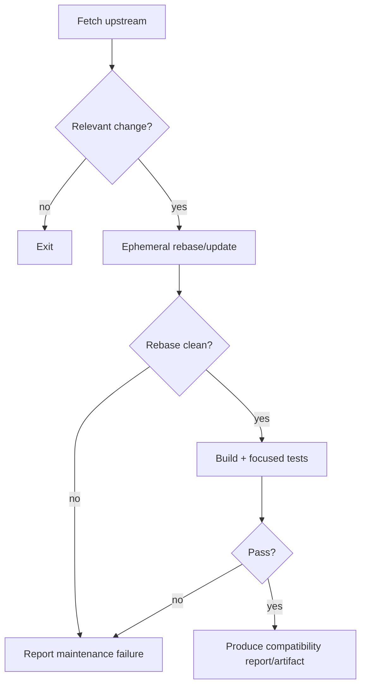

# Upstream Sync Strategy

> **Status:** Current maintenance reference
> **Scope:** `copilot-telegram` downstream branch
> **Last reviewed:** 2026-09-01

The project is a downstream patch over actively changing VS Code/Copilot code. Upstream compatibility is a first-class engineering requirement.

## 1. Maintenance principle

> Keep remote-control behavior isolated in downstream modules and maintain the smallest deliberate set of integration seams into upstream Copilot session code.

The project should absorb upstream behavior changes first, then re-apply the downstream remote-control contract on top.

## 2. Repository model

Recommended remotes:

```text
origin   -> SachiHarshitha/vscode-telegram
upstream -> microsoft/vscode
```

Development branch:

```text
copilot-telegram
```

Do not assume the branch's original base commit is the compatibility target forever. Release metadata should record the exact tested source/upstream relationship for each artifact.

## 3. Downstream-owned source

Prefer changes under:

```text
extensions/copilot/src/extension/remoteControl/**
extensions/copilot/src/extension/telegramRemote/**
extensions/copilot/docs/telegram-remote/**
extensions/copilot/script/telegram-remote/**
```

These areas should contain almost all Telegram-specific behavior.

## 4. Deliberate upstream seams

Current compatibility-sensitive edits include or depend on:

- Copilot CLI service composition in `chatSessions.ts`,
- session-lifetime remote binding/event/interactive hooks in `copilotcliSession.ts`,
- remote-control session discovery/handover additions in `copilotcliSessionService.ts`,
- pending request context and native chat dispatch plumbing,
- model-selection/initializer paths used by the VS Code-LM bridge,
- native session-provider/UI refresh hooks where remote attachment is shown.

Keep these edits narrow and transport-neutral where possible.

Avoid:

- Telegram-specific branches in core agent/tool/worktree logic,
- copying the entire session service into a Telegram implementation,
- maintaining a second authoritative conversation/session state,
- patching the third-party Copilot CLI runtime,
- UI scraping as a compatibility workaround.

## 5. Sync procedure

Typical update:

```bash
git fetch upstream
git checkout copilot-telegram
git rebase upstream/main
```

For a release-based policy, replace `upstream/main` with the selected upstream tag/commit and record it.

After rebase, inspect how the downstream patch moved:

```bash
git range-diff <old-upstream>..<old-downstream> <new-upstream>..HEAD
```

A clean textual rebase is not sufficient evidence of compatibility.

## 6. Conflict resolution order

When an upstream conflict occurs:

1. understand the upstream architectural/behavioral change,
2. preserve the new upstream behavior,
3. decide whether the downstream seam is still necessary,
4. re-apply the smallest compatible remote-control change,
5. update the API/architecture docs if the ownership model changed,
6. add/adjust a focused regression test.

Never resolve a session or permission conflict by blindly keeping the downstream side.

## 7. High-risk files and areas

Monitor at least:

```text
extensions/copilot/package.json
extensions/copilot/src/extension/chatSessions/vscode-node/chatSessions.ts
extensions/copilot/src/extension/chatSessions/copilotcli/node/copilotcliSession.ts
extensions/copilot/src/extension/chatSessions/copilotcli/node/copilotcliSessionService.ts
extensions/copilot/src/extension/chatSessions/copilotcli/node/copilotCli.ts
extensions/copilot/src/extension/chatSessions/copilotcli/node/mcpHandler.ts
extensions/copilot/src/extension/chatSessions/copilotcli/common/pendingRequestContext.ts
```

Also watch:

- Copilot SDK/runtime dependency versions,
- SDK event names/shapes,
- permission/user-input/plan response types,
- native `workbench.action.chat.openSessionWithPrompt.copilotcli` behavior,
- proposed chat-session APIs,
- Agent Host ownership/session storage behavior,
- local session metadata such as `clientName`,
- model configuration plumbing,
- Mission Control remote-session changes,
- Telegram Bot API behavior used by the adapter.

## 8. Agent Host-specific compatibility checks

The current branch discovers Agent Host-owned sessions and performs a controlled fork handover.

On every relevant upstream update verify:

- Agent Host-owned sessions can still be identified reliably,
- Agent Host session-data location/format assumptions are still valid,
- extension-host forks are not later misclassified as Agent Host-owned,
- `registerSessionInUse()` semantics still prevent unsafe concurrent handover,
- source locks are released on every exit/error path,
- `forkSession()` still produces a normal controllable extension-host session,
- Telegram does not accidentally begin treating a live Agent Host session as registry-bound,
- any new official AHP/public-client path is evaluated before adding more ownership heuristics.

If upstream changes session ownership substantially, revisit [ADR-0003](./adr/0003-agent-host-session-handover.md) rather than layering another heuristic blindly.

## 9. Native prompt seam checks

For every upstream update verify:

- pending request context still carries the data needed by remote dispatch,
- the native session command still creates the real request/tool token path,
- argument names/queue semantics remain valid,
- command completion behavior is understood,
- rejection cleanup cannot clear a newer request,
- busy-session steering semantics remain compatible.

If this seam disappears, make an explicit architecture decision before replacing it with direct SDK send.

## 10. Remote-control registry checks

Verify that:

- each SDK event reaches each attached transport once,
- replay/live deduplication remains valid,
- session binding/disposal still matches wrapper lifetime,
- transport capability defaults remain fail-closed,
- typed provenance remains the authority for remote mode,
- Mission Control and Telegram interaction races still resolve once,
- removed/suspended transports cannot win pending responses,
- Telegram cannot gain an elevating mode after upstream mode changes.

## 11. Reference ownership checks

`getSession()`/`createSession()` return reference-counted session wrappers.

On upstream changes verify:

- the acquire/dispose contract is unchanged,
- Telegram list/select/status/file/activity paths still avoid pinning wrappers unnecessarily,
- any new temporary inspection opens/closes deterministically,
- Agent Host handover does not leak the source lock or resulting session reference.

## 12. Test gate

Before accepting an upstream update:

- typecheck/build the Copilot extension,
- run remote-control registry tests,
- run Telegram authorization/routing/activity tests,
- run focused upstream Copilot session tests touched by the patch,
- exercise Agent Host discovery/handover tests,
- exercise native prompt dispatch tests,
- run packaging/release-report checks for a release candidate.

See [TEST_STRATEGY.md](./TEST_STRATEGY.md).

## 13. Compatibility metadata

Every release candidate should record:

```text
exact downstream commit
upstream/base or merge-base commit
VS Code version/build identity
Copilot extension version
resolved Copilot SDK/runtime version
Telegram remote patch/revision
required proposal set
artifact checksum
```

Generated compatibility metadata is preferred over hand-maintained version examples in documentation.

## 14. Automated upstream watch

A scheduled/manual CI workflow should be non-destructive:



Do not automatically move/publish the release branch solely because an unattended rebase passed.

## 15. Long-term exit from the fork

The desired future state is a stable client/control surface that eliminates source-level Copilot patching.

Possible future forms include:

```text
Official Copilot / Agent Host
        |
        +-- stable remote-client/session API or AHP endpoint
                |
                +-- independent Emagin8/Telegram client
```

If an upstream-supported multi-client Agent Host/AHP path becomes available and covers the required IDE/session behavior, prefer migrating toward it over expanding the current ownership/fork bridge.

The fork is an implementation vehicle, not a permanent architectural goal.